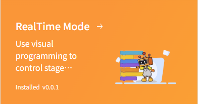
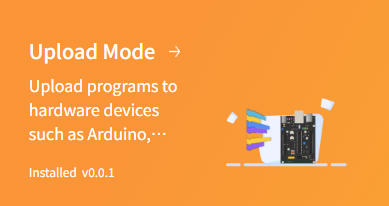
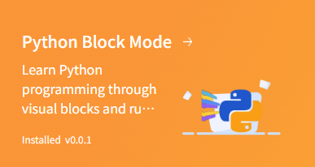
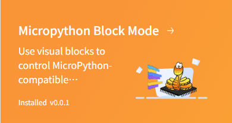
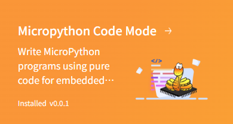
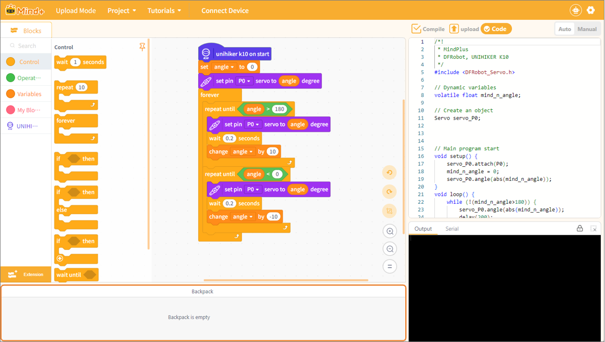
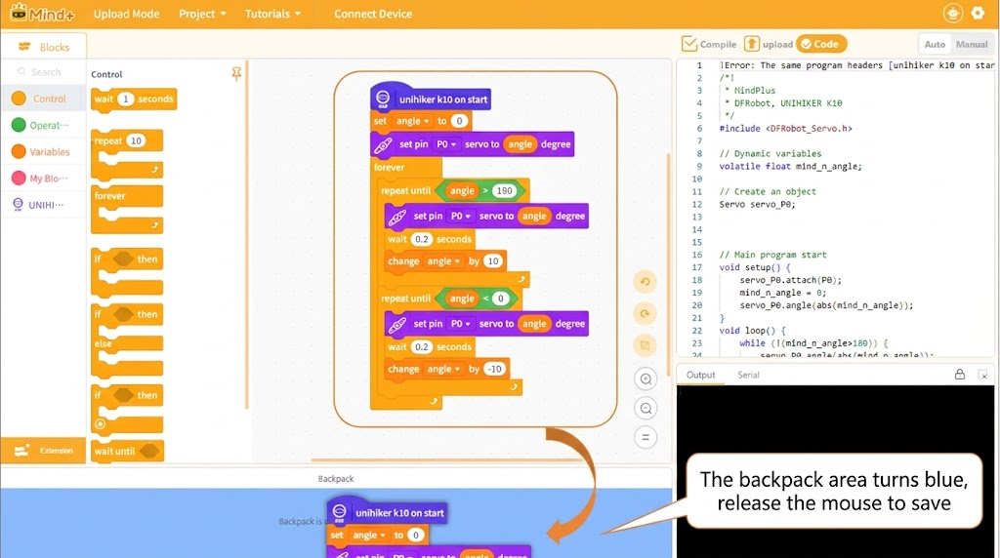
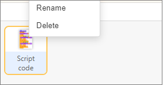
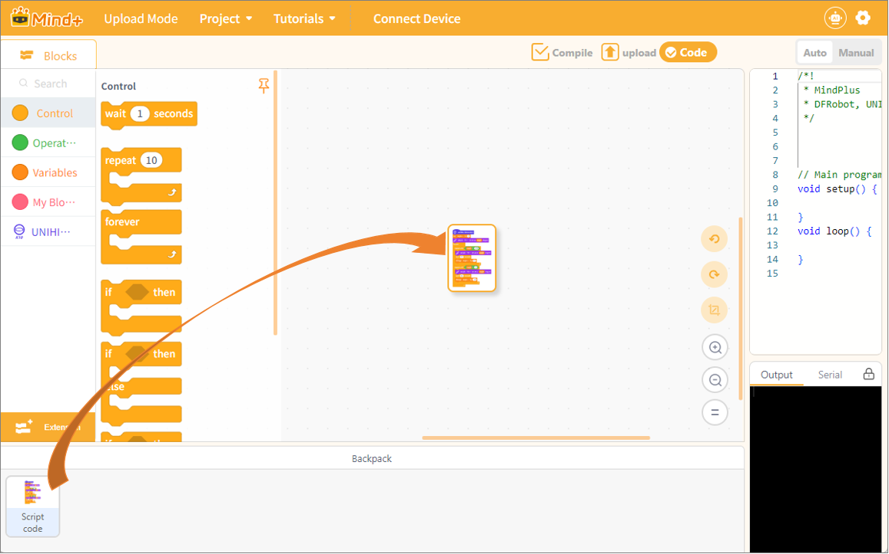
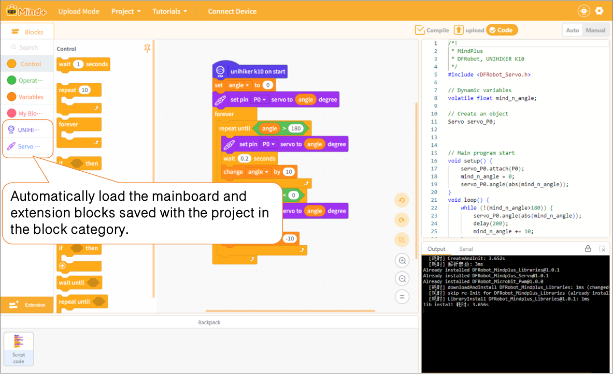

# 3. Coding

## **1. Programming Design**

Programming Design provides a variety of programming modes, covering graphical block-based programming and text-based code programming, to meet the learning needs of all stages—from zero-foundation beginners to advanced development.

|  |  |  |
| ---------------------------------------------------------------------------------------------------------- | ---------------------------------------------------------------------------------------------------------- | ---------------------------------------------------------------------------------------------------------- |
|  |  |                                                                                                            |

| Programming Mode                                                         | Description                                                                                                                                                                                                                                                                    |
| ------------------------------------------------------------------------ | ------------------------------------------------------------------------------------------------------------------------------------------------------------------------------------------------------------------------------------------------------------------------------ |
| [**Real-Time Mode (C1)**](../index.md)                 | Uses block programming to control the stage without an external hardware board. The program runs in real time, and changes to blocks take effect immediately, making it ideal for introductory logic learning, animations, and interactive projects.                           |
| [**Upload Mode (C2)**](../../32UploadMode/index.md)                      | Uses block programming to control physical hardware mainboards. After programming, the code is uploaded to the board, allowing the hardware to run independently even after disconnecting from the computer. Commonly used for hardware projects such as robotics and sensors. |
| [**Python Block Mode (C3)**](../../33PythonBlockMode/index.md)           | Learn Python by dragging and dropping blocks, automatically generating Python code alongside graphical programming. Lowers the barrier to text-based code learning, serving as a transitional mode from graphical programming to Python text programming.                      |
| [**MicroPython Block Mode (C4)**](../../34MicroPythonBlockMode/index.md) | Uses MicroPython blocks to control hardware boards and develop embedded projects via drag-and-drop. Controls hardware such as sensors and actuators without handwritten code, while automatically generating MicroPython code in the background.                               |
| [**MicroPython Code Mode (C5)**](../../35MicroPythonCodeMode/index.md)   | Pure text MicroPython code programming, directly writing code to control hardware mainboards. Suitable for users with programming foundations to flexibly implement more complex embedded control logic.                                                                       |

## **2. General Features - Block Backpack**

The Backpack is a general-purpose graphical programming tool that supports long-term saving and reuse of custom blocks. Users can store frequently used program logic, combined block stacks, and custom function blocks in the backpack without reassembling them every time, greatly improving project creation efficiency. It is ideal for accumulating and organizing frequently reused code snippets and general function logic. It supports renaming, deleting, and dragging blocks anytime, offering lightweight and flexible operation.

**Usage Limitations**

* The Backpack feature is only supported in all graphical block programming modes, including Real-Time Mode, Upload Mode, Python Block Mode, and MicroPython Block Mode. Code-only programming modes do not support the Backpack feature and cannot save or drag block resources.
* The Backpacks in different programming modes are independent of each other, and resources are not shared. Blocks saved in Real-Time Mode cannot be viewed or accessed in other graphical modes such as Upload Mode or MicroPython Block Mode.

| Mode                        | Supported |
| --------------------------- | --------- |
| Real-Time Mode (C1)         | ✅        |
| Upload Mode (C2)            | ✅        |
| Python Block Mode (C3)      | ✅        |
| MicroPython Block Mode (C4) | ✅        |

**Important Notes**

* Backpack resources are saved in the local software cache and will not be saved with the project file. Clearing the software cache will result in the loss of backpack contents.
* If a saved block stack contains a mainboard start block or extension dependencies, the software will automatically load the corresponding mainboard and extension libraries when dragged out again.

**Detailed Steps**

### **Open the Backpack**

Click the Backpack button below the coding area to bring up the Backpack panel (taking Upload Mode as an example).

### **Save Resources**

Select blocks or custom function blocks to add them directly to the backpack. You can store commonly used logic snippets and custom composite blocks for long-term reuse.

Simply drag the selected block(s) you want to save directly into the Backpack panel.

### **Manage Resources**

Items in the backpack support renaming and deletion. After saving the blocks, right-click on the saved block in the Backpack panel to rename or delete it.

### **Use Resources**

Open the Backpack panel and drag saved items directly into the coding area without having to rebuild the same logic, boosting project development efficiency.

**⚠️ Additional Tip:**

If the saved blocks contain a mainboard block (e.g., UNIHIKER K10 on start) or depend on module extensions (such as servo modules), the software will automatically load the corresponding mainboard and extension modules when the blocks are dragged from the backpack into the coding area.

