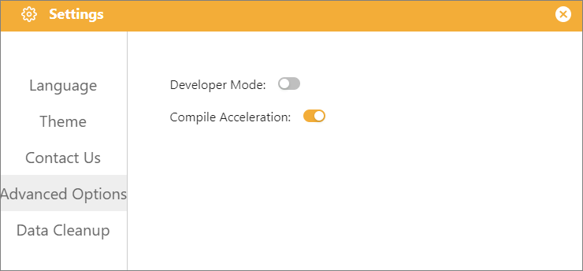

# 3.2.2 Settings

The Settings interface contains the software's global settings. Click the "Settings" button to open it.

## 1. Language

Supports 20 different languages, selectable by the user, to meet a wide range of user needs.

|       简体中文       |  English  | Ελληνικά | Español Latinoamericano |  한국어  |
| :------------------: | :-------: | :--------------: | :----------------------: | :------: |
|      Français      |  ไทย  |     Türkçe     |      ພາສາລາວ      | 繁體中文 |
|  ភាសាខ្មែរ  |  日本語  |    Português    |  Português Brasileiro  |  Magyar  |
|       Deutsch       | Hrvatski |     Català     |       Tiếng Việt       |  Polski  |
| Українська | Čeština |     Română     |                          |          |

## 2. Theme

It supports six different themes, allowing you to change the overall color scheme of the interface to suit different user preferences.

## 3. Contact Us

Find our official contact information under "Contact Us" in the settings, join our study group, and connect with other users to learn together.

## 4. Advanced Options

Advanced Options provide toggles for advanced Mind+ features designed for experienced users, including Developer Mode and Compilation Acceleration.

* **Developer Mode:** Enabling this unlocks the entry to load custom user libraries and supports manually importing local custom extension libraries. It is suitable for users who need to develop and debug custom block libraries.
* **Compilation Acceleration:** Enabling this activates the compilation caching mechanism to reuse existing compilation resources, reducing program upload and compilation time and improving project flashing efficiency.

**Usage Recommendations**

* **General Teaching & Standard Hardware Development:** Keep Developer Mode disabled and Compilation Acceleration enabled to balance UI simplicity with upload efficiency.
* **Importing Local Custom User Libraries:** Enable Developer Mode to access custom library loading; it is recommended to turn it off promptly after debugging is complete.
* **Troubleshooting Cache Errors or Stale Code:** If code updates do not take effect or caching errors occur during upload, temporarily disable Compilation Acceleration and upload again.

## 5. Data Cleanup

Data Cleanup in programming modes is primarily used to clear the local cache data for the corresponding mode. The cleanup scope only applies to the currently opened programming mode and does not affect data from other modes.

⚠️ **Important Notes**

* All cleanup operations only take effect on the currently opened programming mode; data across different modes is independent and will not interfere with each other.
* Clearing the cache will not delete user-saved project files.
* Be cautious when selecting 【Backpack Cache】.

