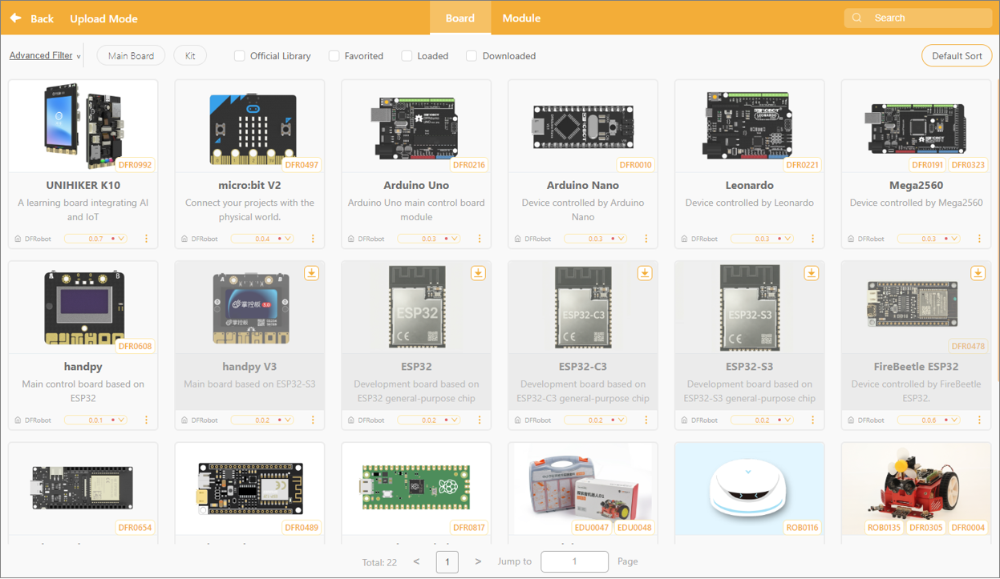

# 3.2.4 Extension Area

In upload mode, the extension area supports two types of extension content:

* **Board Expansion**: Used to select or replace the hardware main controller board currently used for programming, such as Arduino, micro:bit, UNIHIKER K10, etc.
* **Module Expansion**: Once the main controller has been selected, you can further add sensors, actuators, or functional modules compatible with that controller to enhance the program's capabilities.

By configuring the expansion zone, users can flexibly select hardware controllers based on project requirements and load the corresponding modules to enable additional hardware interaction features.

Want to learn more about the commands in each extension library? Click "[Extension](../../Extension/index.md)" to view detailed descriptions of the extension libraries in upload mode.

#### 1. Controller Expansion

The main controller expansion is a core component of the system for identifying and controlling hardware; once loaded, it can drive the corresponding main controller board and its kits. The main controller expansion is further divided into: main controller boards and kits.

Main Board: The core control unit that processes data and controls peripheral devices; it serves as the "brain" of the project and supports 12 different types of main controllers.

| **Controller Name & SKU**                          | **Description**                                                                                                                                      | **Key Features**                                                                                                                                                                                                                                                                                                                                                                                     |
| -------------------------------------------------------- | ---------------------------------------------------------------------------------------------------------------------------------------------------------- | ---------------------------------------------------------------------------------------------------------------------------------------------------------------------------------------------------------------------------------------------------------------------------------------------------------------------------------------------------------------------------------------------------------- |
| **UNIHIKER K10** `(DFR0992)`                | An all-in-one open-source learning board designed for AI and IoT education, integrating a color display, camera, sensors, and Wi-Fi connectivity.          | 1. Built-in 2.8-inch color LCD screen, camera, microphone, and speaker; 2. Powered by an ESP32-S3 chip, supporting on-device AI recognition (face/voice/image); 3. Onboard ambient light, temperature/humidity, 6-axis IMU/motion sensors, and RGB LEDs; 4. Integrated Wi-Fi/Bluetooth with seamless support for IoT cloud platforms and Mind+ block/Python programming.                    |
| **micro:bit V2** `(DFR0497)`                | A pocket-sized micro-computer initiated by the BBC for youth programming education, featuring high usability and rich interactive components.              | 1. 5x5 red LED matrix display for showing text, graphics, and simple animations; 2. Onboard MEMS microphone and speaker for audio input and playback; 3. Built-in motion accelerometer and electronic compass (magnetometer);4 . Supports capacitive touch Logo and 25-pin edge connector for expansion.                                                                                    |
| **Arduino Uno** `(DFR0216)`                 | The world's most renowned benchmark entry-level open-source development board, known for stability, reliability, and a vast ecosystem of shields.          | 1. Based on the classic ATmega328P microcontroller with a robust design and high fault tolerance; 2. 14 digital I/O pins (including 6 PWM outputs) and 6 analog inputs; 3. Standard DIP socketed chip for easy replacement; standard 2.54mm pin header pitch; 4. Seamless compatibility with tens of thousands of Arduino sensor libraries and shields worldwide.                           |
| **Arduino Nano** `(DFR0010)`                | A compact, breadboard-friendly Arduino board offering the same computing performance as the Uno in a significantly smaller footprint.                      | 1. Ultra-compact form factor with dual-row pins that plug directly into breadboards for rapid prototyping; 2. Shares the exact same CPU (ATmega328P) and programming logic as the Uno; 3. Provides 8 analog input pins (2 more than the Uno) for broader analog data acquisition; 4. Onboard Mini/Micro-USB interface for convenient PC connection, debugging, and power.                   |
| **Leonardo**/> `(DFR0221)`                  | An Arduino board with native USB communication capabilities, allowing it to be recognized directly by a computer as an HID device (keyboard, mouse, etc.). | 1. Uses a single ATmega32u4 chip to handle both MCU tasks and USB protocol communication; 2. Capable of emulating USB HID devices such as keyboards, mice, and gamepads; 3. Offers 20 digital I/O pins (including 7 PWM and 12 analog inputs); 4. Features independent hardware serial communication (`Serial1`) separated from USB debugging (`Serial`).                               |
| **Mega2560** `(DFR0191)`                    | An advanced Arduino expansion board equipped with abundant I/O pins and large memory, specifically designed for complex, multi-interface projects.         | 1. 54 digital I/O pins (15 PWM outputs) and 16 analog inputs; 2. 4 independent hardware UART ports for simultaneous multi-module communication; 3. 256KB Flash memory capacity to handle complex algorithms and large codebases; 4. Compatible with most expansion shields designed for Arduino Mega and Uno.                                                                               |
| **mPython Board** `(DFR0608)`               | An educational open-source microcontroller board designed for Maker education and Python teaching, packed with interactive components.                     | 1. Onboard 1.3-inch 128x64 monochrome OLED display for graphical and text interfaces; 2. Integrated Wi-Fi and dual-mode Bluetooth supporting MQTT cloud data transmission; 3. Built-in 3-axis accelerometer, light sensor, microphone, buzzer, and RGB LEDs; 4. Edge-connector touch pads; compatible with both Mind+ graphical blocks and Python programming.                              |
| **mPython Board V3** `(mPython Board V3)`   | Upgraded version of the mPython board powered by the ESP32-S3 core, delivering enhanced computing power, AI expansion, and storage capacity.               | 1. Upgraded to ESP32-S3 architecture with vector AI extension instructions for superior performance; 2. Doubled storage and RAM to support advanced algorithms and richer graphical displays; 3. Fully backwards compatible with existing mPython expansion boards and curriculum resources; 4. Enhanced edge AI processing (voice/vision) and IoT communication performance.               |
| **ESP32** `(ESP32)`                         | A cost-effective, dual-core 32-bit wireless microcontroller board, serving as a go-to foundational platform for IoT development.                           | 1. Dual-core Xtensa LX6 processor running at 240MHz with high computational power; 2. Native dual-mode support for Wi-Fi (802.11b/g/n) and Bluetooth 4.2 (BR/EDR/BLE); 3. Rich peripheral interfaces: capacitive touch, ADC, DAC, UART, SPI, I2C, PWM; 4. Deep sleep ultra-low-power mode, making it ideal for smart home wireless sensor nodes.                                            |
| **ESP32-C3** `(ESP32-C3)`                   | A secure, ultra-low-power Wi-Fi 4 and BLE 5 development board built on an open-source 32-bit RISC-V single-core architecture.                              | 1. Powered by a 32-bit RISC-V single-core microprocessor clocked up to 160MHz; 2. Supports Wi-Fi 4 (802.11b/g/n) and Bluetooth 5 (LE) long-range mode; 3. Outstanding power efficiency with minimal static standby power consumption; 4. Built-in secure boot, Flash encryption, and RSA-3072 hardware acceleration for high security.                                                      |
| **ESP32-S3** `(ESP32-S3)`                   | A powerful dual-core microcontroller board tailored for AIoT (edge artificial intelligence and IoT) applications.                                          | 1. Dual-core Xtensa LX7 processor (240MHz) with vector instructions for AI acceleration; 2. Supports larger high-speed external PSRAM for seamless image and audio stream processing; 3. Integrated 2.4GHz Wi-Fi and Bluetooth 5 (LE) with Mesh networking capabilities; 4. Native USB OTG interface supporting high-speed data transmission and virtual peripheral emulation.              |
| **FireBeetle ESP32** `(DFR0478)`            | Part of DFRobot's low-power FireBeetle series, specially optimized for battery-powered IoT applications.                                                   | 1. Circuitry engineered for ultra-low power consumption with standby sleep current\~10μA; 2. Onboard 3.7V lithium battery charging management circuit with USB auto-charging; 3. Dual-core ESP32 chip providing Wi-Fi and dual-mode Bluetooth connectivity; 4. Compact form factor with stamp-hole/pin-header footprint for easy embedding into enclosures.                                |
| **FireBeetle ESP32-E** `(DFR0654)`          | The upgraded edition of FireBeetle ESP32 with enhanced anti-interference, GDI display interface, and single-button power management.                       | 1. Powered by the ESP32-WROOM-32E module with comprehensive certifications and better EMC; 2. Onboard GDI display port for single-cable direct connection to color and e-ink displays; 3. Integrated battery level detection with hardware/software power-switch control; 4. Fully adapted for Mind+ graphical programming to deliver a streamlined maker workflow.                         |
| **FireBeetle ESP8266** `(DFR0489)`          | A cost-effective, low-power single-core Wi-Fi development board based on the classic ESP8266 chip for IoT connectivity.                                    | 1. Classic ESP8266 processor focused on lightweight Wi-Fi network data transmission; 2. Inherits the FireBeetle low-power design with onboard 3.7V lithium battery charging; 3. Broad code compatibility supporting both Arduino IDE and MicroPython; 4. Budget-friendly choice for building simple Wi-Fi sensor and actuator nodes.                                                        |
| **Raspberry Pi Pico** `(DFR0817)`           | The official first high-performance microcontroller board from Raspberry Pi featuring the in-house RP2040 chip at an accessible price.                     | 1. Dual-core ARM Cortex-M0+ processor with flexible clock speeds overclockable beyond 133MHz; 2. Programmable I/O (PIO) state machines for custom hardware protocols and pin timing; 3. Castellated module design allowing direct soldering as an SMT component or header pin usage; 4. Native support for official C/C++ SDK and MicroPython for fast execution and prototyping.           |
| **RoboMaster TT (ESP32)** `(RoboMaster TT)` | An educational drone system by DJI featuring top-tier flight control algorithms and an ESP32 extension board for AI and drone programming education.       | 1. Combines DJI's advanced flight control algorithms with an open-source ESP32 expansion module; 2. Onboard 8x8 red LED dot matrix, TOF ranging sensor, and RGB status lights; 3. Supports multi-drone Wi-Fi formation swarming, precise indoor positioning, and obstacle avoidance; 4. Supports Python and graphical block programming to easily achieve AI image recognition integration. |

Kit: Kit are sets of sensors, actuator modules, or accessories designed to work with the main control board. They expand the board’s functionality and enrich your creative projects. In upload mode, six different kits are supported.

#### 2. Module Extensions

Module expansion is a feature that automatically displays compatible modules after a main control board has been selected. The system lists available modules based on the hardware supported by the main control board, and users can manually select and add them according to project requirements. These modules can be used to enhance project functionality and enable more sophisticated interaction and control.

In the module expansion section, the modules are divided into 7 major categories, covering a variety of hardware forms:

| Module Category      | Uses                                                              |
| -------------------- | ----------------------------------------------------------------- |
| sensor               | Collect environmental data, such as temperature, light, and sound |
| Actuator             | Control output devices such as servos, motors, buzzers, and LEDs  |
| Communication Module | Supports wireless transmission or communication between devices   |
| Monitor              | Image or text displayed, such as on a screen                      |
| Functional Modules   | Provide specific algorithms or logical functions                  |
| Online Services      | Connect to the Internet to enable online features                 |
| Expansion board      | Expand I/O pins or enhance connectivity                           |

#### 3. Extension Library Updates

In the Extensions section, each extension module displays version update notifications. If a small red dot appears to the right of the version number, it means the current version has not been downloaded locally.

##### How to Update

Select the latest version of the corresponding extension, then click the "Download" button to update it.

Once the update is complete, the red dot next to the version number will automatically disappear, and you can switch to the desired version as needed.

#### 4. Frequently Asked Questions

Click here for a solution to the [issue of being unable to download the extension library](../../FAQ/Coding/RealTimeMode/Extension/HowToFixExtensionLibraryDownloadFailure.md).
