# 3.3.1 Menu Bar

In Python Block Mode, the single-column area offers three different ways to interact with the project: Projects, Tutorials, and Local Terminal.

#### 1. Project

Provides project management functions, including creating new projects, opening projects, saving projects, saving as, and renaming, to help users fully manage their programming projects.

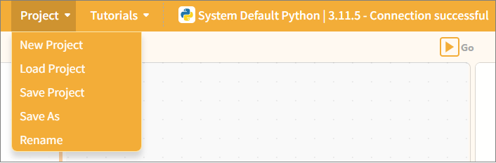

| Features      | Note                                                                                                                                                                                    |
| ------------- | --------------------------------------------------------------------------------------------------------------------------------------------------------------------------------------- |
| New Project   | Create a blank project and clear all currently loaded extension instructions so you can start programming from scratch.                                                                 |
| Load project | Load the saved project file to continue editing or running it.                                                                                                                         |
| Save Project  | Save the current project to your computer and update the original file.                                                                                                                 |
| Save As       | Save the current project as a new file. Users can specify the filename and location; the original project will not be overwritten. This is useful for creating backups or new versions. |
| Rename        | Save the current project as a new file. Users can specify the filename and location; the original project will not be overwritten. This is useful for creating backups or new versions. |

## 2. Tutorials

We provide a wide range of learning resources, including official documentation, online forums, video tutorials, and Example programs.

**Note**: The content of the Example program automatically adjusts based on the selected control board to facilitate hands-on learning.

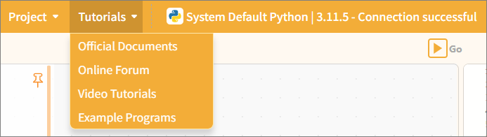

| Features               | Note                                                                                                                                                                                          |
| ---------------------- | --------------------------------------------------------------------------------------------------------------------------------------------------------------------------------------------- |
| Official Documentation | Visit the official documentation page to access a wide range of tutorials                                                                                                                     |
| Online Forums          | Visit the Mind+ official forum to explore a wide range of projects and engage in discussions.                                                                                                 |
| Video Tutorials        | If you're just getting started, you might want to check out some simple examples.                                                                                                             |
| Example Program        | Here is a sample program for the current main control board. Please note that you must first select the main control board in the "Extensions" section before the sample program will appear. |

## 3. Python Environment Selection Interface

Click **UNIHIKER M10** in the menu bar to enter the Python Environment Selection interface. This interface is used to select the Python execution environment for running code, supporting switching between local Python environments and remote UNIHIKER SSH environments. Once an environment is selected, programs will execute on the corresponding target. From top to bottom, the interface consists of: **Function Buttons**, **Runtime Environment List**, and **Environment Details Panel**.

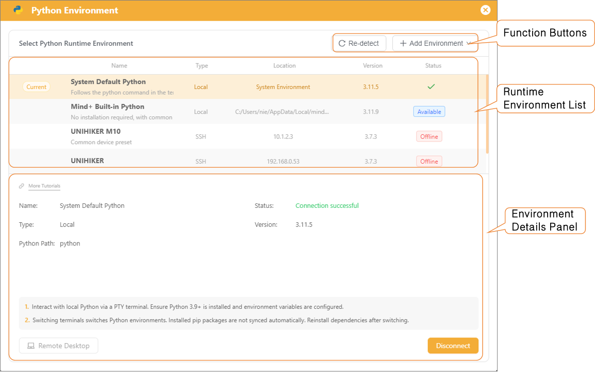

### Function Buttons

* **Re-detect:** Re-detect available Python environments on the local computer and refreshes the environment status in the list.
* **Add Environment:** Creates a custom runtime environment, supporting local Python or other remote SSH devices.

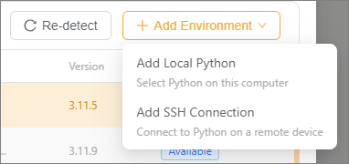

| Add Environment Option | Description                                                                                                                                                |
| :--------------------- | :--------------------------------------------------------------------------------------------------------------------------------------------------------- |
| Add Local Python       | Manually select an installed Python executable on the local computer to add a custom local Python to the environment list.                                 |
| Add SSH Connection     | Create a new SSH remote connection configuration to connect remote hardware devices running Python (such as UNIHIKER) and execute Python programs on them. |

### Runtime Environment List

The runtime environment list displays all available Python runtime environments. Click an entry to select it.

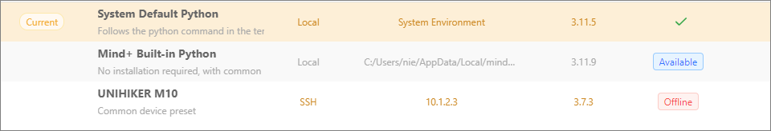

| Environment Name                | Run Location                   | Description                                                                                                                                                                                           |
| :------------------------------ | :----------------------------- | :---------------------------------------------------------------------------------------------------------------------------------------------------------------------------------------------------- |
| **System Default Python** | Local Computer                 | Calls the default Python program in the computer terminal, using the configured local Python environment.                                                                                             |
| **Mind+ Built-in Python** | Local Computer                 | An isolated, installation-free Python environment pre-installed with common programming third-party libraries. If the status is**[Not Installed]**, it can be downloaded and deployed with one click. |
| **UNIHIKER M10**          | UNIHIKER Hardware (SSH Remote) | Connects to UNIHIKER M10 via SSH protocol. Code is delivered remotely and runs directly on the development board hardware.                                                                            |

### Environment Details Panel

After selecting an environment, the details panel displays its corresponding configuration details.

| Environment Name      | Description                                                                                               |
| --------------------- | --------------------------------------------------------------------------------------------------------- |
| System Default Python | 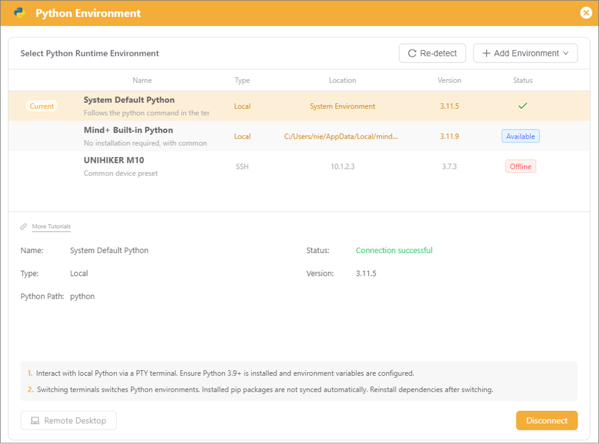 |
| Mind+ Built-in Python | 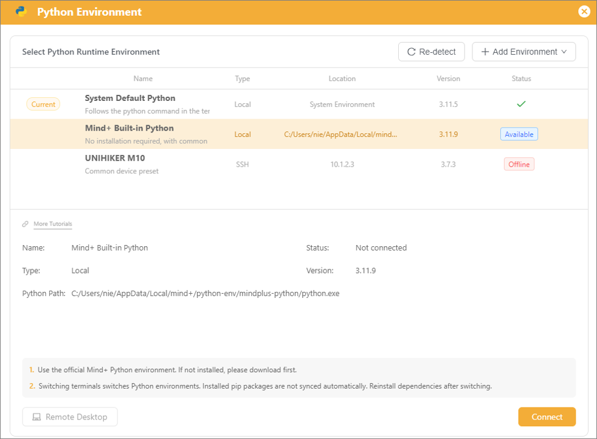 |
| UNIHIKER M10          | 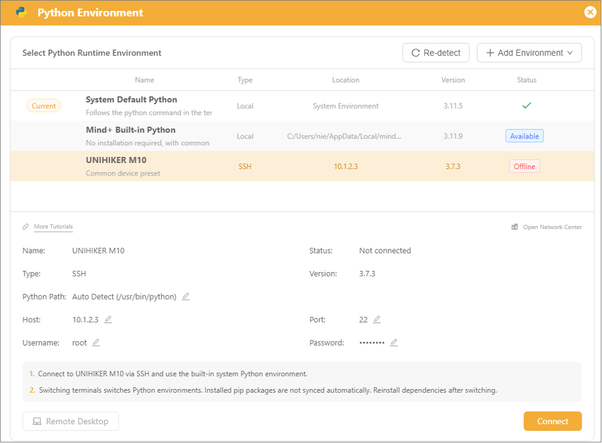 |

### Remote Desktop

The Mind+ Remote Desktop feature allows viewing and controlling the desktop display of devices such as UNIHIKER M10 directly, eliminating the need for an external monitor. It facilitates on-device interface previews, program debugging, and feature demonstrations.

Once communication between the device and Mind+ is established, clicking **Remote Desktop** synchronizes and previews the UNIHIKER screen inside the Mind+ window in real time, enabling efficient debugging of display and interactive Python applications.

#### (1) Direct USB Connection

This method requires no network connection. It connects the computer directly to UNIHIKER M10 using a USB cable. It offers simple operation and a stable connection, ideal for fast local debugging.

1. In the Mind+ environment list, select **UNIHIKER M10** and click **Connect** to complete basic communication pairing.

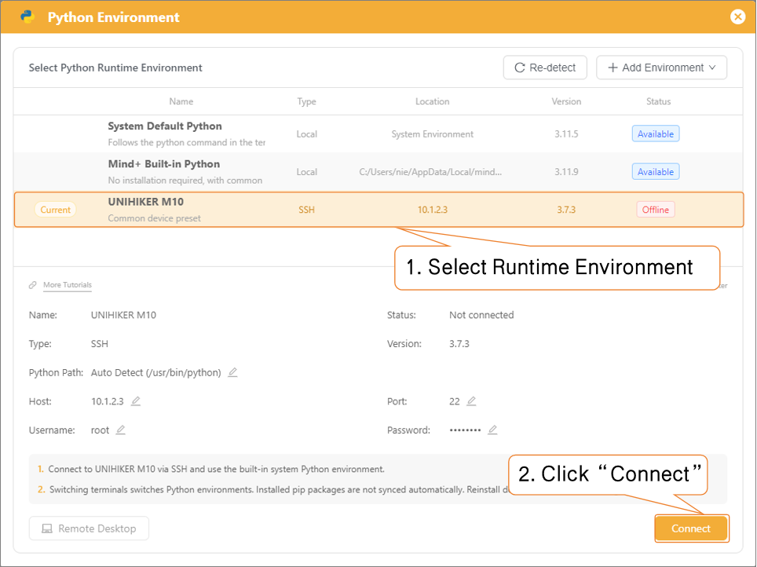

2. Once connected, the originally disabled/grayed-out **Remote Desktop** button will automatically become active. Click **Remote Desktop**, then click **Connect** in the pop-up window to launch the device remote desktop and view the screen in real time.

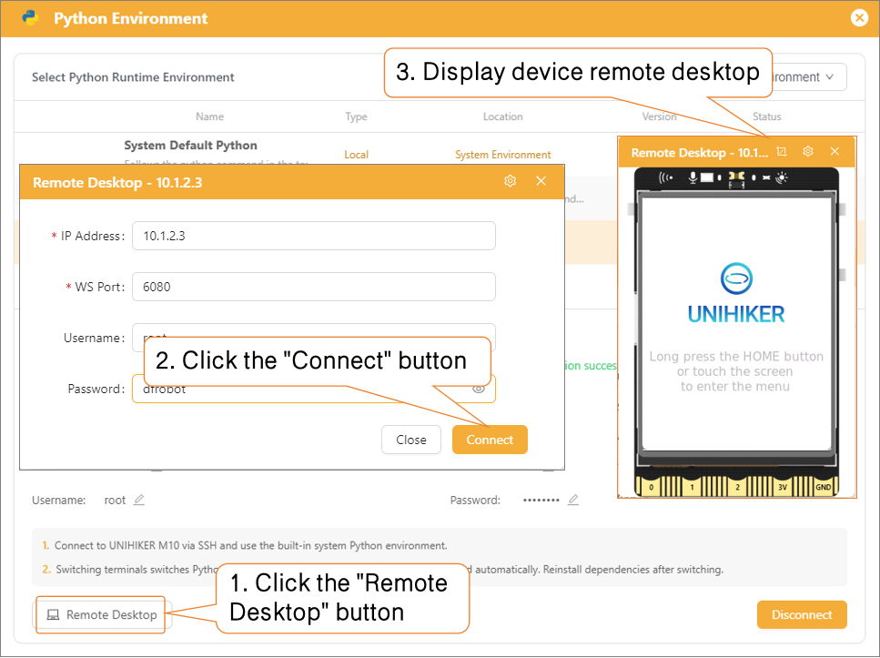

#### (2) SSH Connection

This method allows wireless remote connection over the same Local Area Network (LAN) via IP address without USB cables, suitable for long-distance debugging and fixed deployments.

1. Connect UNIHIKER M10 to the same Wi-Fi network as the computer. Once connected, check and record the device LAN IP address (via the UNIHIKER desktop or terminal).

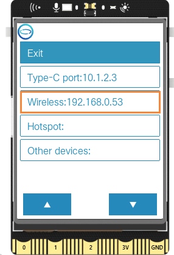

2. In the **Python Environment** interface, click **Add Environment** and select **Add SSH Connection** from the dropdown menu.

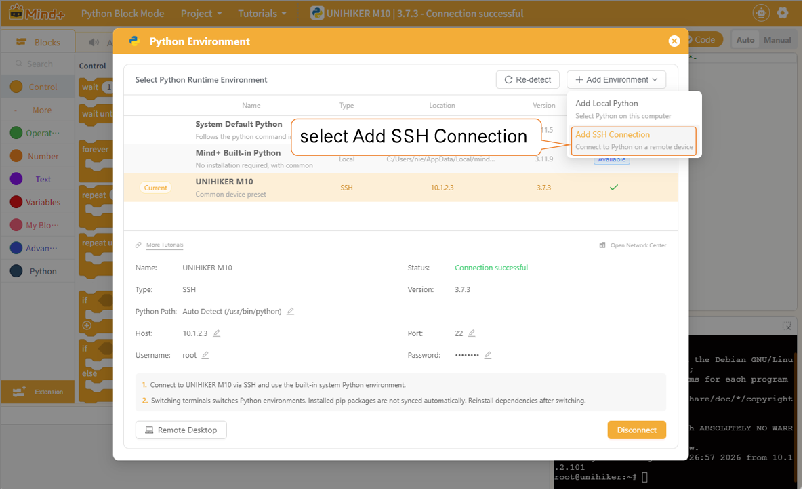

3. Fill in the following parameters in the details panel:

* **Name:** Custom device name (e.g., `UNIHIKER M10`)
* **Host:** Wireless IP address (the IP address obtained from UNIHIKER M10)
* **Username:** `root` (Fixed default parameter for UNIHIKER M10)
* **Password:** `dfrobot` (Default device authorization password for UNIHIKER M10)

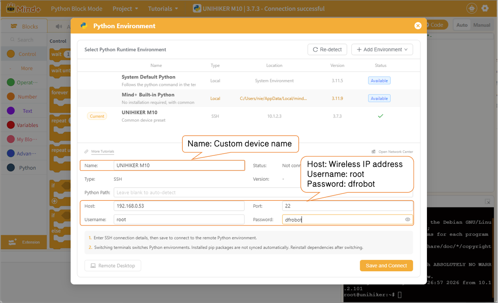

4. Click **Save & Connect** in the bottom-right corner. Once connected, a new entry with the custom device name and LAN IP (e.g., `192.168.0.53`) will appear in the list, indicating successful pairing.

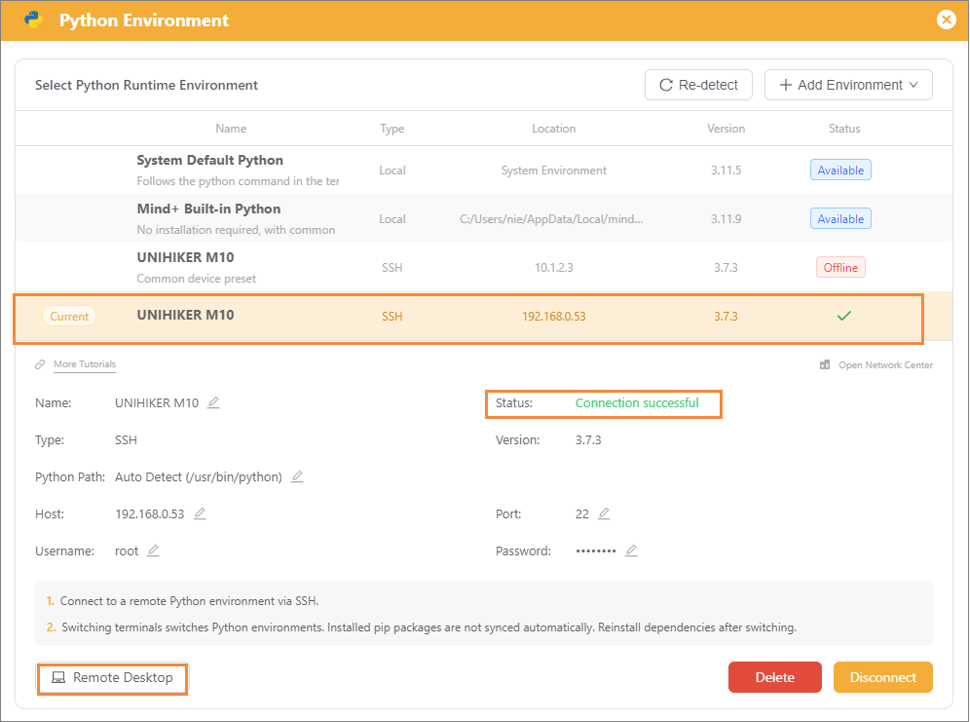

5. Click the enabled **Remote Desktop** button, then click **Connect** in the pop-up window to view the screen in real time.

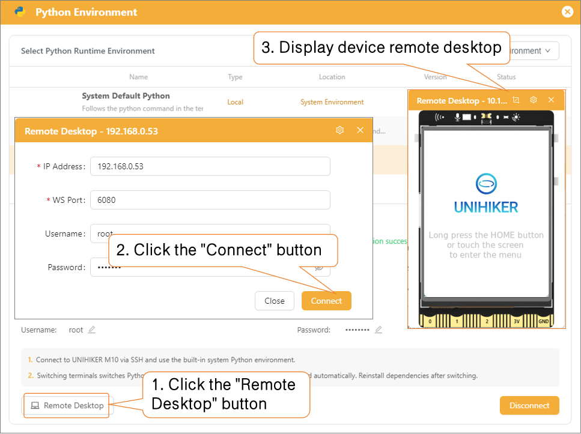

#### (3) Remote Desktop Interface Features

The remote desktop window includes built-in screenshot and display configuration tools:

* **Screenshot Feature:**
  Captures the real-time screen of the UNIHIKER device with one click and saves it locally in high resolution without compression for documentation and review.

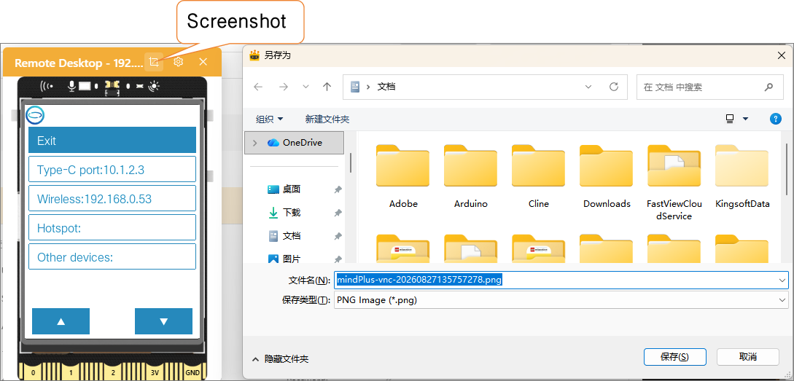

* **Desktop Settings:**
  * **Quality Adjustment:** Supports manual quality adjustment (levels 0–9). Lower settings improve responsiveness and stability on slower networks; higher settings provide crisp rendering of text, UI details, and animations.
  * **Screen Zoom:** Supports **1x**, **2x**, and **3x** scaling to adapt to classroom projectors or large monitors, ensuring students clearly view interface elements and code execution.
  * **Show Frame:** Toggles the device screen border on or off. Enabling the frame clearly distinguishes the screen area from the background; disabling it provides a clean full-screen view.

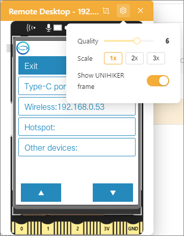

#### (4) Troubleshooting "Connection Failed"

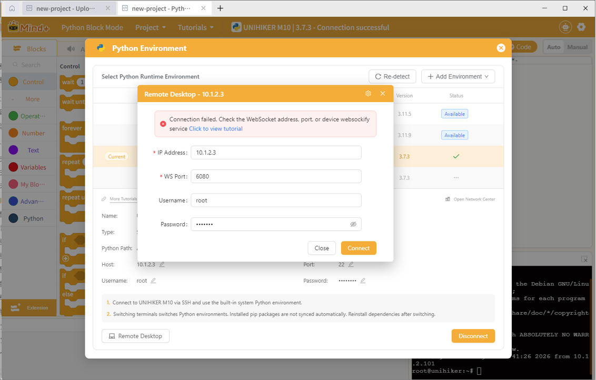

1. Check and ensure that the **Screen Sharing** service under **Home Menu > App Switch** on the UNIHIKER board is set to **Enabled**.

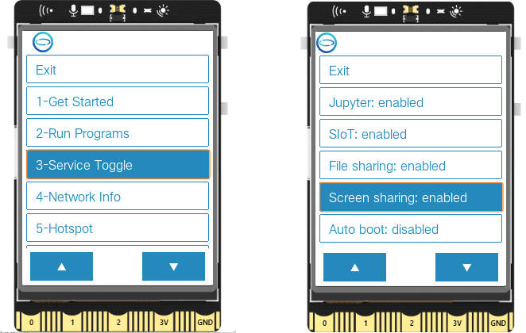

2. Because Mind+ V2 Remote Desktop uses an updated forwarding protocol, UNIHIKER M10 requires a one-time installation of the updated Remote Desktop service prior to first use:

| Attachment Name                                                           | Purpose                                                                   | Action            |
| :------------------------------------------------------------------------ | :------------------------------------------------------------------------ | :---------------- |
| **UNIHIKER M10 Remote Desktop One-Click Install Script (20260716)** | Quickly deploys required remote desktop service programs to UNIHIKER M10. | Click to Download |

**Installation Steps:**

* Open the downloaded `UNIHIKER M10 Remote Desktop One-Click Install Script.mpcode` in Mind+.
* Connect the UNIHIKER M10. Once connected, click the **Run** button (no manual interaction is needed during this step).

* Wait a few minutes until the UNIHIKER **automatically restarts**, then attempt to connect via Remote Desktop again.
* If connection still fails, retry the steps. If it fails after 3 attempts, contact support via the UNIHIKER M10 community group.

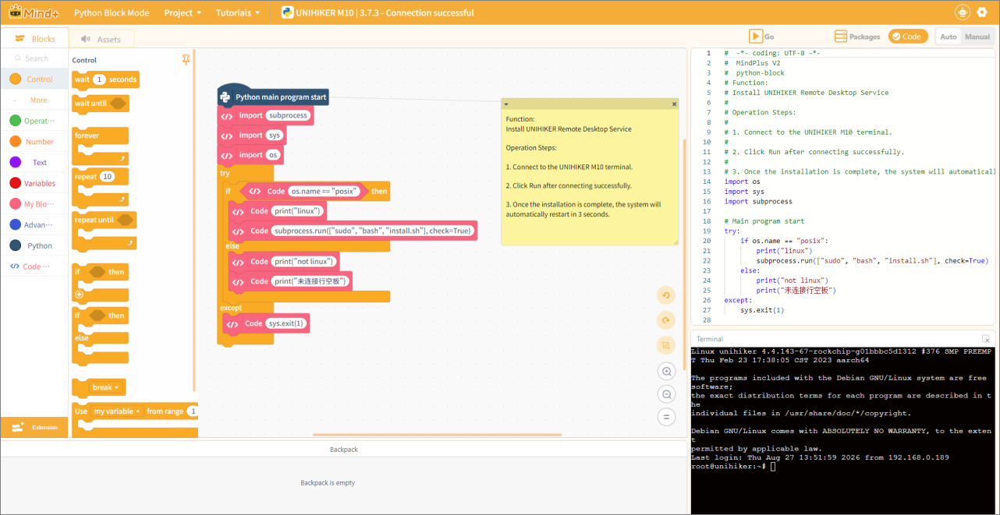
