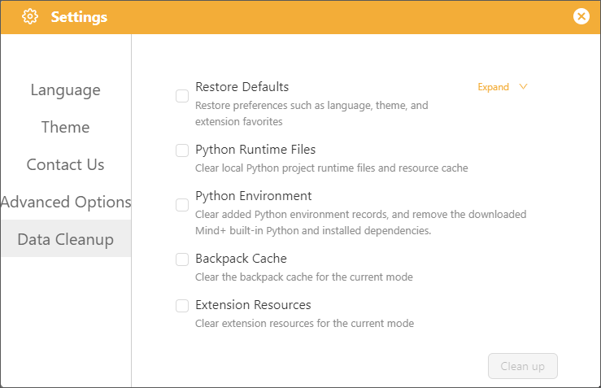
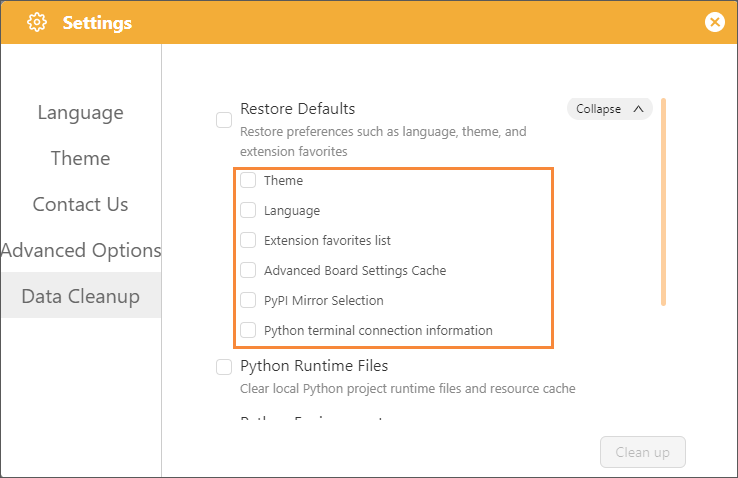

# 3.3.2 Settings

The Settings interface contains the software's global settings. Click the "Settings" button to open it.

## 1. Language

Supports 20 different languages, selectable by the user, to meet a wide range of user needs.

|       简体中文       |  English  | Ελληνικά | Español Latinoamericano |  한국어  |
| :------------------: | :-------: | :--------------: | :----------------------: | :------: |
|      Français      |  ไทย  |     Türkçe     |      ພາສາລາວ      | 繁體中文 |
|  ភាសាខ្មែរ  |  日本語  |    Português    |  Português Brasileiro  |  Magyar  |
|       Deutsch       | Hrvatski |     Català     |       Tiếng Việt       |  Polski  |
| Українська | Čeština |     Română     |                          |          |

## 2. Theme

It supports six different themes, allowing you to change the overall color scheme of the interface to suit different user preferences.

## 3. Contact Us

Find our official contact information under "Contact Us" in the settings, join our study group, and connect with other users to learn together.

## 4. Advanced Options

Developer Mode is an advanced feature toggle for Mind+, available to developers and advanced users. Once enabled, users gain access to custom graphical block development, hardware driver library creation, and the ability to import third-party extension packages, allowing them to expand functionality beyond what is built into the official version.

**Recommendations for use**:

* Use cases: Custom extension development, debugging underlying issues;
* Non-essential scenarios: For basic graphical programming instruction and routine project development, there is no need to enable this mode.

## 5. Data Cleanup

Data Cleanup in programming mode is primarily used to clear local cache data of the corresponding mode. **The cleanup scope only applies to the currently active programming mode and will not affect data in other modes.**

⚠️ **Important Notes**

* All cleanup operations only take effect on the currently opened programming mode; data across modes is strictly isolated and independent.
* Clearing cache files will not delete project files saved manually by users.

| Cleanup Option                 | Description                                                                                                                                                                                                                                                                          |
| :----------------------------- | :----------------------------------------------------------------------------------------------------------------------------------------------------------------------------------------------------------------------------------------------------------------------------------- |
| **Restore Default**      | One-click reset for software preferences such as language, theme, extension favorites, mainboard advanced configurations, PyPI mirror sources, and Python terminal connection credentials. ⚠️ Does not delete project files, Python environments, or general resource caches. |
| **Python Runtime Files** | Clears temporary runtime files and resource caches generated by all Python projects; project files will not be deleted.                                                                                                                                                              |
| **Python Environments**  | Removes saved external Python environment records, uninstalls the Mind+ built-in Python interpreter, and removes all third-party dependencies.                                                                                                                                       |
| **Backpack Cache**       | Clears only the backpack cache downloaded in the current programming mode without affecting other modes.                                                                                                                                                                             |
| **Extension Resources**  | Clears only the extension assets and driver resources downloaded in the current programming mode.                                                                                                                                                                                    |

**Restore Default Settings** contains the following sub-items: Theme, Language, Extension Favorites List, Mainboard Advanced Settings Cache, PyPI Mirror Source Selection, and Python Terminal Connection Info.

* **Theme:** Restores the interface theme to factory default.
* **Language:** Restores the interface language to default.
* **Extension Favorites List:** Clears manually bookmarked extension lists.
* **Mainboard Advanced Settings Cache:** Clears custom advanced configuration caches related to mainboards.
* **PyPI Mirror Source Selection:** Resets the Python package download source to default.
* **Python Terminal Connection Info:** Clears saved terminal connection history.
