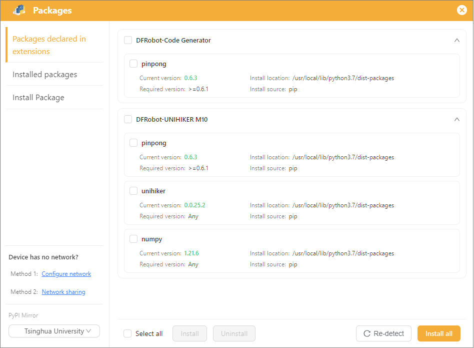
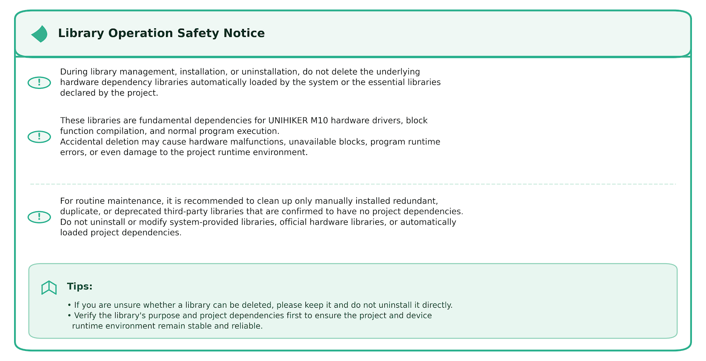
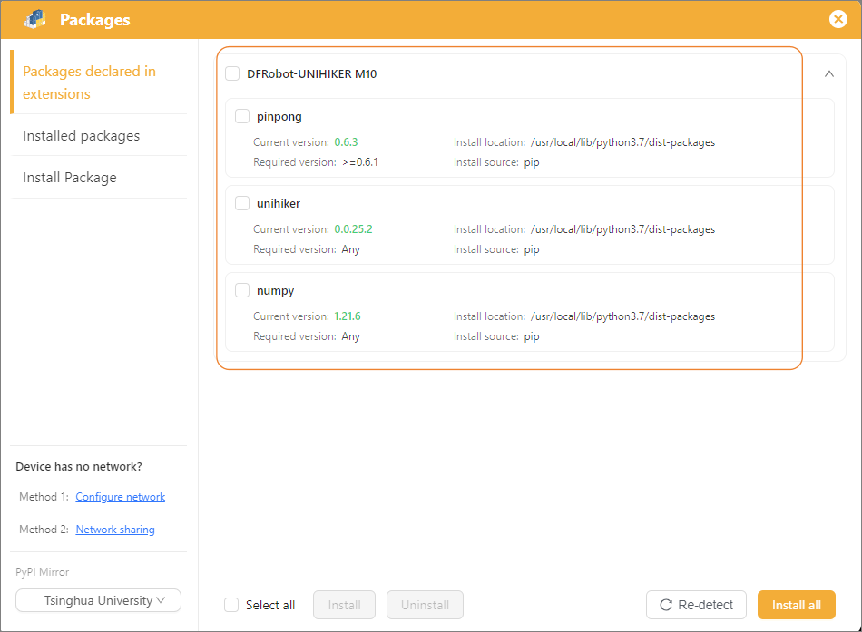
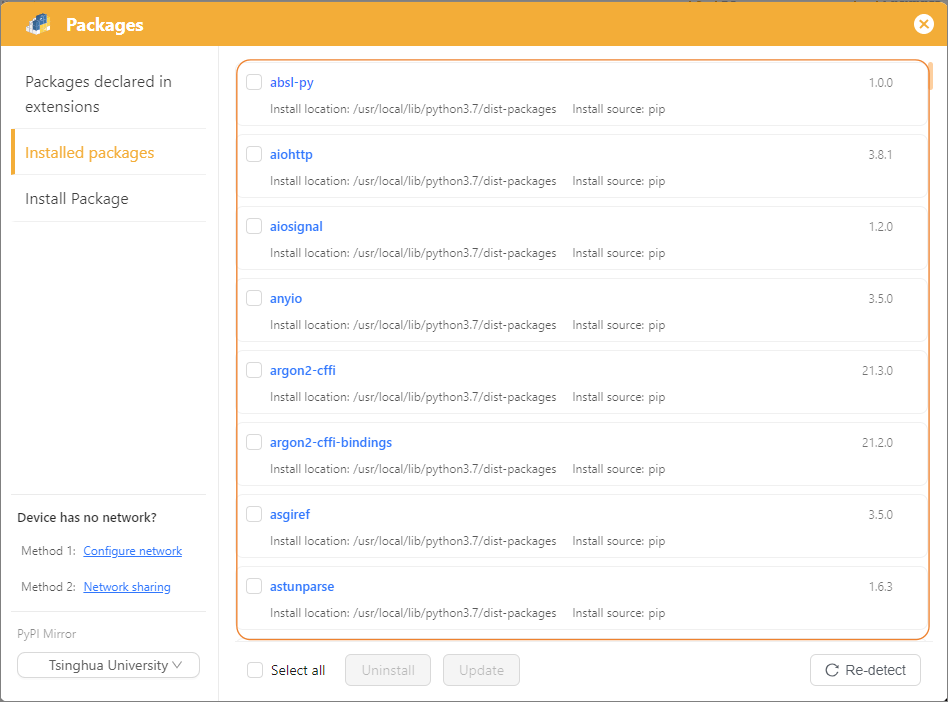
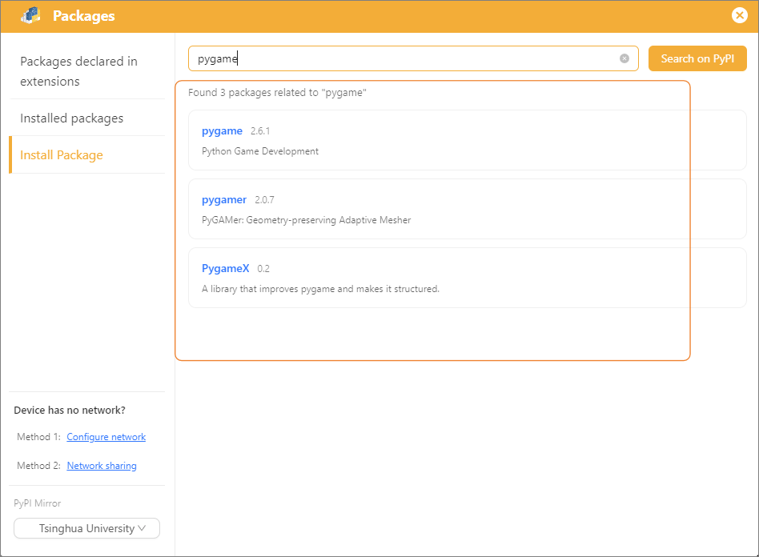
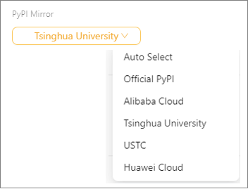
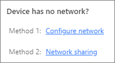
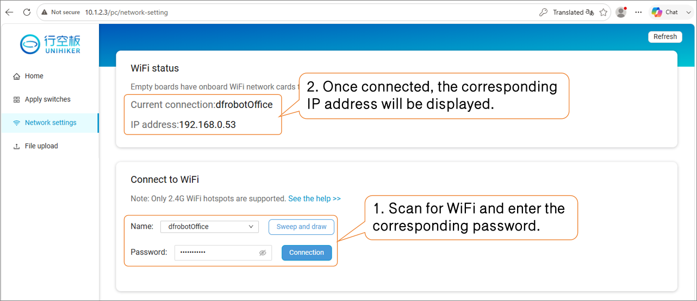
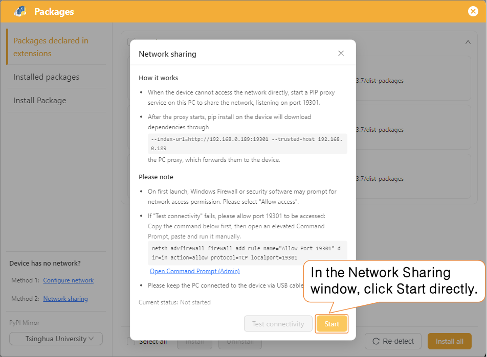

# 3.3.7 Library Management

Library Management is the core management interface for extensions and dependencies in Mind+ Python Block Mode. It is primarily used to load hardware function extensions, install Python dependency libraries, and manage custom extension resources for the current programming project. It serves as a key entry point for developing hardware features and expanding program capabilities.

The interface is divided into three main sections: **Libraries Declared in Extensions**, **Installed Libraries**, and **Install Python Libraries**. Combined with library update and mirror source switching features, it provides clear layout partitions and visual operations. Users can quickly manage project dependencies without writing command-line code, even with zero prior experience.

| Functional Module                          | Feature Overview                                                                                                                                                                                                                                                                                                                                        | Core Benefits                                                                                                                                                                                                                                                                                                                                                                                                                                                                                                   |
| :----------------------------------------- | :------------------------------------------------------------------------------------------------------------------------------------------------------------------------------------------------------------------------------------------------------------------------------------------------------------------------------------------------------ | :-------------------------------------------------------------------------------------------------------------------------------------------------------------------------------------------------------------------------------------------------------------------------------------------------------------------------------------------------------------------------------------------------------------------------------------------------------------------------------------------------------------- |
| **Libraries Declared in Extensions** | Automatically parses project block code and hardware extensions, identifying and displaying essential dependencies required for project execution.                                                                                                                                                                                                      | 1. Zero manual operations with fully automatic identification, lowering the user learning curve; 2. Automatically adapts to the hardware environment, ensuring that UNIHIKER hardware blocks compile and run properly; 3. Proactively checks for missing libraries and version mismatches, preventing runtime errors at the source; 4. Standardizes project dependencies to facilitate teaching troubleshooting, project sharing, and project reuse.                                             |
| **Installed Libraries**              | Displays all installed libraries in the local Python environment, including hardware pre-installed libraries and custom third-party extensions. Supports viewing library versions, one-click updating, or uninstalling redundant libraries to achieve visual inspection and self-maintenance of the runtime environment.                                | 1. Dual-environment separate management, avoiding resource confusion and environment conflicts; 2. Command-line-free visual maintenance, allowing beginner users to independently manage development environments; 3. Quickly locates dependency anomalies, significantly reducing code and hardware debugging difficulty.                                                                                                                                                                            |
| **Install Python Libraries**         | A visual installation portal for third-party Python libraries without requiring command-line tools. Supports searching or entering library names manually to install standard libraries across the network. Enables targeted installation of extension libraries for both local and UNIHIKER hardware environments to expand advanced project features. | 1. Simple operation and beginner-friendly, well-suited for classroom teaching and entry-level learning; 2. Overcomes software default limitations to unlock advanced features like data analysis, image processing, and network communication; 3. Flexible dual-environment support, adapting to multi-scenario development including local debugging and remote hardware execution; 4. Covers development needs from entry-level to advanced, accommodating full-stage Python project creation. |

## 1. Libraries Declared in Extensions

Automatically and intelligently parses the block code of the current project, allowing users to quickly verify dependency completeness and troubleshoot program errors caused by missing or mismatched library versions. It is ideal for project self-checks, classroom troubleshooting, and project migration/reuse.

For example, when **UNIHIKER M10** is added in Extensions, the "Libraries Declared in Extensions" section in Library Management will automatically refresh and display the list of hardware-specific dependency libraries.

This list is automatically recognized and loaded by the system without requiring manual user installation:

1. Loads the official underlying hardware dependency libraries required for UNIHIKER execution, including screen drivers, touch controls, system controls, and hardware communication protocols.
2. Indicates that the current project has been bound to the UNIHIKER M10 hardware environment, where all listed libraries are mandatory dependencies for normal execution.
3. Serves as a project validation mechanism to visually display the adapted hardware environment, preventing hardware functional failures caused by missing or mismatched libraries.

## 2. Installed Libraries

Displays all third-party libraries currently installed in the selected runtime environment (Local Python / UNIHIKER SSH Remote Environment). Supports viewing library versions, one-click updating, and one-click uninstalling of redundant libraries to clean up runtime environments, resolve library conflicts, and remove unused dependencies, keeping both local and device environments clean and stable.

## 3. Install Python Libraries

A visual online installation portal requiring no command-line operations. It supports keyword searches for Python libraries across the index and installation by custom library names. Users can freely expand advanced functionalities such as data processing, algorithms, networking, and computer vision to meet diverse Python development needs, making it effortless even for beginners.

## 4. Mirror Source Selection

The interface includes a built-in PyPI mirror source switching feature, which is a key configuration to ensure library installation success. It supports switching between the official source and high-speed regional mirror sources (such as Tsinghua, Alibaba, etc.), effectively resolving download slowdowns, timeouts, and installation failures on campus or home networks, greatly improving download speeds and installation stability for third-party libraries.

## 5. UNIHIKER M10 Offline Solutions

When the UNIHIKER M10 is not connected to a network, Python dependency libraries cannot be installed online. You can select either of the following networking solutions based on your on-site setup:  **Configure Network** or **Network Sharing**.

### Method 1: Configure Network

Connect the UNIHIKER to a **2.4G Wi-Fi network or mobile hotspot** to grant the device direct Internet access.

* **Advantages**: Provides full global network access for UNIHIKER, enabling both Python library installations and the execution of various IoT/online projects.

### Method 2: Network Sharing

Connect the device to a computer using a USB cable and start the PIP proxy service on the PC to route Python library downloads to UNIHIKER without requiring Wi-Fi.

* **Advantages**: Does not require a wireless network.
* **Note**: This method only supports installing dependencies via `pip` and does not provide global Internet access to UNIHIKER.

