# 4.1.2 Data Sampling and Sampling Device Guide

In AI model training within Mind+ V2, high-quality and representative sample data is critical to determining the final model performance. The system provides multiple data access and collection channels to facilitate acquiring training samples across different application scenarios.

The following sample collection methods are supported:

| **Data Sampling Method**             | **Applicable Hardware & Scenarios**                   | **Core Advantages**                                                                                                               |
| :----------------------------------------- | :---------------------------------------------------------- | :-------------------------------------------------------------------------------------------------------------------------------------- |
| **Webcam Capture**                   | Built-in PC webcam, driver-free USB webcam, document camera | Plug-and-play; ideal for desktop objects and simple gesture capture.                                                                    |
| **Local File Import**                | Local image collections, public datasets (JPG/PNG)          | Supports bulk import and offline annotation; easy to expand dataset volume.                                                             |
| **Hardware Wireless Stream Capture** | **HUSKYLENS 2**, mobile robots, line-tracking robots  | **What you capture is what you see**: Eliminates field-of-view (FOV) differences between training and deployment webcams/cameras. |

---

## 1. Webcam Capture

**Working Principle:** Directly accesses the video stream from the built-in PC webcam, external driver-free USB webcam, or document camera to frame the shot in real time and capture frames in the Mind+ preview area.

**Core Advantages:** Zero configuration required; plug-and-play without network setup or IP pairing.

**Detailed Steps:**

### Step 1: Select or Add a Category Label

* Click **[+ Add Category]** to create a new category and name it (e.g., `Cat`).

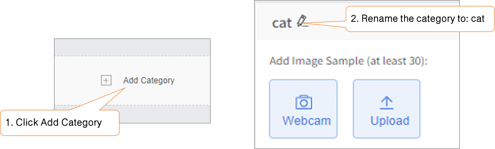

### Step 2: Select Webcam and Preview

* In the sample collection area, click **[Webcam]**. The system will automatically open the local default computer webcam (such as the built-in webcam or default USB webcam).

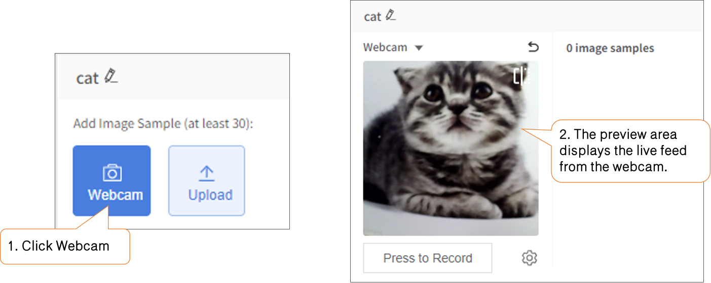

### Step 3: Collect Samples

* **Single Capture:** Place the object in front of the lens and click **[Hold to Record]** to capture a single image.
* **Continuous Capture:** Press and hold **[Hold to Record]** for continuous shooting. Slowly move the object, change angles, or adjust distance during continuous shooting to enrich sample diversity.

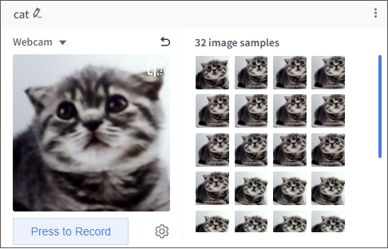

---

## 2. Local File Import

**Working Principle:** Bypasses live webcam capture to directly read and load image files stored on the local disk, batch-assigning them to the specified category workspace.

**Core Advantages:** Supports rapid entry of large-scale, high-quality samples; allows reusing public datasets or existing image assets; suitable for curated pre-shoot datasets.

**Detailed Steps:**

### Step 1: Prepare Local Image Data

* Organize images locally on your computer, ideally grouped into separate folders by category.
* Common image formats are supported (e.g., `.jpg`, `.jpeg`, `.png`). A minimum resolution of 224×224 pixels per image is recommended to ensure clear target features.

### Step 2: Select or Add a Category Label

* Click to select the target category (e.g., `Dog`).
* If the category does not exist yet, click **[+ Add Category]** to create it first.

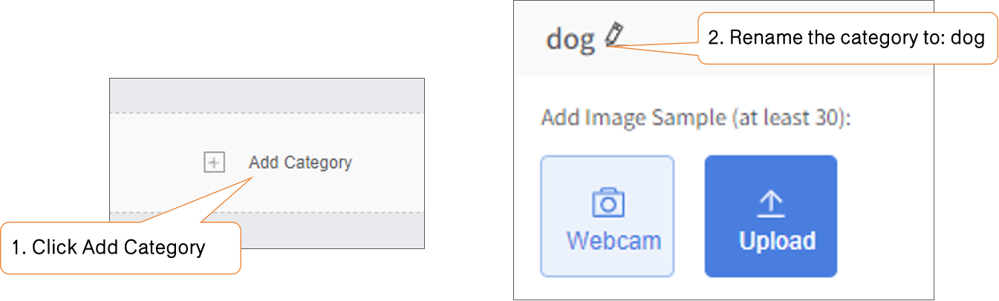

### Step 3: Batch Upload Images

* In the current category card or collection area, click **[Upload Data]**, then click **[Select Files to Upload]**.
* In the file manager, navigate to the target folder, press `Ctrl + A` to select all images, and click **[Open]** to complete the batch import.

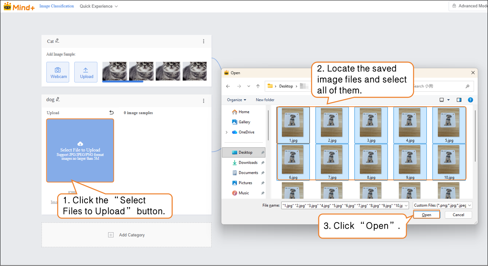

## 3. WebRTC Stream Capture

**Working Principle:** HUSKYLENS 2 features a built-in WebRTC video streaming service. It transmits the first-person perspective (FPV) video feed captured by the hardware webcam/camera back to Mind+ in real time via a wired connection (USB network card mode) or wireless link (Wi-Fi LAN) for sampling.

**Core Advantages:** Uses the native sensor of the final deployment hardware for sampling, fully preserving the webcam's FOV, color balance, and lens distortion profile. It also frees hardware from cables, enabling remote sampling on mobile robots or robotic arms in dynamic environments.

**Detailed Steps:**

### Mode A: Wired Stream Transmission

#### Step 1: Enable WebRTC Video Streaming

* Connect HUSKYLENS 2 to the PC using a USB cable. Swipe on the HUSKYLENS 2 screen to locate **Live Video Transmission** (if not found, please [Update Firmware](https://wiki.dfrobot.com.cn/#7.%E5%9B%BA%E4%BB%B6%E6%9B%B4%E6%96%B0) first). Under Live Video Transmission, turn on the **WebRTC Transmission** switch and tap confirm.

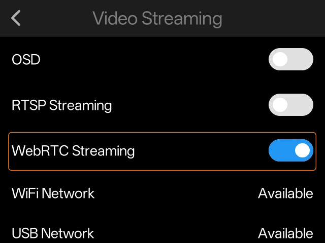

* The device will return to the home screen. A live transmission icon will appear in the top-right status bar to indicate stream mode. Open any model on HUSKYLENS 2 to start video transmission.

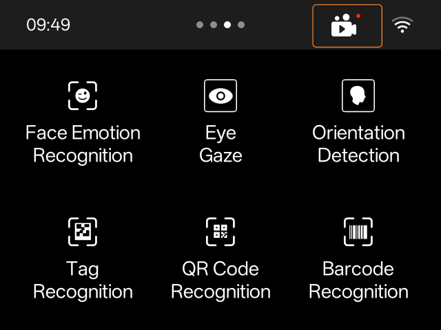

* Once the model is loaded, an IP address will appear on the HUSKYLENS 2 screen.

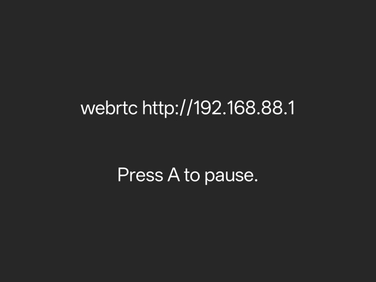

#### Step 2: Select or Add a Category Label

* Select the target category label for sampling.
* If the category does not exist, click **[+ Add Category]** to create it first.

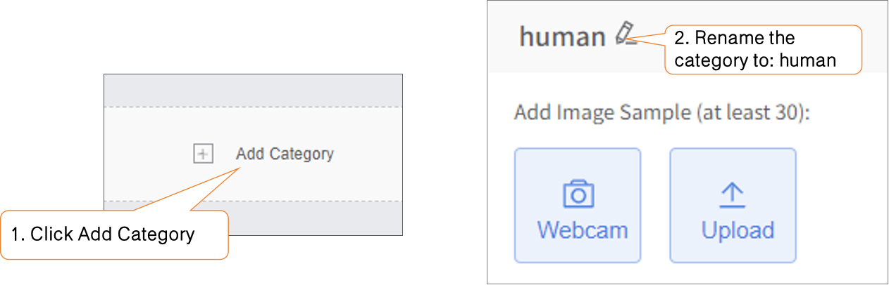

#### Step 3: Select Webcam and Connect

* In the sample collection area, click **[Webcam]**, then select **[Connect 192.168.88.1]** from the webcam list.
* Once connected, the collection window will display the real-time FPV feed from HUSKYLENS 2, indicating the connection is ready.

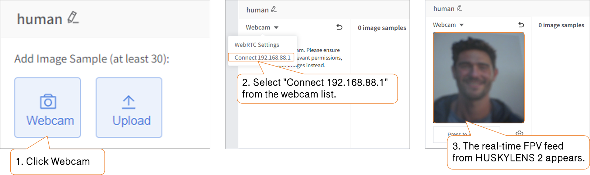

#### Step 4: Collect Samples

* **Single Capture:** Place the object in front of the lens and click **[Hold to Record]** to capture a single image.
* **Continuous Capture:** Press and hold **[Hold to Record]** for continuous shooting. Slowly move the object, change angles, or adjust distance during continuous shooting to enrich sample diversity.

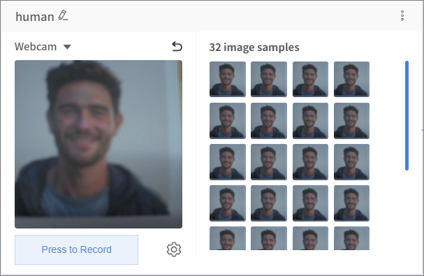

---

### Mode B: Wireless Stream Transmission

#### Step 1: Enable WebRTC Video Streaming

* Ensure you are using the [HUSKYLENS 2 Wi-Fi Module](https://www.dfrobot.com.cn/goods-4251.html "HUSKYLENS 2 Wi-Fi Module") and have successfully connected to a Wi-Fi network in Settings.
* Power HUSKYLENS 2 via USB cable. Swipe on the screen to find **Live Video Transmission** (if not found, please [Update Firmware](https://wiki.dfrobot.com.cn/#7.%E5%9B%BA%E4%BB%B6%E6%9B%B4%E6%96%B0) first). Turn on the **WebRTC Transmission** switch and tap confirm.

* The device returns to the home screen with the live transmission icon shown in the top-right status bar. Open any model on HUSKYLENS 2 to start video transmission.

* After opening the model, IP addresses will appear on the HUSKYLENS 2 screen (if two IPs appear, the device is connected to both wired and wireless networks; `192.168.88.1` is the wired IP).

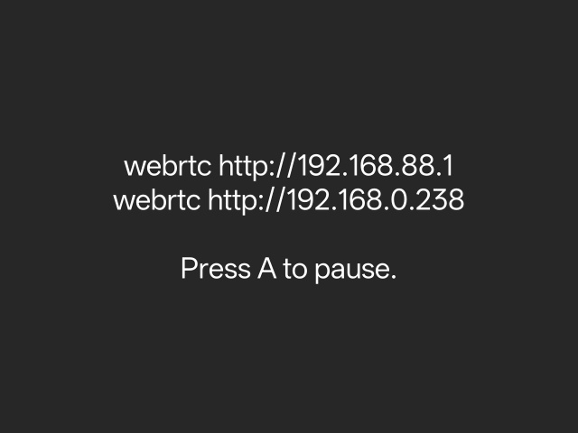

#### Step 2: Select or Add a Category Label

* Select the target category label for sampling.
* If the category does not exist, click **[+ Add Category]** to create it first.

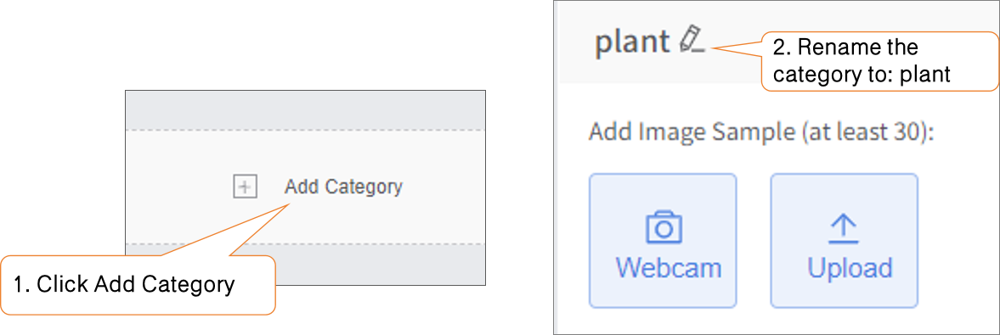

#### Step 3: Select Webcam and Connect

* In the sample collection area, click **[Webcam]**, select **[WebRTC Settings]** from the webcam list, and input the corresponding network IP address.

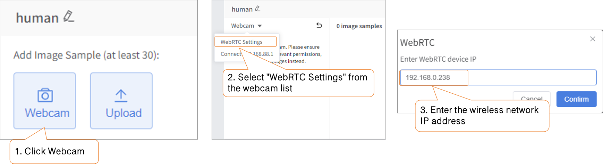

* Next, the webcam list will update with the configured network IP address. Click **[Connect 192.168.0.238]**. Once connected, the collection window will display the real-time FPV feed from HUSKYLENS 2.

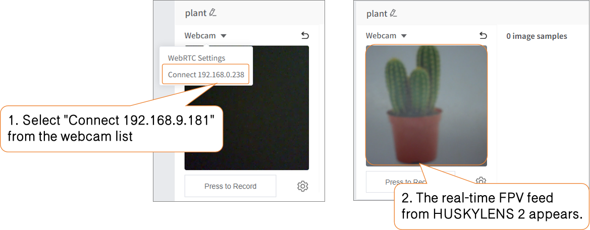

#### Step 4: Collect Samples

* **Single Capture:** Place the object in front of the lens and click **[Hold to Record]** to capture a single image.
* **Continuous Capture:** Press and hold **[Hold to Record]** for continuous shooting. Slowly move the object, change angles, or adjust distance during continuous shooting to enrich sample diversity.

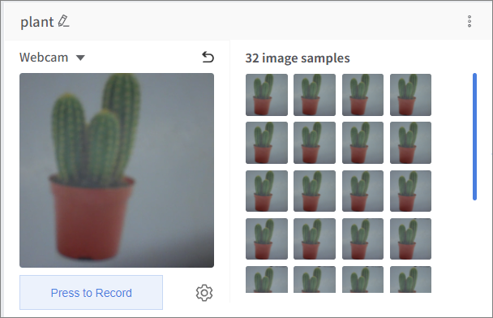
