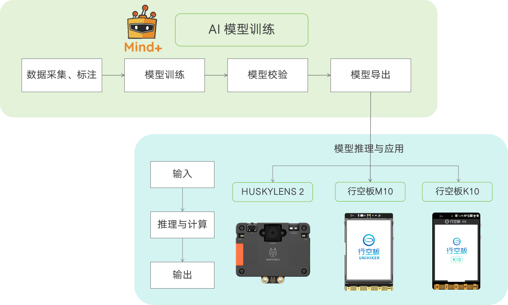
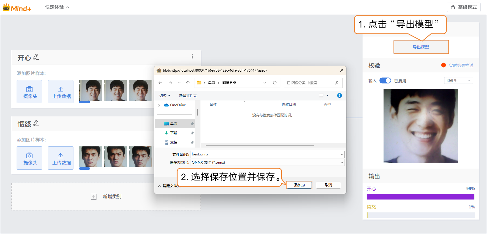
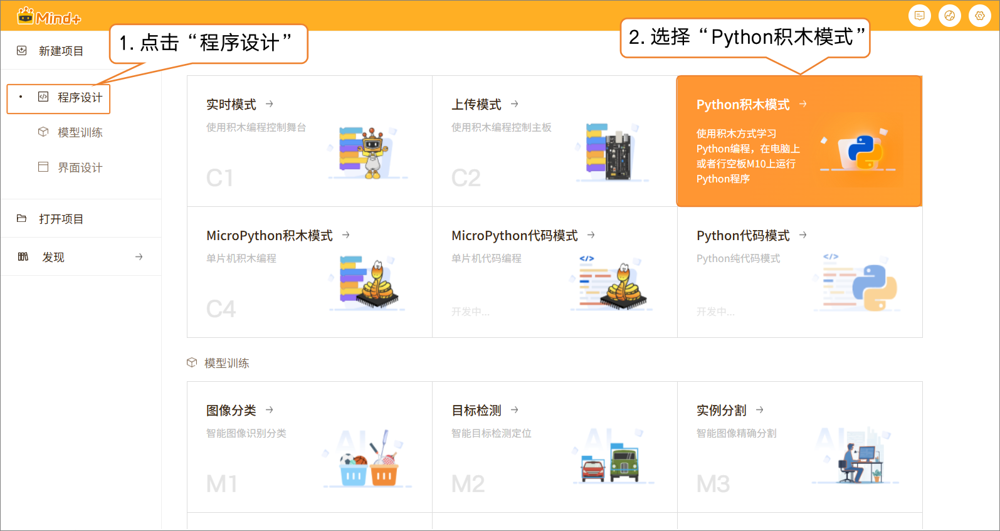
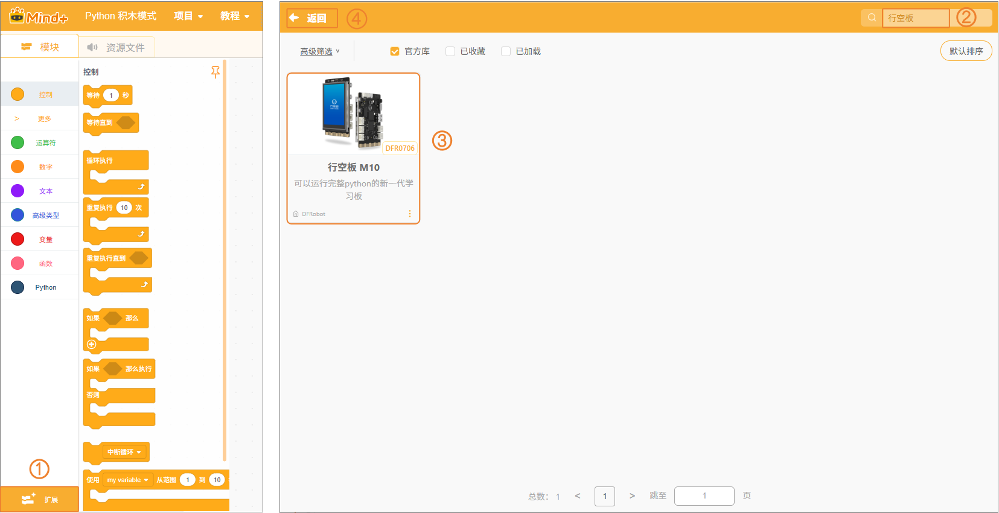
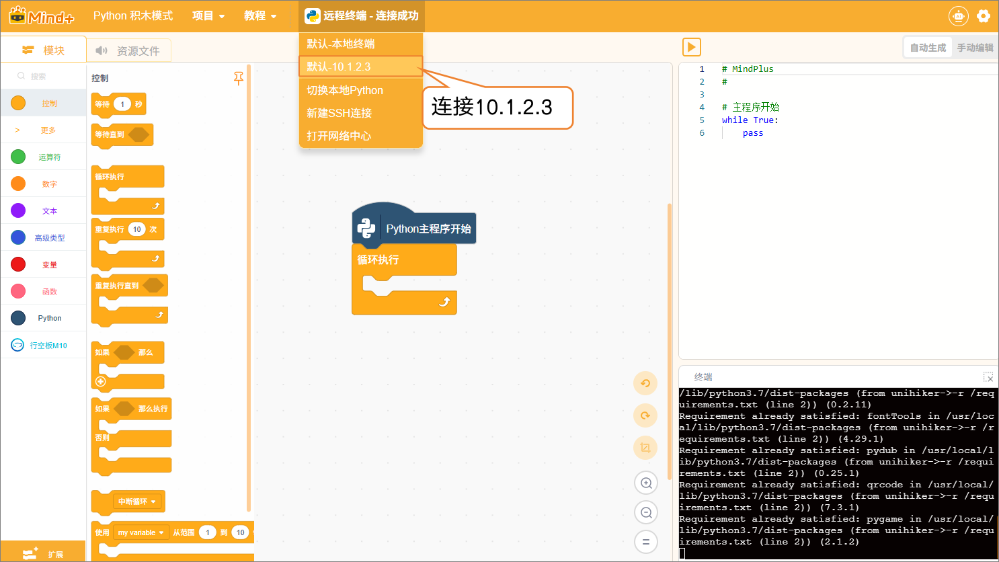
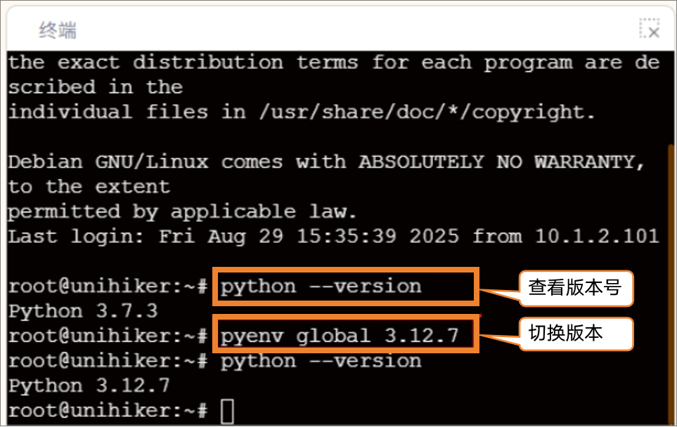
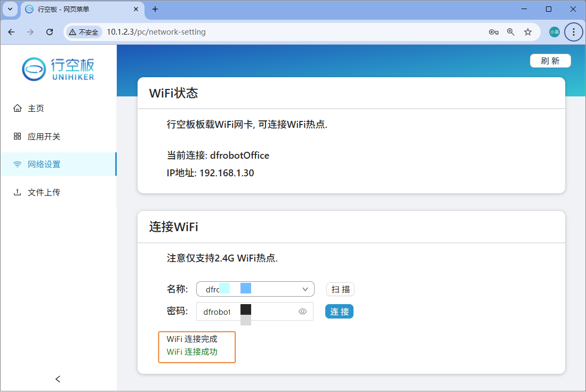
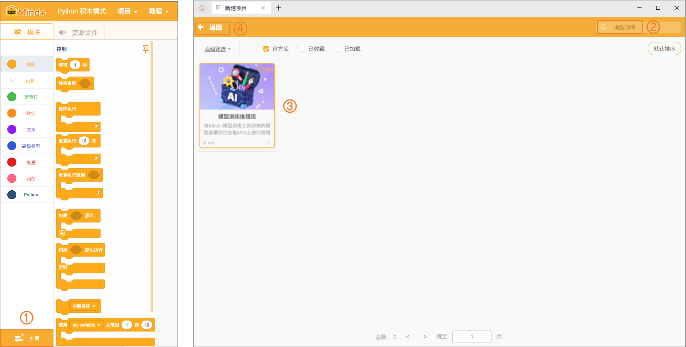
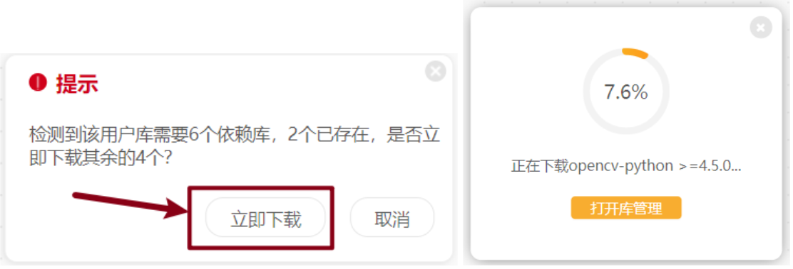
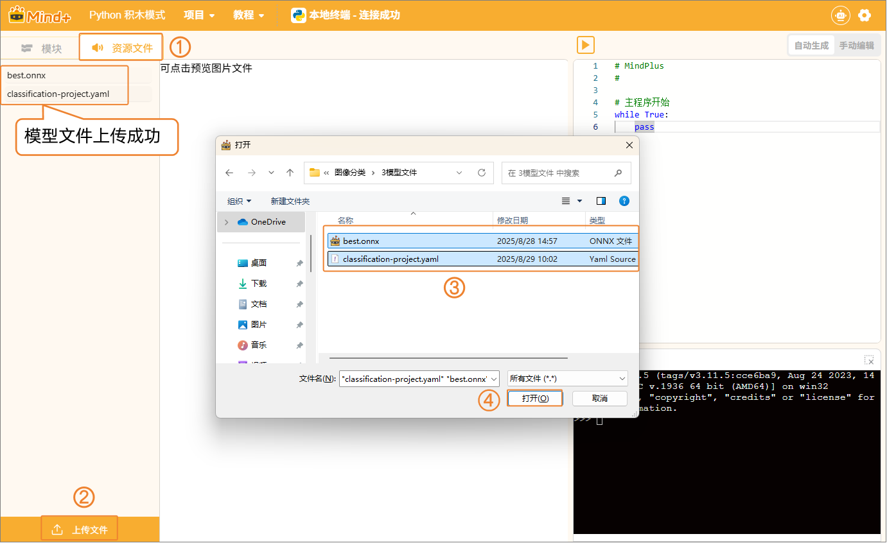

# 4.1.4 模型部署

## 1.功能介绍

模型部署是将训练完成并验证效果的模型，从AI工具箱导出并运行在目标硬件上，实现模型推理应用。通过部署，模型可以对摄像头或传感器采集的数据进行实时推理，生成识别结果，用于驱动硬件设备或智能交互系统，实现AI识别功能的实际应用落地。

模型可部署到多种硬件设备（如PC、边缘计算终端或其他兼容设备），这里我们将重点展示UNIHIKER M10上的部署与推理应用，以便展示模型在终端的实际应用流程。

## 2.模型推理解释

- **模型推理**：指已训练模型在部署后处理新输入数据，并生成预测结果的过程。与训练阶段不同，推理阶段不进行参数更新，只进行计算和预测。
- **推理应用**：将模型推理结果用于实际场景，如优质苹果自动分拣装置、表情识别、商品识别完成自动计价等。

## 3.部署方式

- **本地推理**：在目标设备（如UNIHIKER M10）上直接运行模型，对摄像头或传感器数据进行实时推理。
- **结果联动应用**：根据模型推理输出控制风扇、舵机、水泵、灯光或其他外设，实现智能交互或自动化操作。

## 4.应用价值

- **边缘推理**：在UNIHIKER M10本地完成模型计算，无需依赖云端，响应快速且稳定。
- **智能应用落地**：通过推理结果直接驱动硬件，实现手势控制、表情识别、物体检测等场景。
- **教学与实践**：展示AI模型从训练、部署到推理应用的完整流程，便于理解AI在实际生活中的应用。

## 5.操作流程

> **注意**：以下操作流程主要针对模型校验结果符合预期后的模型导出、推理及应用。关于模型训练的详细步骤，可参考对应的模型操作指南。

### 5.1导出模型

- 当模型的校验结果符合预期后，即可导出模型文件（模型文件以2. 快速开始中的模型为例）。点击“导出模型”将模型导出为ONNX格式的文件和yaml格式的配置文件，选择保存位置并完成模型文件导出。
  - **ONNX** **文件**：用于模型部署和推理。
  - **YAML** **配置文件**：用于记录模型参数及部署配置。

建议将整个模型训练项目保存为项目文件，以便后续优化或调整模型：

- 打开 “快速体验” 菜单，选择 “保存项目”。
- 选择保存路径并点击 确认。
- 后续可通过 “快速体验” → “打开项目”，重新打开已保存的项目文件。

### 5.2 Python模式 - 行空板M10

#### 5.2.1 硬件准备

- 硬件清单

|  |  |  |
| ------------------------------------------------------------ | ------------------------------------------------------------ | ------------------------------------------------------------ |
| [行空板M10（系统版本：0.4.1）](https://www.dfrobot.com.cn/goods-3404.html) | [USB摄像头](https://www.dfrobot.com.cn/goods-2847.html)      | [USB数据线](https://www.dfrobot.com.cn/goods-2977.html)      |

- 硬件连接
  - 请参照下方连接图，完成电脑、行空板与 USB 摄像头的连接：

#### 5.2.2编程环境和扩展准备

- 新建程序设计项目：在程序设计中，选择“Python积木模式”。

- 添加主控：点击“扩展”，在搜索框中输入“行空板”，点击扩展板上的“下载”按钮。下载完成后，点击扩展包完成加载，最后点击“返回”，返回编程界面。

- 连接终端设备：在终端连接选项中，选择“默认-10.1.2.3”以连接行空板。

- 切换Python版本：在终端中输入“python --version”后按“回车键”以检查行空板M10的python环境版本。如果不是指定版本3.12.7，在终端输入“pyenv global 3.12.7”以切换为该版本。

- 行空板网络配置：由于依赖库是要下载到行空板中的，因此，需要先给行空板联网。

- 添加模型训练用户库：点击“扩展”，在搜索框中输入“模型训练”，点击扩展库上的“下载”按钮。下载完成后，点击扩展包完成加载，最后点击“返回”，返回编程界面。

扩展库添加完成后，如果出现下载指定依赖库的提示，按照提示点击“立即下载”即可。

#### 5.2.3模型推理与应用

- 上传模型
  - 将导出的 ONNX 文件及yaml配置文件上传到目标环境或硬件平台。

本项目基于2.快速开始操作示例中训练并导出的模型进行实现。

- 编写程序
  - 当识别到开心表情时，在M10屏幕上显示对应的开心图片以与对应的提示文字；当识别到愤怒表情时，在M10屏幕上显示愤怒的表情与对应的提示文字。
  - 根据实际应用需求，编写调用模型进行推理的程序。

- 运行并验证

| 图像分类结果为：开心                                         | 图像分类结果为：愤怒                                         |
| ------------------------------------------------------------ | ------------------------------------------------------------ |
|  |  |

### 5.3 上传模式 - 行空板K10

- 暂不支持，持续开发中。

### 5.4 实时模式 - 电脑

- 暂不支持，持续开发中。

## 6. 更多模型部署推理应用案例

| 相关模型 | 应用案例                                                     | 案例描述                                                     |
| -------- | ------------------------------------------------------------ | ------------------------------------------------------------ |
| 目标检测 | [商品自动检测与计价装置](https://h7dvigefi0.feishu.cn/drive/folder/XT8wffG7ilCSvOd9blscx8ianve) | 本项目基于目标检测技术，实现商品的自动识别与计价功能。系统通过摄像头实时采集货架或购物篮中的商品图像，利用训练好的目标检测模型识别每个商品的类别与位置，并根据商品信息计算总价格。 |
| 图像分类 | [表情识别驾驶伙伴](https://h7dvigefi0.feishu.cn/drive/folder/NBRnf1qOVlRf77dKb6fcYrD0ntc) | 本项目基于图像分类技术，根据实时检测到的表情给予不同的互动反馈。当驾驶员表现出生气表情时，系统会友善地提醒“别生气，放轻松”，帮助舒缓情绪；当驾驶员展现出开心表情时，系统则会回应“我们来一起唱歌吧！”，为旅途增添轻松与乐趣。 |