## 1. Function Overview

**Model Deploy** involves exporting a trained and validated model from the Mind+ **Model** tool and running it on target hardware to perform model inference. Through deployment, the model can process data collected by cameras or sensors in real time, generate recognition results, and drive hardware devices or intelligent interactive systems, realizing practical AI applications.

Models can be deployed to various hardware devices (such as PCs, edge computing terminals, or other compatible devices). Here, we will focus on deployment and inference on the **UNIHIKER M10**, demonstrating the complete workflow of applying a model on an end device.

## 2. Model Inference Explanation  

- **Model Inference:** Refers to the process in which a trained model, after deployment, processes new input data and generates prediction results. Unlike the training phase, inference does not update parameters; it only performs computation and prediction.
- **Inference Application:** Uses the results of model inference in real-world scenarios, such as automatic sorting of premium apples, facial expression recognition, or automatic pricing after product identification.

## 3. Deployment Methods  

- **Local Inference:** Run the model directly on target devices (e.g., **UNIHIKER M10**) to perform real-time inference on camera or sensor data.
- **Result-Driven Applications:** Control fans, servos, pumps, lights, or other peripherals based on model inference output to enable intelligent interaction or automated operations.

## 4. Application Value  

- **Edge Inference:** Perform model computation locally on the **UNIHIKER M10** without relying on the cloud, ensuring fast and stable response.
- **Practical AI Applications:** Directly drive hardware through inference results, enabling scenarios like gesture control, facial expression recognition, and object detection.
- **Teaching & Practice:** Demonstrates the complete workflow from model training and deployment to inference application, helping users understand AI applications in real life.

## 5. Operation Workflow  

**Note:** The following **Operation Workflow** mainly applies to exporting, inferring, and applying a model after its validation results meet expectations. For detailed steps on **Model** training, please refer to the corresponding **Model Operation Guide**.

###  5.1 Export Model  

- Once the model’s validation results meet expectations, the model files can be exported (using the model in **Quick Start** as an example). Click **Export Model** to export the model as an ONNX file and a YAML configuration file, select the save location, and complete the export process.

- - **ONNX File:** Used for model deployment and inference.
  - **YAML Configuration File:** Records model parameters and deployment settings.

It is recommended to save the entire Model project as a project file for later optimization or adjustment:  

- Open the “Quick Experience” menu and select “Save Project”.
- Choose the save path and click “Confirm”.
- Later, you can reopen the saved project file through “Quick Experience” → “Open Project”.  

### 5.2 Taking the UNIHIKER M10 as an example

#### **5.2.1 Hardware Preparation**

- Hardware List  

|  |  |  |
| ------------------------------------------------------------ | ------------------------------------------------------------ | ------------------------------------------------------------ |
| [UNIHIKER M10（System version：>=0.4.1）](https://www.dfrobot.com/product-2691.html) | [USB Camera](https://www.dfrobot.com/product-2089.html)      | [USB 3.0 to Type-C Cable](https://www.dfrobot.com/product-2171.html)      |

- Hardware Connection  

- - Please refer to the connection diagram below to connect the computer, UNIHIKER M10, and USB camera:

#### 5.2.2 Programming Environment and Extension Preparation  

-  Create a new Program Design project: In Program Design, select **“Python Block Mode”**.  

- Add Main Controller: Click **Extension**, enter “UNIHIKER” in the search box, and click the **Download** button on the expansion board. After the download is complete, click the extension package to finish loading, then click **Back** to return to the coding interface.  

-  Connect the Terminal Device: In the terminal connection options, select **“Default-10.1.2.3”** to connect the UNIHIKER M10.  

- **UNIHIKER M10 network configuration:** Since the dependent libraries need to be downloaded onto the UNIHIKER M10, you must first connect the board to a network.

- **Add Model Training User Library:** Click “Extensions,” enter “Model Training” in the search box, and click the “Download” button on the library. After the download is complete, click the extension package to finish loading, then click “Return” to go back to the coding interface.  

#### 5.2.3 Model Inference and Application  

- Upload Model  

Upload the exported ONNX file and YAML configuration file to the target environment or hardware platform.
This project is implemented based on the model trained and exported in the **Quick Start** example.  

- Programming  

When a happy expression is recognized, display the corresponding happy image and prompt text on the UNIHIKER M10 screen; when an angry expression is recognized, display the angry expression and corresponding prompt text.

Write a program to call the model for inference according to the actual application requirements.  

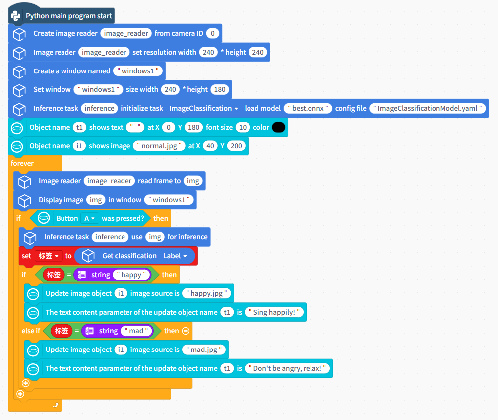

- Run and Validate

| The Image Classification result is: Happy                    | The Image Classification result is: Angre                    |
| ------------------------------------------------------------ | ------------------------------------------------------------ |
|  |  |

### 5.3 Taking the Huskylens 2 as an example
#### 5.3.1 Model Deploy

!!! Note "Note" 
    This hardware currently only supports **Object Detection**, which requires an internet connection for conversion.

Once model training is complete, click "Deploy to HUSKYLENS 2".

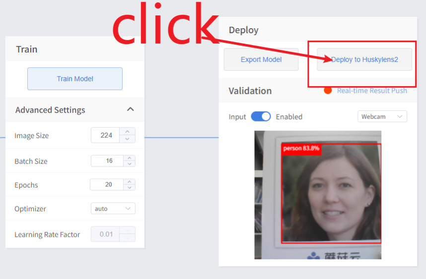

- Step 1: Select an icon  

First, choose an appropriate icon for your model application. Several pre-selected icons are provided here; you can select your preferred icon from the previews, or click `+` to upload any custom icon image. We recommend using PNG images with transparent backgrounds, white-line icons, and a resolution of 60*60 pixels.  

- Step 2: Enter App name and Title  

!!! Tip
    **Naming Restrictions:** For Erha Image Recognition 2 system versions <1.2.0, Chinese characters are not currently supported in model names.

    Names cannot contain the following characters:

    <TEXT>

    \ / : * ? " < > |

Set the App Name and Title based on the model's functionality. For example, if you want to use this model for supermarket product recognition, set App Name and Title to `Product Recognition`.  

- Step 3: Click Start Conversion  

Click "Start Conversion" to begin the process.

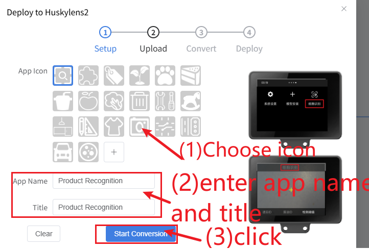

Wait for the message "model converted successfully" to appear, then click "Download to Computer".

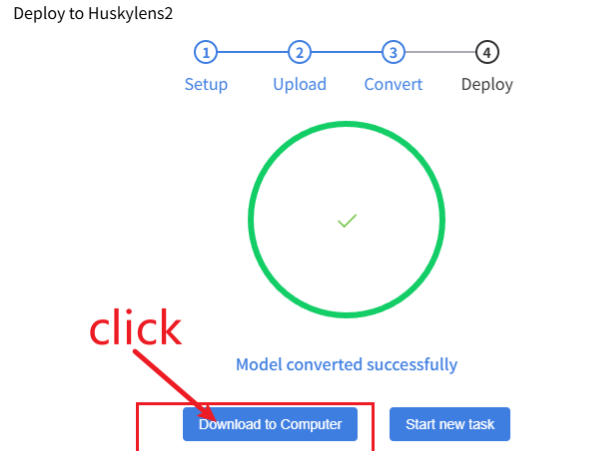

Save the converted model compressed file to your computer.

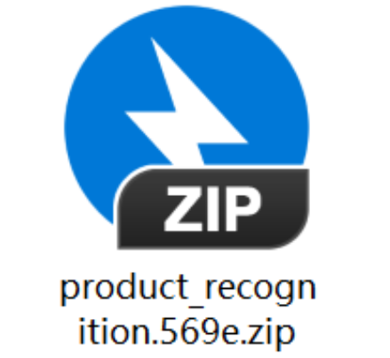

#### 5.3.2 Hardware Preparation 

| 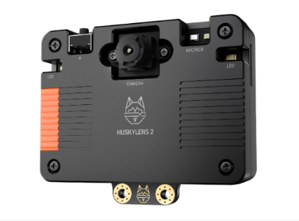 | 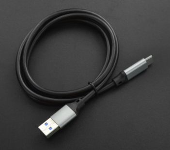 |
| ------------------------------------------------------------ | ------------------------------------------------------------ |
| [Huskylens 2 （System version：>=1.1.6）](https://www.dfrobot.com/product-2995.html) |  [USB 3.0 to Type-C Cable](https://www.dfrobot.com/product-2171.html)      |

Connect your computer to HUSKYLENS 2 using a Type-C cable. Once connected, a disk named `Huskylens` will appear on your computer.

Copy the generated model ZIP file to the following directory on the `Huskylens` disk:`\storage\installation_package`

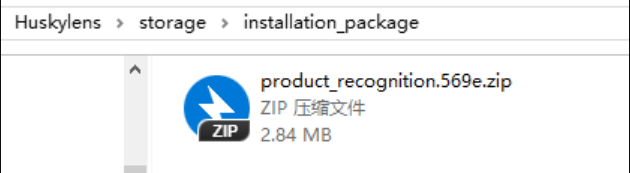

#### 5.3.3 Model Installation
Tap the HUSKYLENS 2 screen to wake it up (if the screen is off), then navigate and tap to enter the `Model Installation` menu.

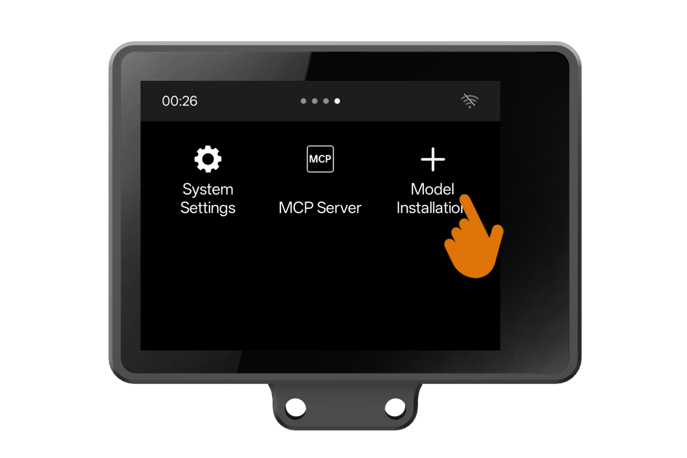

Select "Local Installation" from the menu. After a successful installation, the screen will display the interface shown in the diagram below.

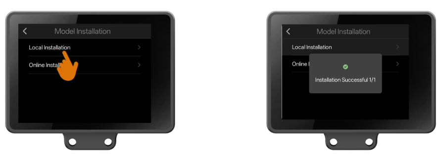

At this point, observe the HUSKYLENS 2 screen—if a new function named "Product Recognition" appears, it indicates that we have successfully imported the self-trained model into HUSKYLENS 2.

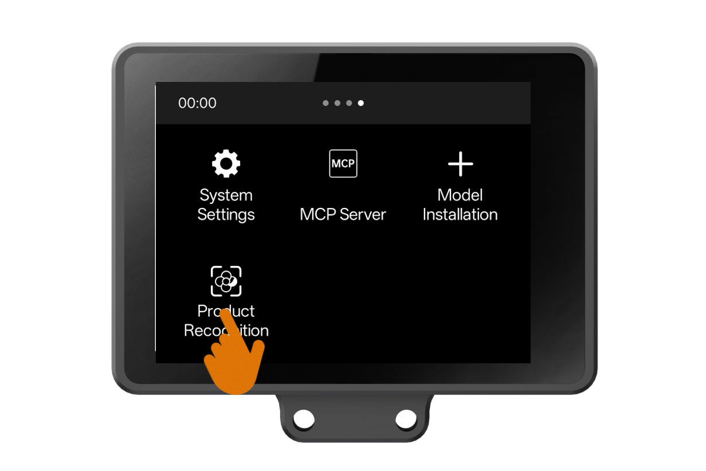

You can tap to enter the "Product Recognition” function and observe the recognition effect of the self-trained model.

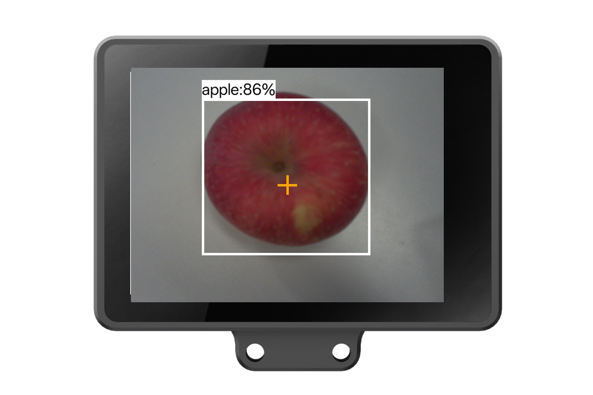

<!-- ## 6. More Model Deployment and Inference Application Cases

| Related Model        | Application Case                                             | Case Description                                             |
| -------------------- | ------------------------------------------------------------ | ------------------------------------------------------------ |
| Object Detection     | Automatic Product Detection and Pricing Device               | This project uses object detection technology to automatically recognize and price products. The system captures real-time images of items on shelves or in shopping baskets through a camera, identifies each product’s category and location using a trained detection model, and calculates the total price based on product information. |
| Image Classification | [Emotion Recognition Driving Companion](https://h7dvigefi0.feishu.cn/drive/folder/E0zXfpt63lghKpdKceoc5NWanJe) | This project leverages image classification to provide interactive responses based on real-time facial expressions. When the driver shows an angry expression, the system gently reminds, “Don’t be upset, take it easy.” When the driver smiles, it cheerfully responds, “Let’s sing together!”, creating a relaxed and enjoyable driving experience. | -->