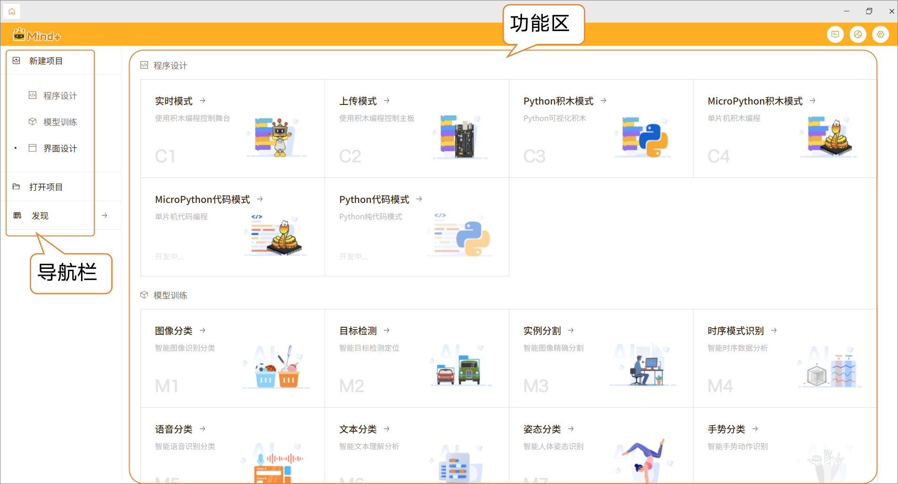
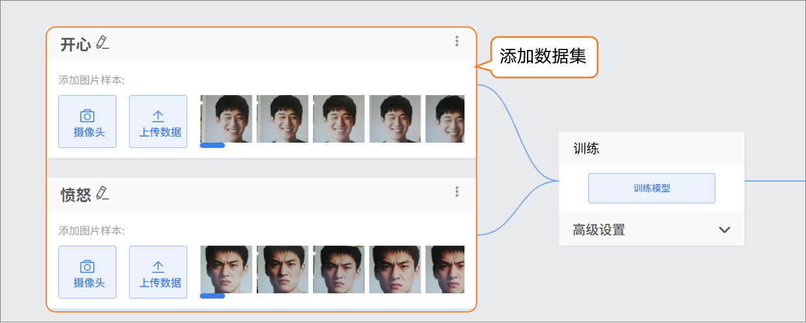
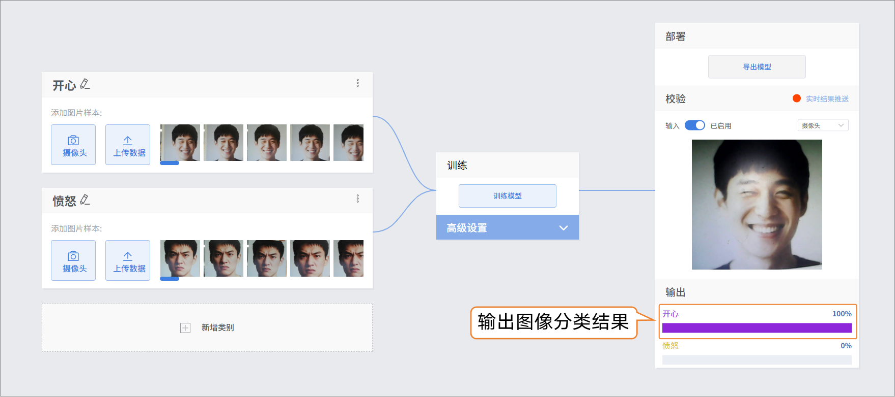

# 4.1.2 快速开始

## 1.快速预览

重构后的Mind+主界面采用左侧导航栏+右侧功能区的布局，分区清晰、操作直观，方便用户快速创建和管理项目。整体设计简洁明了，以卡片式展示为主，各功能入口清晰可见。

- 界面特点
  - 卡片式布局：各功能模块独立展示，配有图标和简要说明，直观易懂。
  - 图标可视化：图标形象直观，帮助用户快速理解功能用途。
  - 清晰分类：程序设计、模型训练和数据可视化面板分区明显，便于用户快速选择。

## 2.操作示例

示例操作以“图像分类”为案例，演示模型训练的基本流程，帮助用户快速上手体验。

- 新建项目

- 添加数据集

- 训练模型

- 模型校验

