# 4.1.5 实时结果推送

## 1.功能介绍

实时结果推送是另一种模型部署方式。不同于将模型导出到硬件端运行，实时结果推送是在平台端完成推理，并将预测结果即时传输到SIoT平台或外部设备。通过这种方式，用户无需在本地或硬件中加载完整模型，也能直接体验模型在实际应用中的效果。

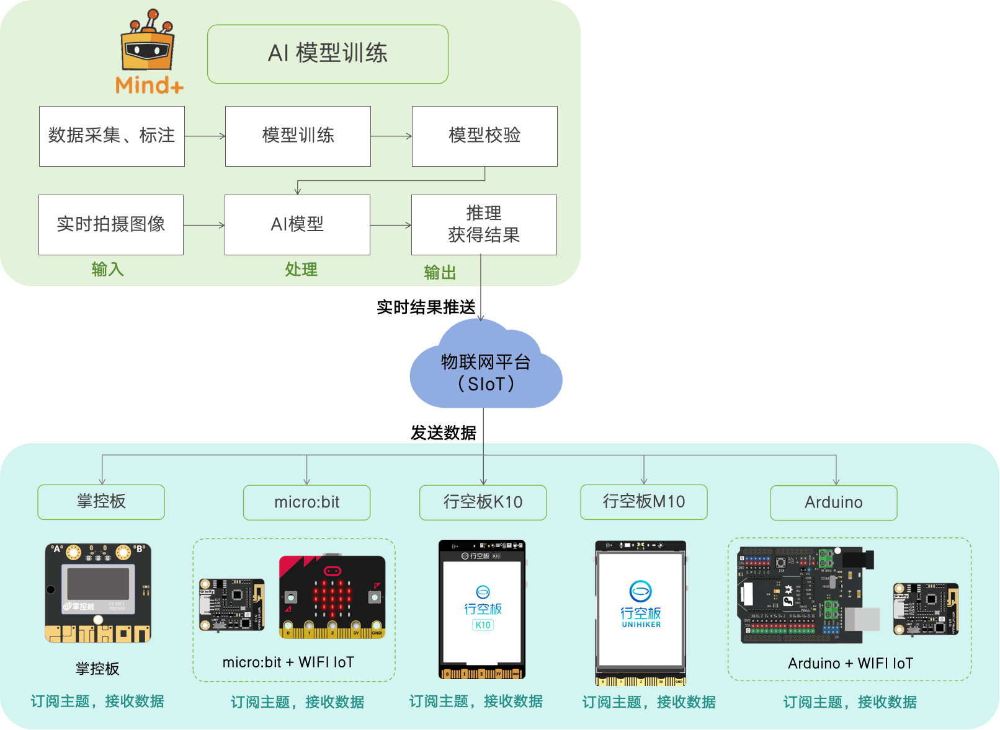

**功能特点**

- **轻量化**：硬件无需承担推理运算，只接收平台推送的结果，降低设备端性能要求。
- **实时性**：模型输出会即时推送，方便进行交互与快速验证。
- **灵活性**：可与不同终端联动，如可视化面板、智能小车或IoT设备。
- **易用性**：不需要复杂的部署操作，适合教学实验和快速原型开发。

## 2.应用场景

- **教学演示**：学生能够直观观察模型识别效果，并与硬件互动。
- **原型验证**：在项目初期快速验证模型可行性，而无需等待完整部署。
- **IoT** **联动**：与智能硬件结合，例如识别结果触发小车运动或灯光控制。
- **数据展示**：在平台或终端实时显示推理结果，便于分析与展示。

## 3.操作流程

重点演示在UNIHIKER K10上进行图像分类实时结果推送的操作流程与具体步骤。

以下操作流程主要针对模型校验结果符合预期后实时结果推送。关于模型训练的详细步骤，可参考对应的模型操作指南。

### 3.1硬件清单

- 硬件准备

|  |  |
| ------------------------------------------------------------ | ------------------------------------------------------------ |
| [UNIHIKER K10](https://www.dfrobot.com.cn/goods-4014.html)   | [USB数据线](https://www.dfrobot.com.cn/goods-2977.html)      |

- 硬件连接

### 3.2环境准备

实时结果推送依托MQTT进行无线网络传输，因此需要输入计算机的实际IP地址。操作流程如下：首先启动数据传输工具（运行.bat批处理文件），然后获取计算机的 IP 地址。

运行过程中不能关闭传输工具。

- SIoT工具下载连接：
  - 腾讯微云下载（推荐）: 链接: https://share.weiyun.com/6SFhgLQj
  - 百度云盘下载： 链接：https://pan.baidu.com/s/17clVjJXWTZh02FteKy3mcA?pwd=mind 提取码：mind
  - 阿里云盘下载： https://www.aliyundrive.com/s/tCqwJwGtZzL 提取码: 3h4x
  - 谷歌云盘下载： 链接： [点击下载](https://drive.google.com/drive/folders/16Lf0itQ-v2oZrUJEFHrOhjfgS68eN6bn?usp=sharing)

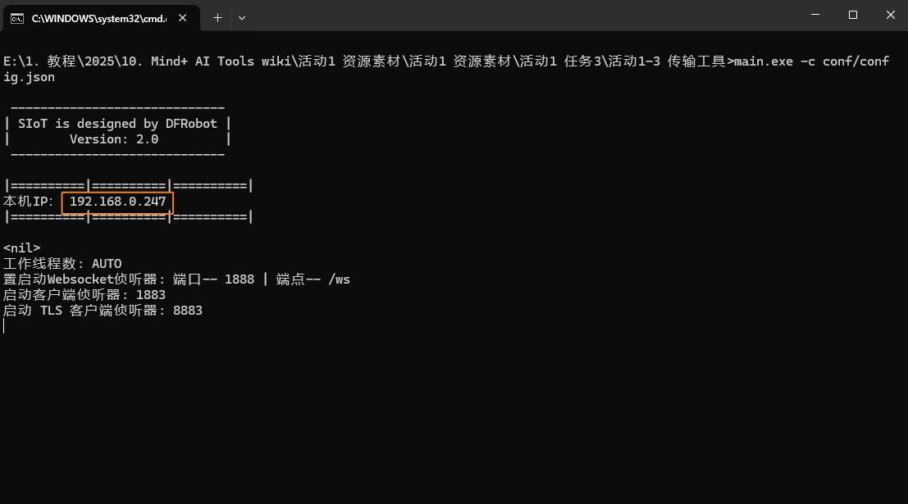

### 3.3实时结果推送应用

- 实时结果推送
  - 当模型校验完成并满足要求后，点击“实时结果推送”。在“实时推送服务器设置”中，将MQTT服务器地址修改为本机 IP 地址（可在数据传输工具中查看）。

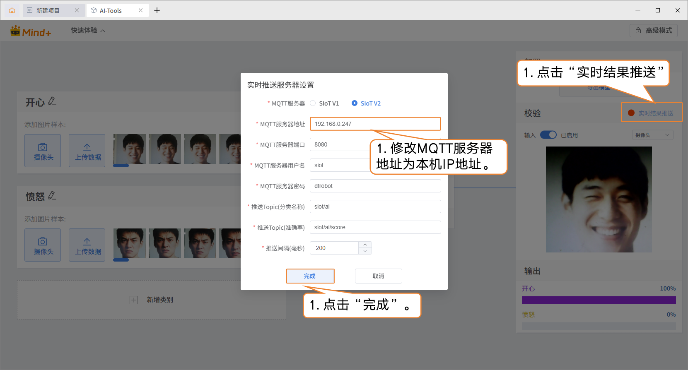

- 服务器连接成功后，实时结果推送的按钮变为绿色。

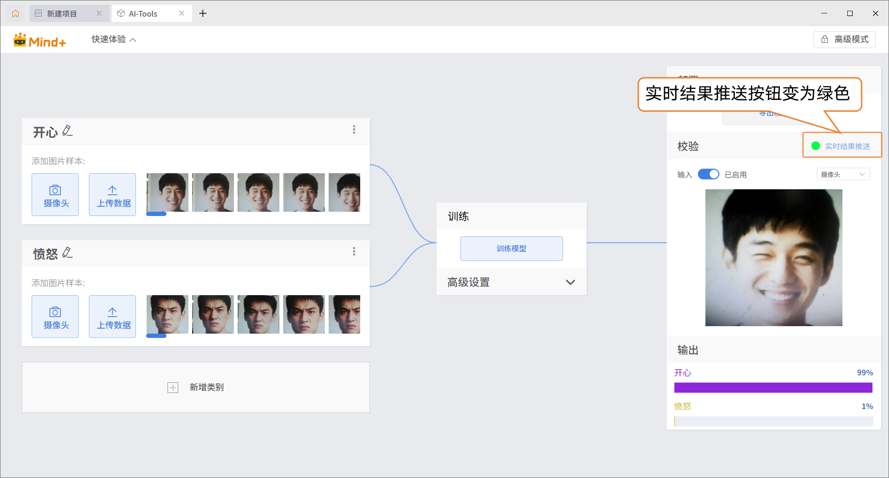

- 编写程序
  - 添加主控：点击“扩展”，在“主控扩展”中，下载“行空板K10”并添加。

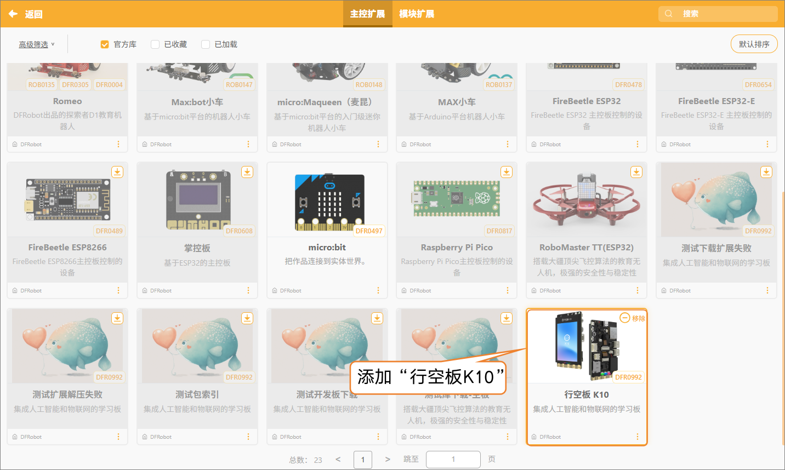

- 添加扩展库：点击“扩展”，在“扩展库”的搜索框中分别输入“Wi-Fi”、“MQTT”下载后并添加。

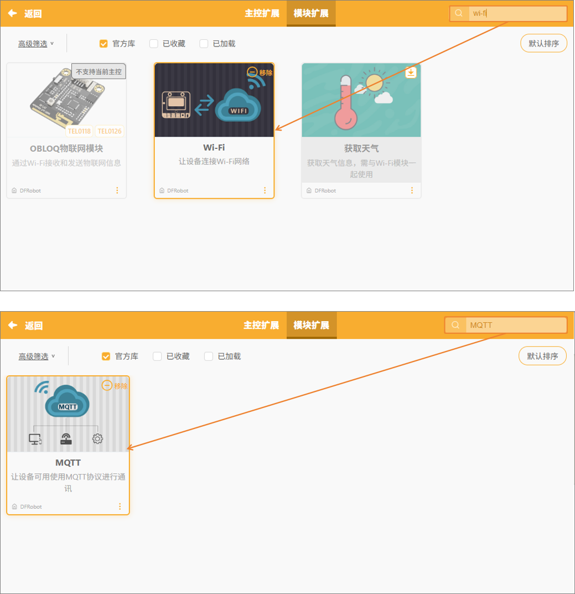

- 程序示例

 接收实时结果推送到MQTT上的消息，并分析MQTT消息。如果MQTT消息为开心，UNIHIKER K10上的RGB灯显示为黄灯；接收到MQTT消息为愤怒，UNIHIKER K10上的RGB灯显示红灯。

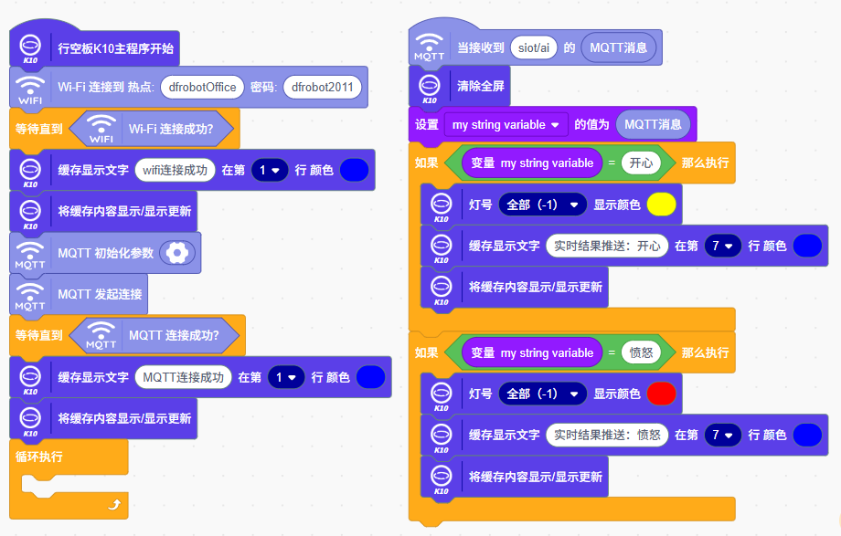

- 测试与运行

| 实时结果推送                                                 | UNIHIKER K10执行效果                                         |
| ------------------------------------------------------------ | ------------------------------------------------------------ |
| 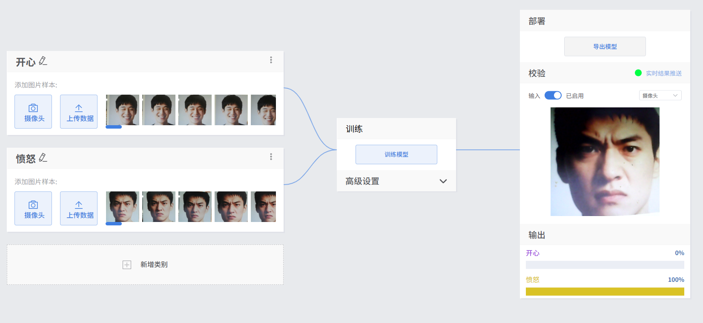 | 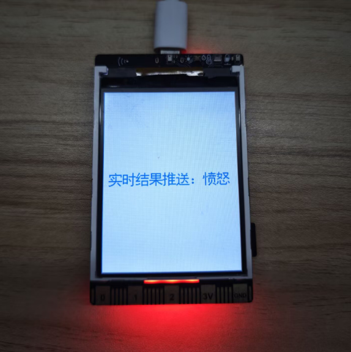 |
| 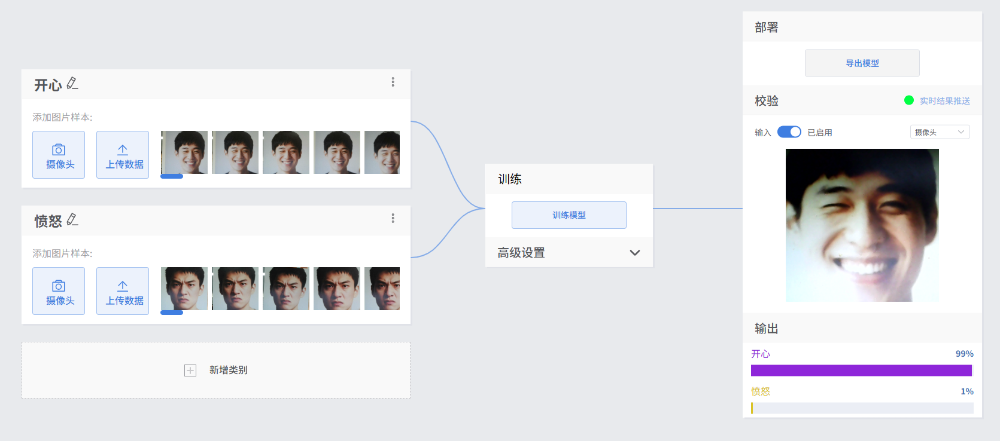 | 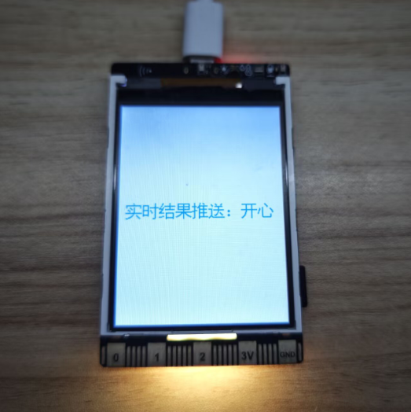 |

## 4.更多实时结果推送应用案例

| 模型     | 应用案例                                                     | 案例描述                                                     |
| -------- | ------------------------------------------------------------ | ------------------------------------------------------------ |
| 姿态分类 | [人脸追踪摇头风扇](https://h7dvigefi0.feishu.cn/drive/folder/ZZEJfHGOPlTLsJdM1PRc0CUin5d) | 这个项目实现了一款能够实时检测人脸关键点并自动跟随人脸位置转动的智能风扇。它不仅能像普通风扇一样持续送风，还能根据人脸位置智能调整方向，从而实现随人移动的精准送风。 |

- 实时结果推送是一种高效的模型应用方式，可将推理结果通过网络实时传输到指定平台或设备。除了示例中的UNIHIKER K10主控板外，该功能同样适用于UNIHIKER M10、micro:bit、Arduino、掌控板等多种主控板，甚至能够直接运行在实时模式下，实现跨硬件的数据交互与结果展示。
- 如需进一步学习，可前往[SioT使用教程](https://mindplus.dfrobot.com.cn/siot)查看详细说明。
- 特别提示：当主控板为micro:bit与Arduino时，需要搭配硬件OBLOQ物联网WiFi模块一起使用。