# 【图像分类】 专业模式

本项目以“交通转向标志识别”为案例，带领用户学习如何在专业模式下完成图像分类任务。通过该案例，用户不仅能掌握基本流程（数据设置、数据标注、模型训练），还可以深入体验专业模式中的进阶功能，如自定义训练参数、观察训练曲线、调整数据增强策略，从而更精细地控制模型的训练过程并提升模型性能。

模型训练完成后，系统能够对新图像中的交通转向标志进行准确识别，实现对交通转向标志的自动检测与分类。

- **效果：** 模型能够准确识别图片或摄像头实时画面中的交通转向标志，并标注类别名称（如左转、右转、直行等），同时显示预测置信度。
- **效果展示：**

### 模式切换

- 打开Mind+，在菜单栏中选择 “新建项目”，然后点击 “模型训练”。在训练选项中找到 “物体分类（M1）” 并点击，即可完成项目创建。

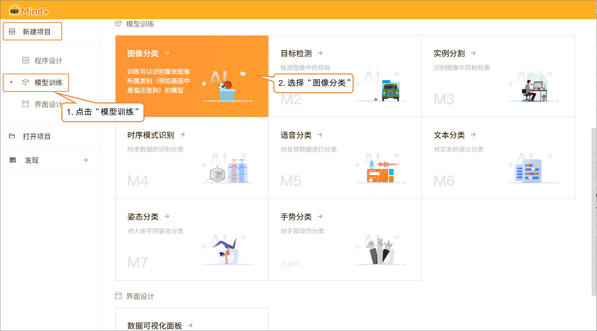

- 在界面右上角点击 “专业模式” 以切换模式。切换成功后，菜单栏将新增以下功能模块：数据设置、标注设置、模型训练、模型校验和模型部署。

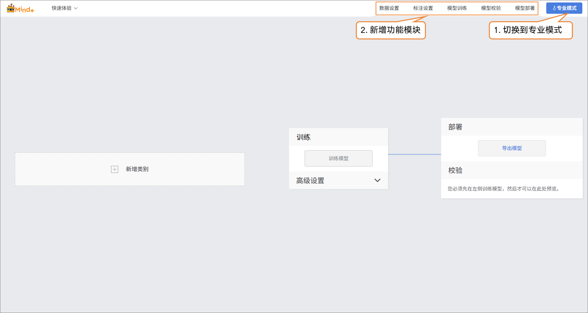

### 数据设置

- 切换到 “数据设置” → 点击左上角 “创建数据集”，例如创建一个名为交通标志识别的数据集。

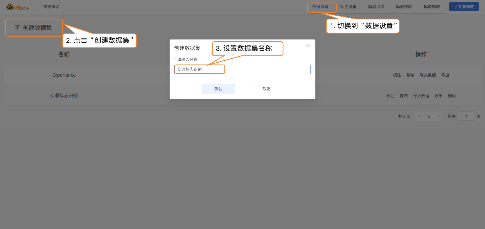

- 切换到专业模式后，数据集列表中会默认显示一个 “Experience” 数据集，该数据集由快速体验模式生成。用户可以对新建数据集执行以下操作：标注、复制、导入数据、导出以及删除。
  - 注意：默认数据集不可删除。

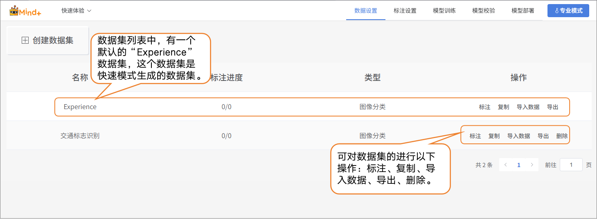

- 接下来，为新建的交通标志识别数据集执行 “导入数据” 操作。系统支持两种导入方式：有标注数据和无标注数据。
- 导入方式1：无标注数据导入
  - 适用于仅上传原始图片的情况（如直行、左转、右转等交通标志混合在一起的图片，且每种类别图片数量不低于20张）。
  - 操作步骤：选择导入类型为 “无标注数据” → 点击 “点击上传” → 从本地选择图片 → 点击“确认”完成导入。

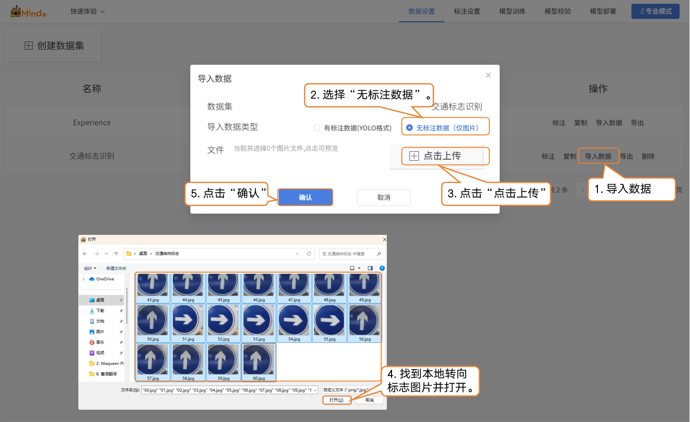

- 导入方式2：有标注数据
  - 直接上传 YOLO 格式的已标注数据（.zip 压缩包）。
  - 按照平台要求组织文件夹结构，上传后无需手动标注，直接跳转到模型训练。
  - 注意：有标注数据的分类名称需使用英文，否则上传后标签可能出现乱码。

### 标注设置

- 转向标志图片导入成功后，标注进度栏会同步显示已导入的图片数量及对应的标注数量。

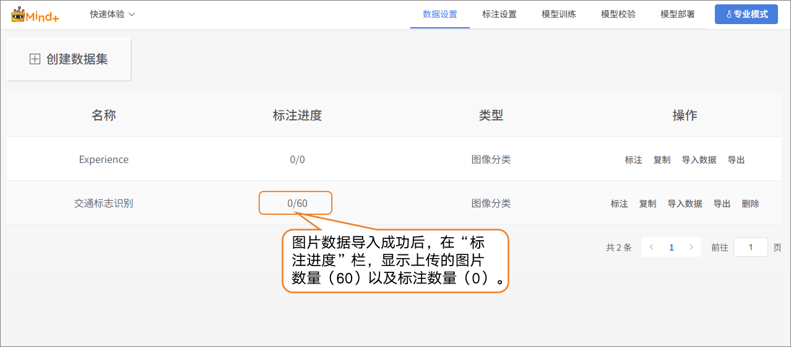

- 在“操作”栏中点击 “标注”，进入交通标志的标注设置界面。

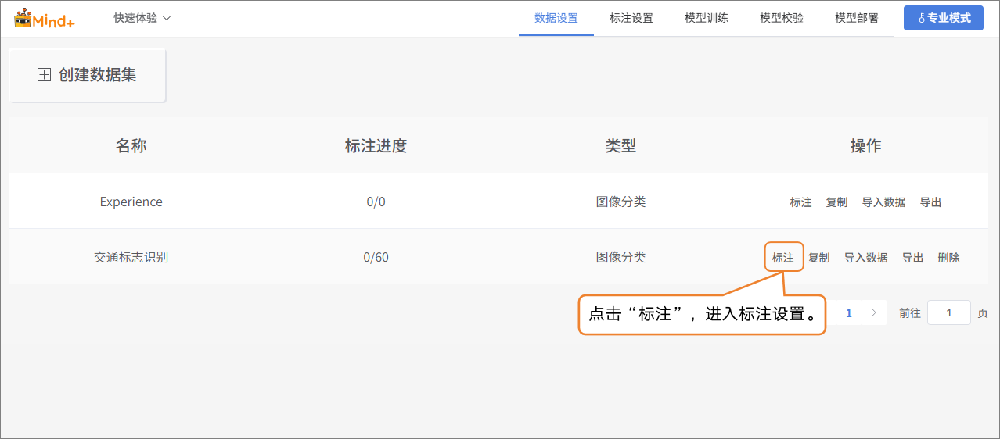

- 按照界面提示完成标签创建（左转、右转、直行），用于标注不同类别的交通标志。

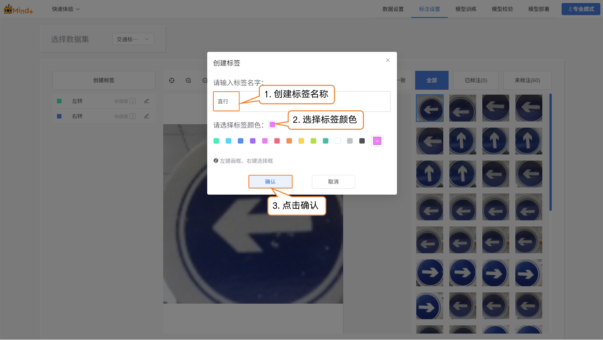

- 接下来，在界面最右侧的图片区，对图片逐张标注：
  - 左转标识→点击“左转”标签
  - 右转标识→点击“右转”标签
  - 直行标识→点击“直行”标签
- 标签标注完成后，图片右下角会显示蓝色√，标注的结果会显示在标注结果栏中。

注意：所有图片都需要进行标注。

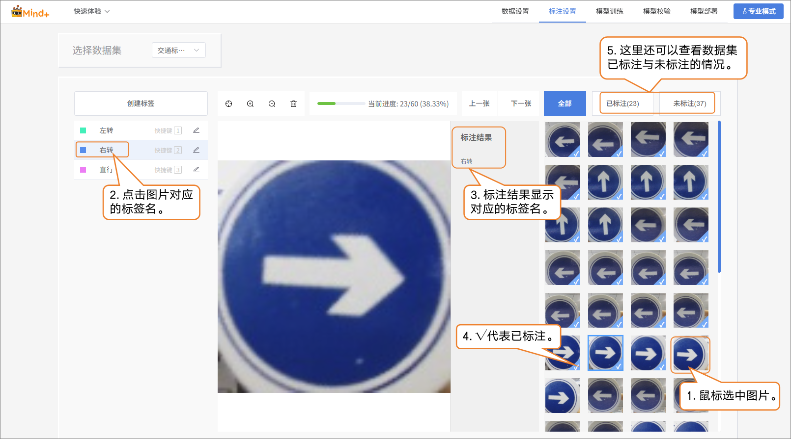

### 模型训练

- 所有图片都标注完成后，切换到“模型训练”功能模块。

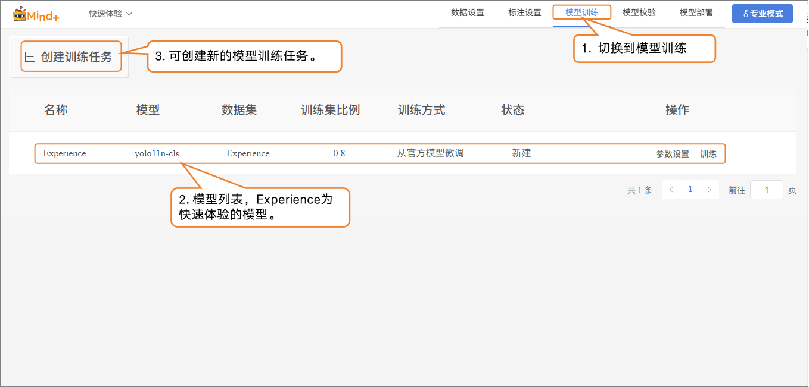

- 点击 **“创建训练任务”**，在弹出的窗口中进行如下设置：
  - **名称**：交通标志识别模型（根据需求自行命名）
  - **模型**：根据自己需求进行选择（也可保持默认）
  - **训练类型**：根据自己需求进行选择（也可保持默认）
  - **数据集**：交通标志识别（在数据设置中，我们已创建并命名数据集 **交通标志识别**；在标注设置中，也完成了图片的标注与整理。至此，数据已具备训练所需的完整结构。接下来进入模型训练阶段，系统将基于该数据集对图片进行特征提取与模式学习，从而逐步具备对转向标志进行分类识别的能力。所以，这里的数据集必须选择交通标志识别。）
  - **训练比例**：根据自己需求进行选择（也可保持默认）

| **创建任务参数** | **作用**                                               | **说明**                                                     |
| ---------------- | ------------------------------------------------------ | ------------------------------------------------------------ |
| 名称             | 仅用于区分和管理不同的训练任务，不会影响模型性能。     | 相当于给这次实验取一个名字，方便后续查看和比较。             |
| 模型             | 决定使用哪一种神经网络结构来训练。                     | 不同的模型有不同的“学习方式”和“理解能力”。比如，有的模型适合处理小型数据集，有的模型更适合复杂的分类任务。 |
| 训练类型         | 确定训练的方式，比如是 **分类**、**回归** 还是 **检测**。 | 告诉模型“你要学会干什么”。                                   |
| 数据集           | 告诉模型要从哪些数据中学习。                           | 相当于教材，模型会从这个数据集的图片和标签里，学习如何识别不同交通标志。 |
| 训练比列         | 决定数据集中多少比例用来训练，多少比例用来验证。       | 训练集 = 模型学习用的例子验证集 = 检查模型学习效果的例子（模型没见过的图片） |

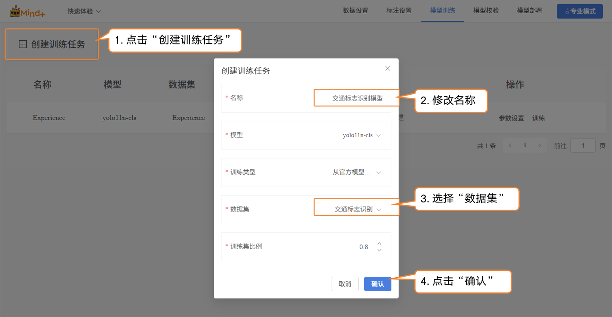

- 模型训练任务创建成功后，点击“参数设置”进入训练参数配置界面。你可以根据需求调整参数，也可以直接使用默认设置开始训练。
  - 基础参数设置：图片大小、批次大小、训练轮次
  - 高级参数设置：保存频率、随机上下翻转概率、随机左右翻转概率、优化器等

| 高级参数     | 说明                                                         | 说明                                                         |
| ------------ | ------------------------------------------------------------ | ------------------------------------------------------------ |
| 保存频率     | 指训练时模型保存的间隔，防止训练过程中意外中断导致数据丢失。 | 保存频率 = 5 → 每 5 轮训练保存一次模型。保存频率 = -1 → 不自动保存，只留最后一个模型。 |
| 随机上下翻转 | 指对图像进行数据增强时，系统会随机决定是否把图像沿着水平中轴线（上下方向）翻转，让模型学会识别不同方向的图像。 | 概率 = 0 → 永远不会翻转（等于没开启这个增强）。一只猫的照片，随机上下翻转后就是头朝下、脚朝上的样子。对于一些任务（比如人脸识别），上下翻转可能会破坏特征，所以一般要根据实际任务决定要不要用。 |
| 随机左右翻转 | 指对图像进行水平翻转，就是镜像处理。                         | 概率 = 0 → 永远不会翻转。一只猫的照片，左右翻转后变成猫从左往右变成从右往左。这个操作在很多图像分类和目标检测任务里非常常见，比如识别猫狗、人、车辆等。 |

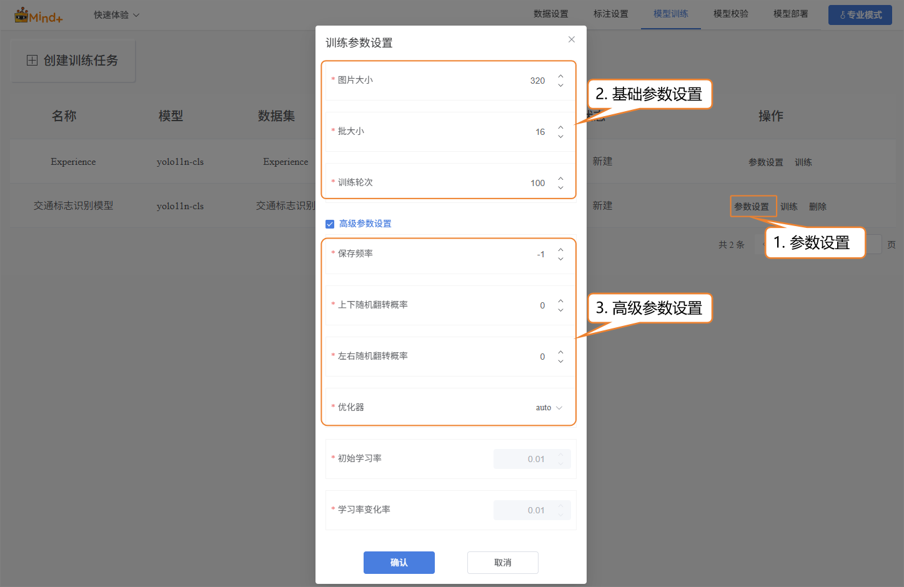

- 点击“训练”，开始进行模型训练。

- 模型训练完成后，可在操作栏对已训练的模型执行删除、导出和查看训练结果等操作。

### 模型校验

- 切换到“模型校验”功能模块，选择训练项目为：交通标志识别模型；选择模型为：best.pt。其余参数根据需求进行设置，直接使用默认参数也可以。

| **文件** | **保存时机**                       | **代表意义**       | **使用场景**  |
| -------- | ---------------------------------- | ------------------ | ------------- |
| last.pt  | 训练过程中的最后一次保存的模型     | 训练完成的最终状态 | 继续训练/微调 |
| best.pt  | 训练过程中在验证集上表现最好的模型 | 模型验证性能最佳   | 测试/部署     |

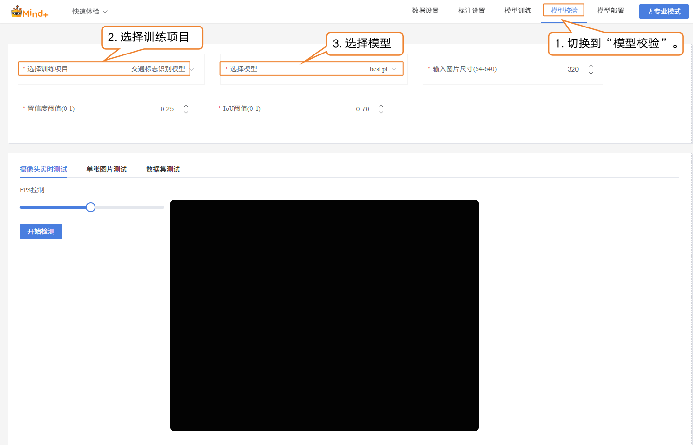

- **模型校验支持两种方式：** 摄像头实时测试、单张图片测试。
  - **摄像头实时测试：** 通过摄像头实时识别转向标志。

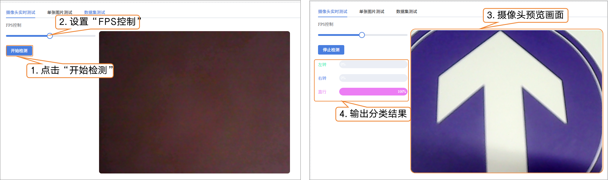

- **单张图片测试：** 上传一张图片进行识别验证。

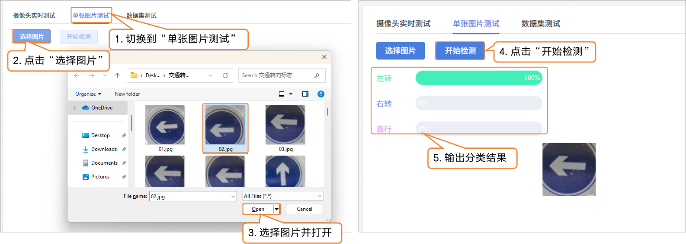

如果对模型效果不满意，可以在“模型训练”功能模块中，重新创建任务，调整参数后再次训练模型，以进一步提升识别效果。

### 模型部署

- 当模型测试结果符合需求时，切换到 “模型部署”功能模块：
  - 可根据需求导出、转换或上传模型。
  - 平台支持导出为 ONNX 格式，便于在其他应用环境或硬件设备中使用。

**如需了解模型部署及实时结果推送的操作方法，可访问以下进行学习**

- [4.1.4 模型部署](/AITools/Basic_description/model_deployment/model-deployment) 

- [4.1.5 实时结果推送](/AITools/Basic_description/real_time_push/real-time-push) 

### 常见问题

| **常见问题**                           | **导致的原因及解决方法**                                     |
| -------------------------------------- | ------------------------------------------------------------ |
| 训练完成的模型识别率不高               | 可能原因：数据标注不完整或错误标注遗漏、图片标签标注错误解决方法：仔细检查每张图片的标注，确保所有图片都完成标注且标签正确。 |
| 在数据设置中，导入数据失败或格式不匹配 | 可能原因：无标注数据导入时图片格式不符合要求；有标注数据导入时 YOLO 格式不规范。解决方法：提前整理好图片和标注文件，严格按照平台要求的格式上传。 |
| 默认数据集不可删除导致混淆             | 可能原因：Experience 数据集不可以删除，会导致标志设置时，忘记选择数据集。解决方法：在标注设置、模型训练、模型校验时，一定要选择对的数据集。 |
| 摄像头实时测试识别不准确               | 可能原因：光照、角度或背景复杂导致模型无法准确识别。解决方法：尝试在光照均匀、角度正对标志的环境下测试，或增加训练数据增强。 |
