### 图像分类-快速体验

图像分类的快速体验操作步骤以**“猫狗识别”**案例为例，带领大家学习图像分类模型的训练流程。该案例主要演示图像分类在实际应用中的效果：模型不仅能够识别图片中的猫或狗，还能对摄像头实时采集的画面进行分类，帮助用户直观理解图像分类的基本原理与应用价值。

- 效果：通过摄像头或上传图片，可以看到每张图片或实时画面被识别为“猫”或“狗”，屏幕上同步显示预测标签和对应置信度，直观展示模型分类能力。
- 效果展示：

图像分类模型训练实现过程分为五个步骤：

- **新建项目** —— 创建图像分类项目并准备数据集；
- **新增类别** —— 添加待识别的分类标签（如“猫”“狗”），并通过摄像头采集（或上传本地）对应的图像数据集；
- **训练模型** —— 通过平台训练得到图像分类模型；
- **模型校验** —— 测试模型效果。
- **模型部署** —— 模型训练完成后，可以将其导出并部署到硬件设备，实现本地运行与应用。同时，用户还可以选择将模型的识别结果进行实时推送，便于远程监测与管理。

### 步骤1：新建项目

- 打开 Mind+，在菜单栏中选择 “新建项目”，然后点击 “模型训练”。在训练选项中找到 “图像分类（M1）” 并点击，即可完成项目创建。

- 项目创建成功后，会跳转到新的图像分类快速体验界面。

### 步骤2：新增类别

- 点击 “新增类别” 按钮，即可为图像分类任务添加所需的类别。用户可以根据项目需求，添加多个类别，用于后续的数据采集与模型训练。

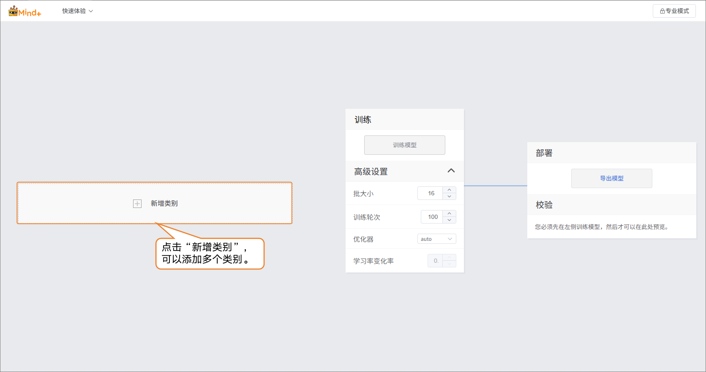

- 类别创建成功后，可以通过两种方式添加图片样本：
  - **摄像头采集**：适合现场拍摄，快速获取实时图像，方便在实验过程中直接收集数据。
  - **本地上传**：适合导入已准备好的图片素材，便于批量添加和管理现有数据。
- 通过这两种方式，用户能够灵活地构建数据集，为后续的模型训练做好准备。

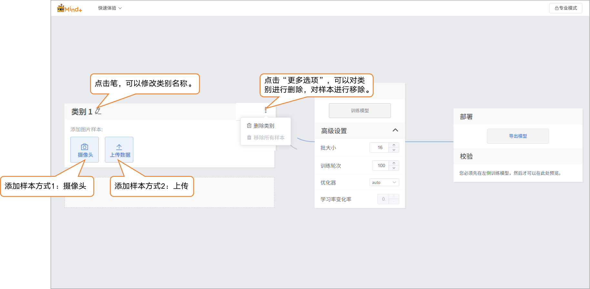

- 样本添加方式1：摄像头采集
  - 点击摄像头，将摄像头对准目标，可通过预览框，查看摄像头采集到的画面是否有效，按“录制”进行样本采集。图片样本采集完成后，点击“×”退出采集画面。
  - 注：如果台式机没有摄像头，可通过外接USB摄像头。
  - 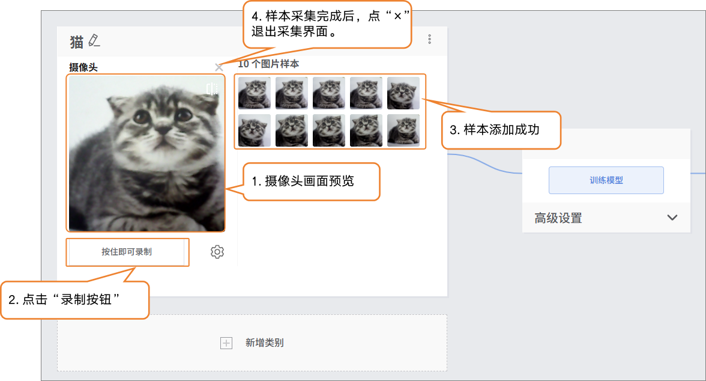

  - 在采集样本数据时，可通过“设置”按钮，设置摄像头的采集帧率（每秒采集的图片数，数值越高采集越快）。
  - 注意：FPS太高，采集的画面差异过小，对训练的用处不是很大。
  - 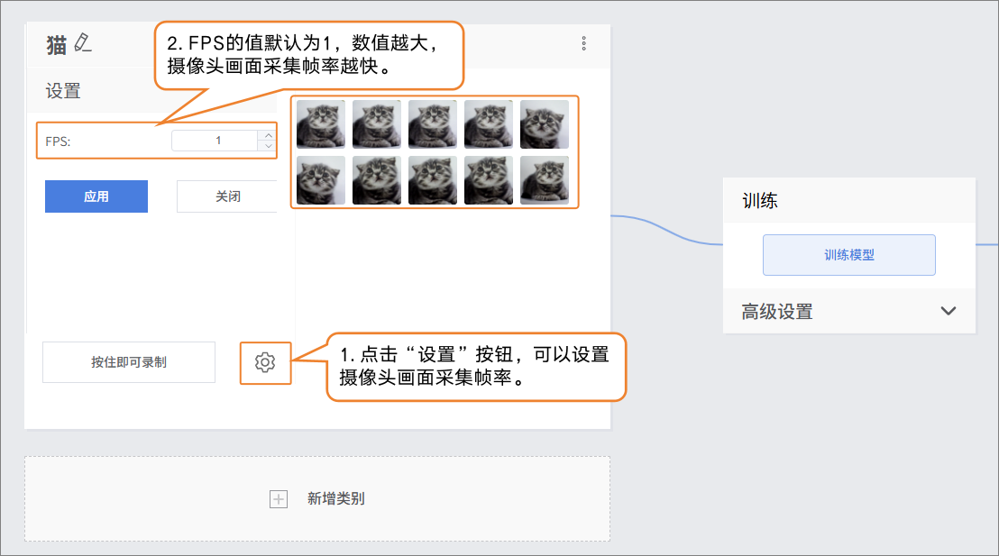
- 样本添加方式2：本地上传
  - 点击“新增类别”，新建另一类别（如“狗”）→ 点击 “选择文件上传”，选择电脑本地图片批量导入。

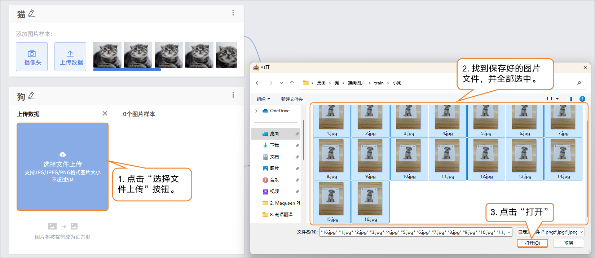

> 数据样本小提示：
>
> - 每个数据类别可准备20-50张多样化图片（不同角度、光照、背景），类别间数量尽量平衡。
> - 建议你给类别起个简洁的名字，比如‘猫’、‘狗’，不要用太复杂的符号或过长的名称。

### 步骤3：训练模型

- 在训练模型前，点击“高级”设置训练参数，批次大小、训练轮次、优化器。

| 参数     | 参数说明                                                     | 类别说明                                     | 推荐设置                                       |
| -------- | ------------------------------------------------------------ | -------------------------------------------- | ---------------------------------------------- |
| 批次大小 | 一次送入模型里训练的数据样本数量。当数据很多时，一次把数据都送进去，计算机算不过来，因此就分成一批一批来学习。例如，默认批大小为16，每次训练用16张图片。 | 每次学习多少内容                             | 批次大小：16（默认即可）                       |
| 训练轮次 | 所有训练数据完整地送入模型学习一遍，叫做一轮。学习一遍可能会不够牢固，要重复多次训练才能记住规律。例如，默认训练轮次为100，模型会将数据集从头到尾学习100遍。推荐训练轮次为20次以上。 | 学几遍                                       | 训练轮次：20（小数据集可以将训练轮次适当减小） |
| 优化器   | 优化器时用于决定模型在训练过程中如何更新参数，也就是每次学习之后，要往哪个方向走，走多少步。优化器决定了模型训练的效率和效果。 | 学习的方法（死记硬背？归纳总结？举一反三？） | 优化器：auto（默认即可）                       |

- 完成训练参数设置后，点击 “训练模型” 即可开始训练（若不做设置，也可直接使用系统默认参数）。

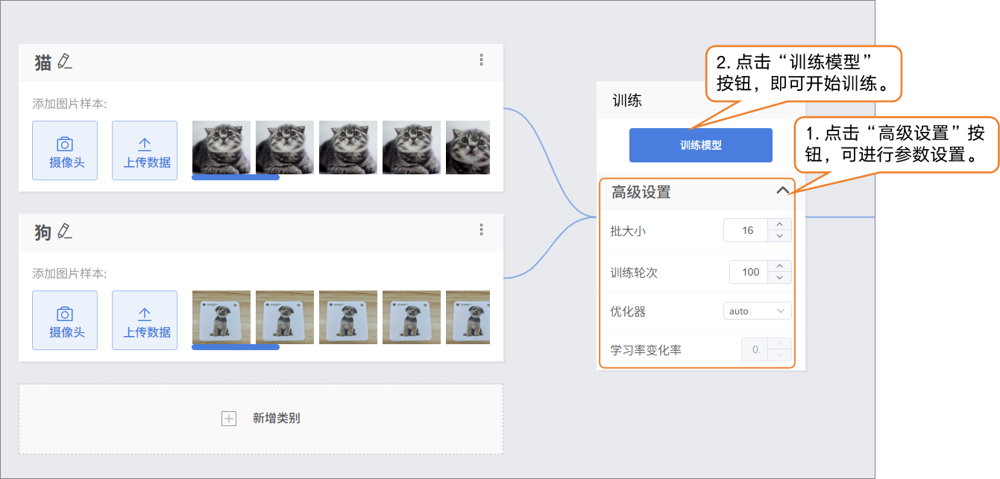

- 在训练模型过程中，可通过点击“深入了解”按钮，查看训练监测相关数据。
  - 训练损失（train loss）：训练损失是模型在**训练数据**上的预测误差，损失越小，说明模型对训练数据的预测越准确。
  - 验证损失（val loss）：验证损失是模型在验证数据（未用于训练的数据）上的预测误差，验证损失持续下降，模型泛化能力在提升。
  - 准确率1（accuracy top 1）：模型预测的概率最高的类别与真实标签一致的比例。图片真实类别是“猫”，模型预测概率最高的类别也是“猫”，则算作正确。
  - 准确率5（accuracy top 5）：模型预测概率排名前五的类别中包含真实标签的比例。图片真实类别是“猫”，模型预测概率前五的类别有“狗、猫、兔、鸟、牛”，则算作正确。

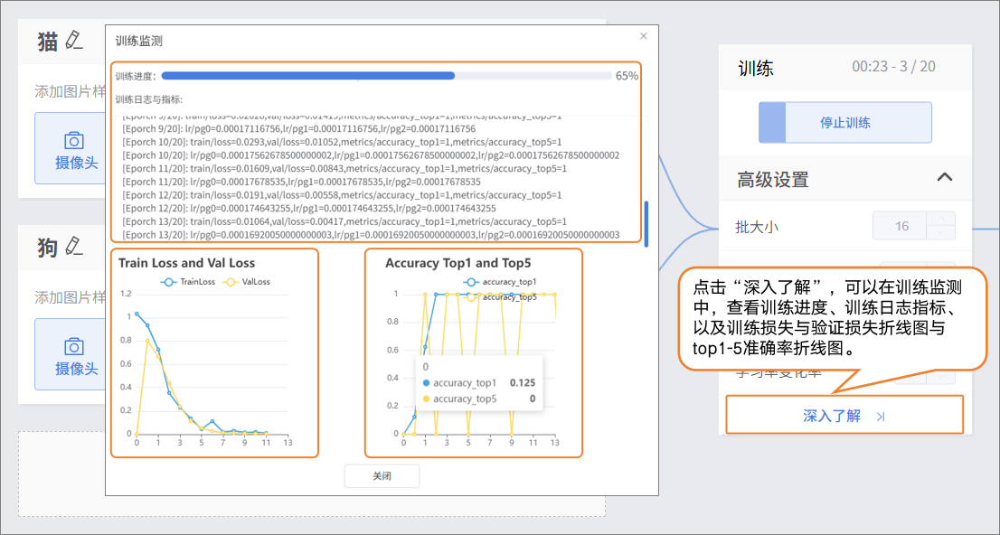

### 步骤4：模型校验

- 模型训练完成后，可以通过校验区，检验模型效果。校验的方式分为两种：摄像头、文件。
  - 小提示：用一些未参与训练的新图片进行测试，更能反映模型实际效果。
- 检验方式1：摄像头
  - 将摄像头对着猫的图像，看看输出分类结果。

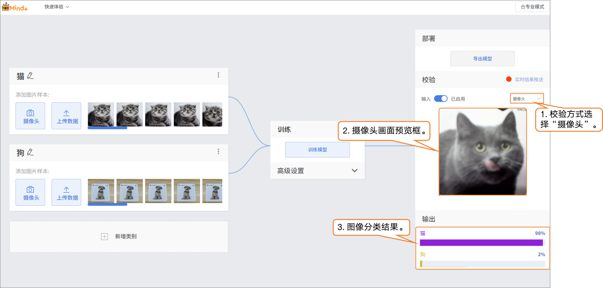

- 校验方式2：文件
  - 修改检验方式为“文件”，点击“上传文件”，选择一张图片并打开。

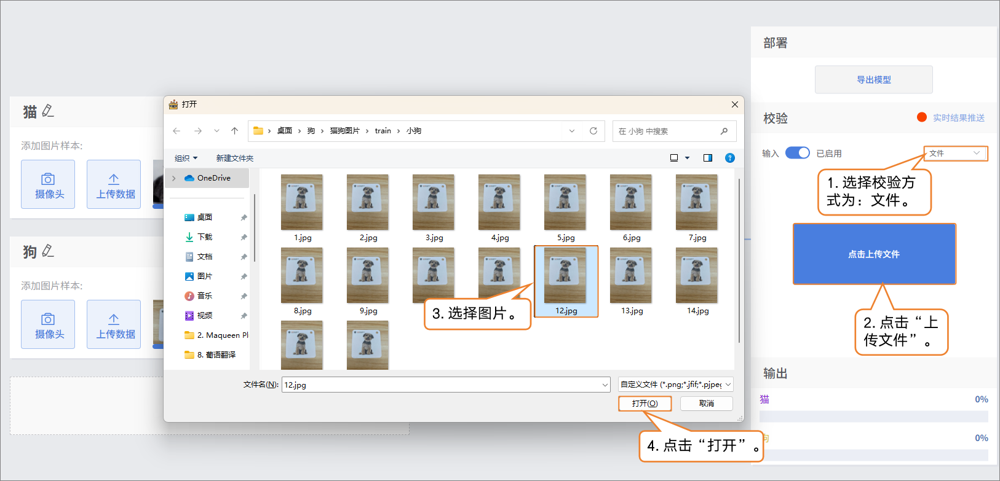

- 图片上传成功后，输出图片分类结果。

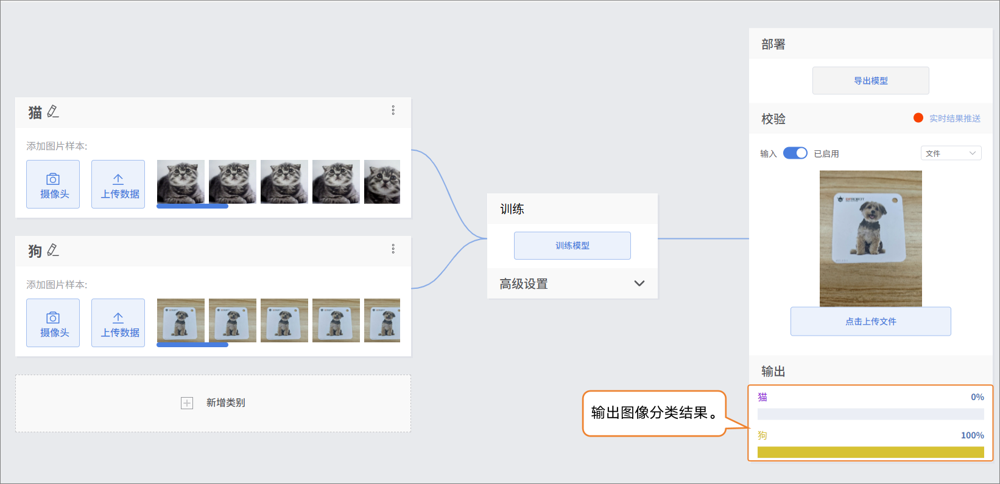

### 步骤5：模型导出

- 当模型校验结果满足需求时，就可以进入部署阶段。
  - “部署” → 点击 “导出模型”。
  - 平台支持将模型导出为 ONNX 格式，便于在其他环境中使用或进行二次开发。

小提示：ONNX 是一种开放的模型格式，可以在多种深度学习框架和设备上运行。这样，你不仅可以在平台上测试，还能把模型应用到真实项目中。

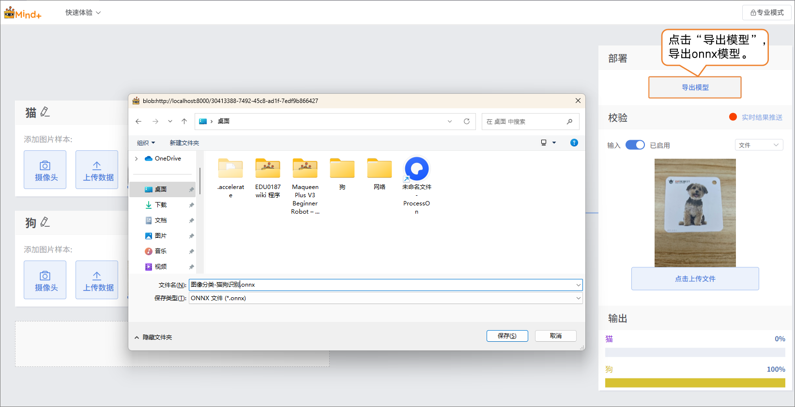

### 步骤6：模型部署

方法一：参考[4.1.4 模型部署](/AITools/Basic_description/model_deployment/model-deployment)

- 适用：支持硬件部署的模型（如行空板M10/K10），如图像分类、目标检测等模型。

方法二：参考[4.1.5 实时结果推送](/AITools/Basic_description/real_time_push/real-time-push)

- 适用：暂不支持硬件部署的模型，如语音识别、文本分类等模型。

### 模型训练常见问题

- 在模型训练过程中，可能会遇到各种问题，例如训练速度慢、精度不理想或参数设置不当。下面整理了常见问题及解决思路，帮助你更顺利地完成模型训练。

| **常见问题**     | **导致的原因及解决方法**                                     |
| ---------------- | ------------------------------------------------------------ |
| 模型准确率不高。 | 可能原因：样本数据数量不足样本类别不平衡。解决方法：在添加样本数据时，确保每个类别的样本覆盖不同角度、光照和背景。尽量保持各类别样本数量均衡，以提升模型的准确率。 |
| 训练时间过长     | 可能原因：批次大小设置过小，每次训练处理的数据量少，导致训练轮次需要更多时间。训练轮次设置过大，模型重复学习数据太多。解决方法：适当增大批次大小，让模型每次处理更多样本，加快训练速度。根据数据量和任务需求合理调整训练轮次，避免不必要的重复训练。 |