## 目标检测-快速体验

目标检测的快速体验操作步骤以 “野生动物检测（如斑马、大象）” 为例，带领用户学习目标检测模型的训练流程。该案例主要演示目标检测在实际应用中的效果：模型不仅能够识别图片中的斑马或大象等目标类别，还能为每一个目标生成边界框（Bounding Box），准确标出物体的位置范围。通过这种方式，用户可直观看到模型对图中每个对象的独立识别与定位结果，从而理解目标检测与普通图像分类（仅识别类别，无位置信息）的区别，并感受其在现实场景（如智能分拣、安防监控）中的应用价值。

- **效果：** 模型能够在摄像头捕获的实时图像以及本地上传的图片中，用边界框框选出斑马、犀牛等目标，并显示对应的类别标签名称（如 "zebra""rhino"）及识别置信度（反映模型对该识别结果的置信程度）。
- **效果展示**:

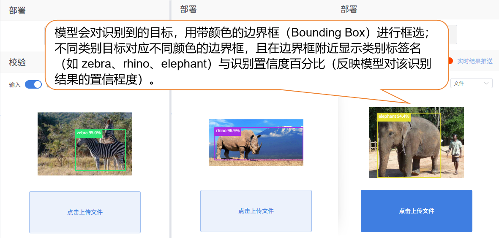

目标检测模型训练实现过程分为五个步骤：

1. **新建项目** —— 创建目标检测专属项目；
2. **添加图片样本并标注** —— 采集或上传图片样本，对目标进行类别标注并生成边界框，确保位置准确；
3. **训练模型** —— 通过平台训练得到可用的目标检测模型；
4. **模型校验** —— 测试模型，查看边界框定位精度和类别识别准确率；
5. **模型导出** —— 模型训练完成后，将其导出并部署到硬件设备，实现本地运行与应用；同时，用户可选择将模型的识别结果实时推送到 SIoT 平台，便于远程监测与管理。

## 步骤1：新建项目

- 打开 Mind+，在菜单栏中选择 “新建项目”，然后点击 “模型训练”。在训练选项中找到 “目标检测（M2）” 并点击，即可完成项目创建。

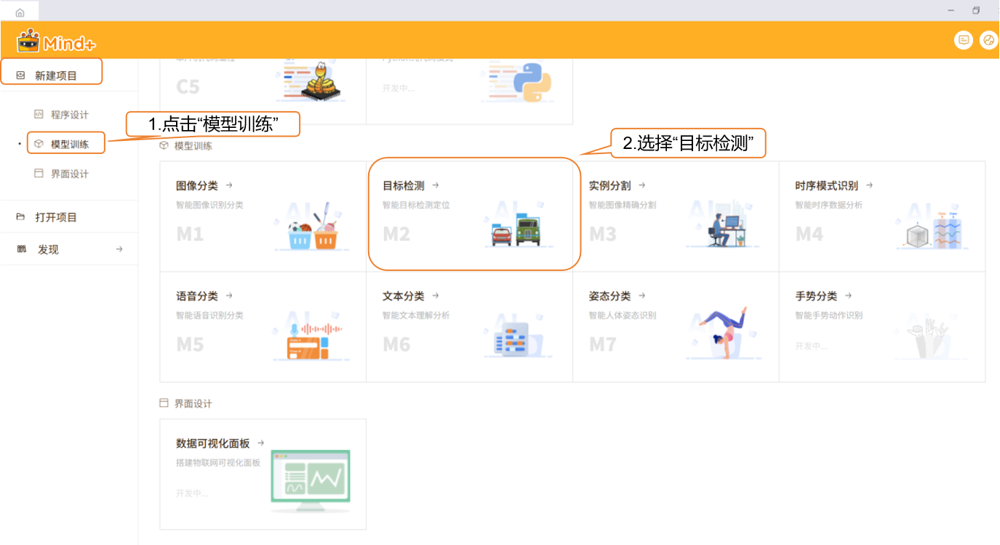

- 项目创建成功后，会跳转到新的目标检测快速体验界面。

## 步骤2：添加图片样本并标注

- 添加样本是模型训练的基础，需保证样本质量与标注准确性，具体分为 “样本添加” 和 “样本标注” 两部分。

**样本添加方式：**

  - - 在当前数据集中，可以通过摄像头采集或本地上传两种方式添加图片样本。
      - **摄像头采集：** 适合现场拍摄，快速获取实时图像，方便在实验过程中直接收集数据。
      - **本地上传：** 适合导入已准备好的样本素材，便于批量添加和管理现有数据。

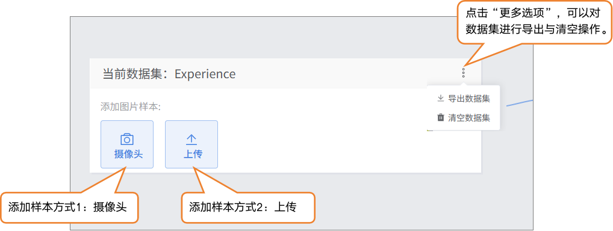

  - 为了保证目标检测模型训练效果，请确保数据集样本满足以下要求，包括每类样本数量、目标清晰度、标注完整性、背景光照。

| **要求项目** | **要求**                   | **说明**                                                     |
    | ------------ | -------------------------- | ------------------------------------------------------------ |
    | 样本数量     | 每类至少 20-50 张          | 每个类别至少提供 20-50 张图片样本；目标形状或颜色多样时建议增加样本，以覆盖更多情况； |
    | 类别平衡     | 各类别数量尽量接近         | 各类别样本数量差异过大可能导致模型偏向数量多的类别，建议保持平衡，例如斑马 50 张、大象 50 张、水牛 50 张。 |
    | 目标清晰度   | 图中目标清晰可见           | 确保目标完整、清晰，不模糊或被遮挡；小目标或形状复杂目标需保证标注时可准确描绘轮廓； |
    | 标注完整     | 每个目标都需标注，轮廓闭合 | 每张图片中所有目标都必须标注，轮廓要闭合；多目标图片需为每个目标单独标注，否则生成边界框标注会出错。 |
    | 背景与光照   | 背景简单、光照均匀         | 背景尽量干净，减少干扰物，光照均匀避免过暗或过曝，以提高模型训练准确性。 |

**添加方式1：摄像头采集** 

  - 点击摄像头，将摄像头对准目标，可通过预览框，查看摄像头采集到的画面是否有效，按“录制”进行采集样本。

    - > 图片样本采集完成后，点击“×”退出采集画面。
      >
      > 如果台式机没有摄像头，可通过外接USB摄像头。
      >
      > **此方式本次教学案例不适用，下图仅为操作过程示例**

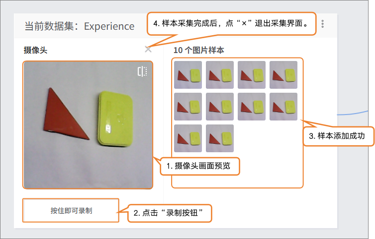

  - 在采集样本数据时，可通过“设置”按钮，设置摄像头的采集帧率（每秒采集的图片数，数值越高采集越快）。

  - 注意：FPS太高，采集的画面差异过小，对训练的用处不是很大。

- **【数据标注】方法见下方说明↓**

**添加方式2：本地上传** 

  - 本地上传分为**无标注数据**和**有标注数据**两种：

  - - **无标注数据**：仅上传图片样本，后续需要手动对图中目标进行标注。
    - **有标注数据**：图片样本已经完成标注，并生成了对应的边界框标注文件，可以直接用于模型训练，无需再次标注。

  - **上传-无标注数据**

    - 点击 “上传” 按钮
    - 在 “导入数据类型” 中选择 无标注数据
    - 点击 “选择文件上传”
    - 在本地文件夹中找到已准备好的图片样本，全选后上传到数据集，这样就完成了无标注数据的添加。
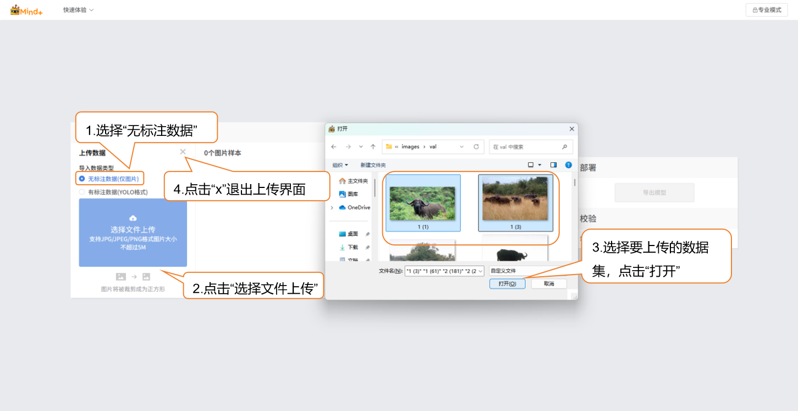

    -  **样本标注操作（针对无标注数据）**
      - 第一步：创建标签。点击界面中的 "数据标注" 按钮，在弹出的 "创建标签" 窗口中，依次输入目标类别名称（如 "zebra""rhino"），并选择标签颜色（便于区分不同类别），点击" 确认 " 完成标签创建。
        - 点击“数据标注”

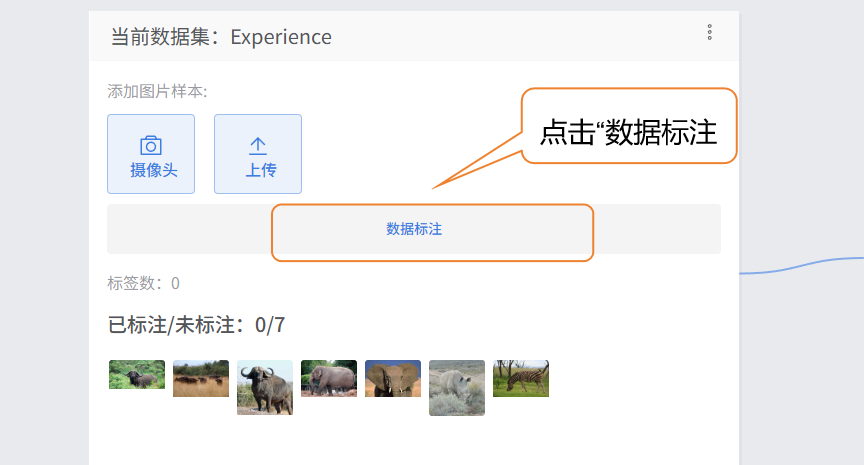

        - 弹窗：提示创建目标样本标签

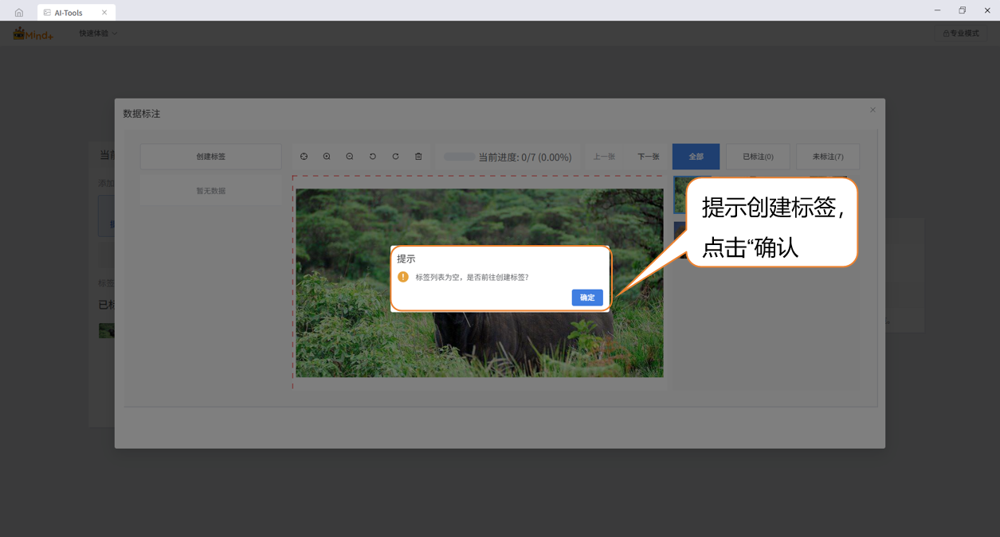

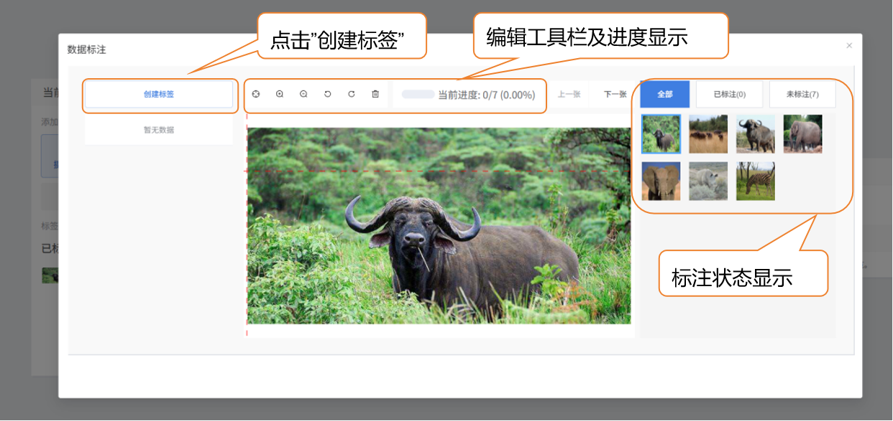

        - 编辑标签名称、颜色

      - 第二步：绘制边界框。标注时，先在左侧标签列表中点击对应的标签名（如 "zebra"），然后用鼠标左键在图片中沿目标边缘绘制矩形边界框，确保边界框完整包裹目标；若一张图片中有多个目标（如同时有斑马和犀牛），需重复 "选择标签 - 绘制边界框" 步骤，直至所有目标标注完成。
        - 通过鼠标手动框选标记目标：
          - 移动鼠标，在目标图像的顶点处点击鼠标左键。
          - 拖动鼠标，直至白框完全框选目标，再点击一次左键。

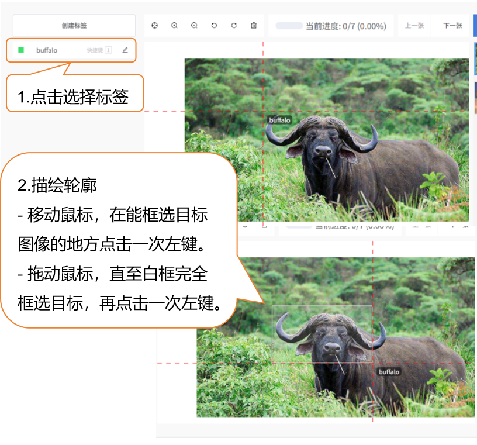

          - 如需调整，在方框处点击鼠标右键，即可移动框选位置和大小范围。

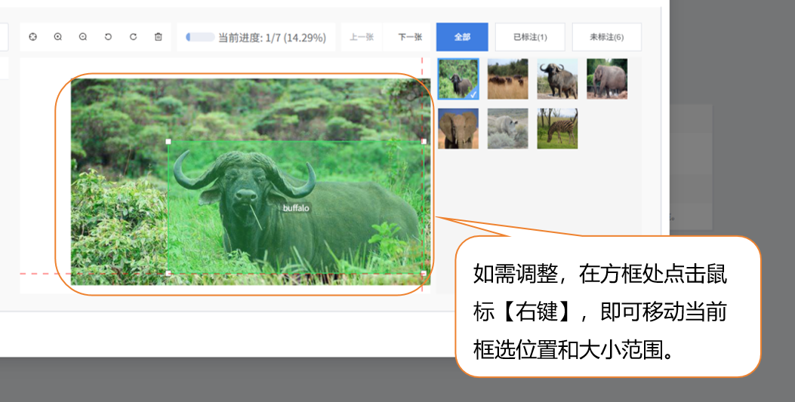

          - 如果一张图片中有多个重复目标，需要为每个目标图像分别重复步骤1和步骤2，直至全部完成。

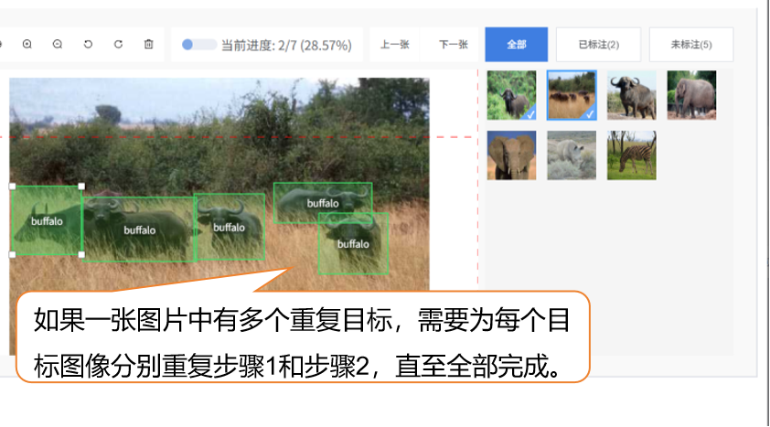
      - 同上，依次完成添加所有需要的标签，以及对不同目标的框选标记
      - 点击“x”退出数据标注界面

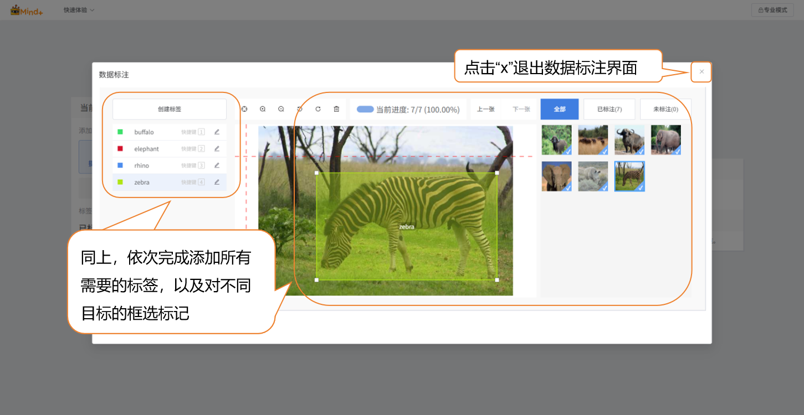

      - 进度查看：界面底部会显示标注进度（如 "已标注 / 未标注：7/0"），可实时跟踪标注情况，避免漏标。

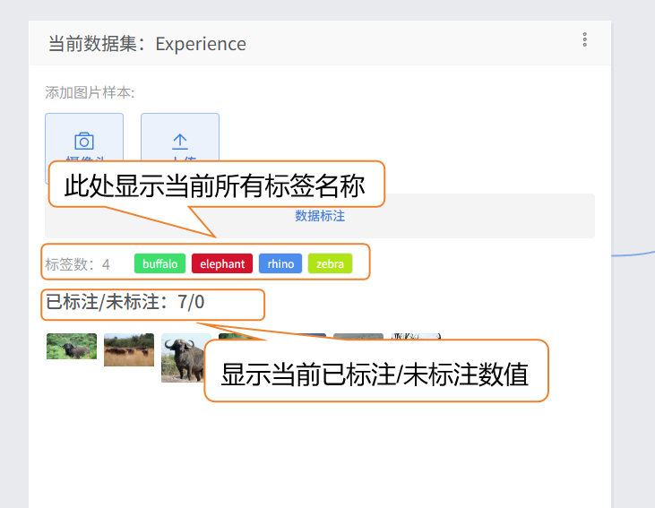

**上传-有标注数据**

  1. 点击 “上传” 按钮
  2. 在 “导入数据类型” 中选择 有标注数据
  3. 点击 “选择文件上传”
  4. 在本地文件夹中找到已准备好YOLO格式数据集文件（.zip），完成有标注数据的添加。
  5. 上传完成后点击“x”退出上传界面。
  6. > 专业说明：YOLO 格式标注要求边界框坐标采用归一化处理，即中心 x 坐标、中心 y 坐标、宽度、高度均相对于图像宽高缩放到 0-1 范围内，便于模型统一处理不同尺寸的图像。

  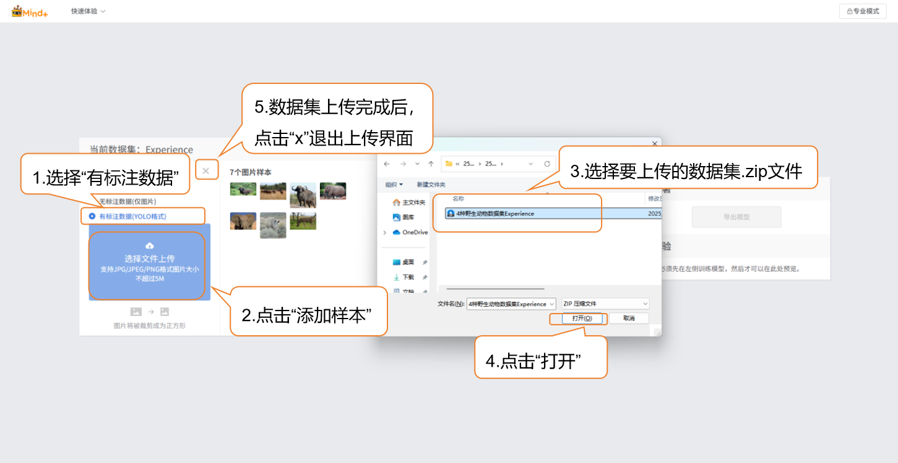
  7. 有标注数据上传成功后，不需要在手动进行数据标注，直接开始步骤3的操作，开始训练模型。

  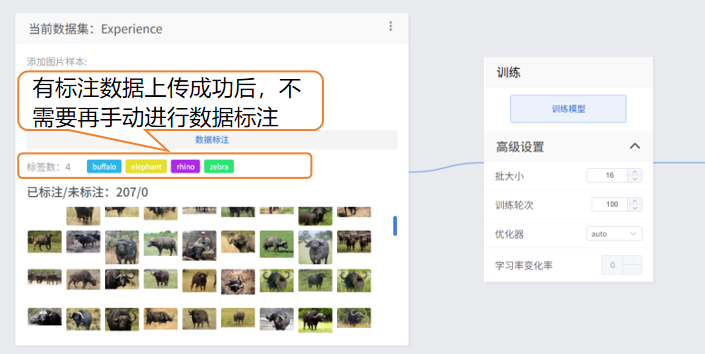

## 步骤3：训练模型

- 完成数据集中所有图片的标注后，设置训练参数，并点击“训练模型”开始训练。

| 参数     | 参数说明                                                     | 类别说明                                     | 推荐设置                                                     |
| -------- | ------------------------------------------------------------ | -------------------------------------------- | ------------------------------------------------------------ |
| 批次大小 | 一次送入模型里训练的数据样本数量。当数据很多时，一次把数据都送进去，计算机算不过来，因此就分成一批一批来学习。例如，默认批大小为16，每次训练用16张图片。 | 每次学习多少内容                             | 批次大小：16（默认即可）                                     |
| 训练轮次 | 所有训练数据完整地送入模型学习一遍，叫做一轮。学习一遍可能会不够牢固，要重复多次训练才能记住规律。例如，默认训练轮次为100，模型会将数据集从头到尾学习100遍。推荐训练轮次为 20 次以上； | 学几遍                                       | 训练轮次：100（若为小数据集（每类样本 20-50 张），可适当减小至 15-20 次，避免过拟合） |
| 优化器   | 优化器时用于决定模型在训练过程中如何更新参数，也就是每次学习之后，要往哪个方向走，走多少步。优化器决定了模型训练的效率和效果。 | 学习的方法（死记硬背？归纳总结？举一反三？） | 优化器：auto（默认即可）                                     |

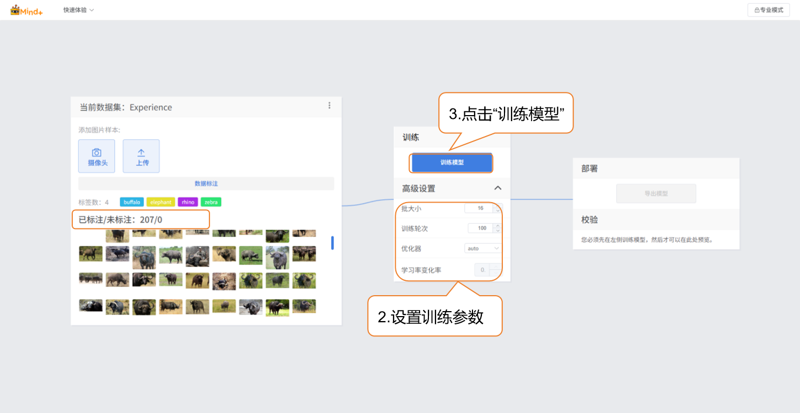

- 在训练模型过程中，可通过点击“深入了解”按钮，查看训练监测相关数据。
  - 训练损失（train loss）：训练损失是模型在 **训练数据** 上的预测误差，损失越小，说明模型对训练数据的预测越准确。
  - 验证损失（val loss）：验证损失是模型在 **验证数据**（未用于训练的数据）上的预测误差，验证损失持续下降，模型泛化能力在提升。
  - 验证集平均精度（Val mAP50）：表示在验证集上，当预测框和真实框的重叠率大于一半（50%）时，预测才算正确。数值越高，说明模型识别得越准。

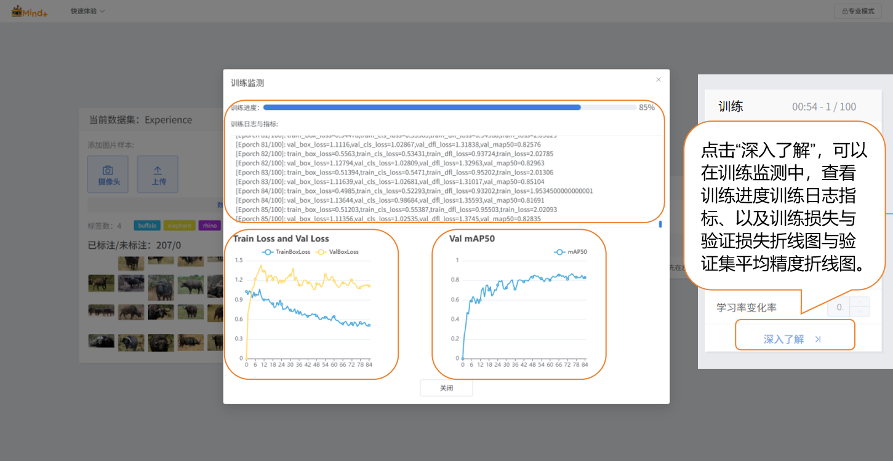

  - 模型训练完成
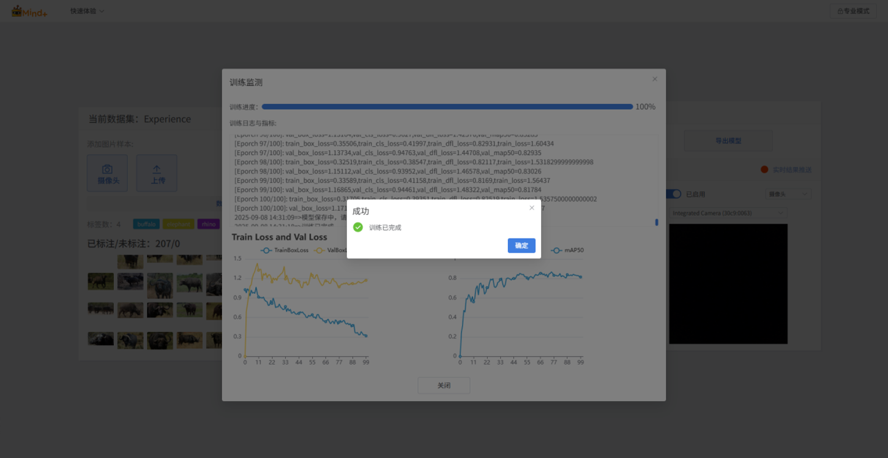

## 步骤4：模型校验

- 模型训练完成后，可以通过校验区，检验模型效果。校验的方式分为两种：摄像头、文件。
- **检验方式1：摄像头**
  - 可选择摄像头（如有外接）
  - 将摄像头对着目标图像，看看输出的结果。
  - > 此方式不适合于本次教学案例，故以下图示意操作步骤↓

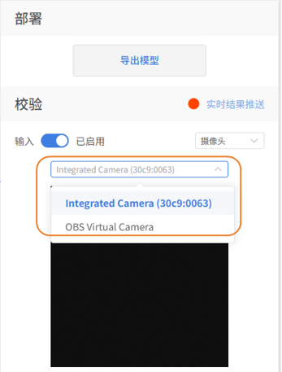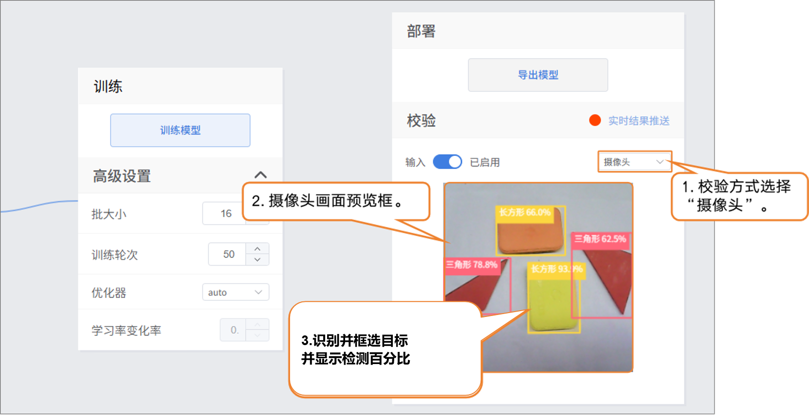

  - 
- **校验方式2：文件**
  - 修改校验方式为‘文件’
  - 点击“上传文件”，选择一张测试图片并打开。

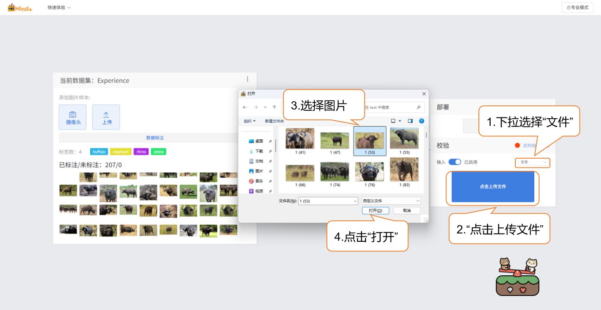

- 图片上传成功后，输出识别结果。

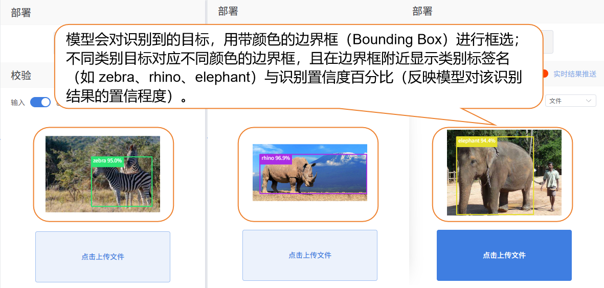

## 步骤5：模型导出

- 当模型校验结果满足需求时，就可以进入部署阶段。
  - “部署” → 点击 “导出模型”。
  - 平台支持将模型导出为 ONNX 格式，便于在其他环境中使用或进行二次开发。

> 小提示：ONNX 是一种开放的模型格式，可以在多种深度学习框架和设备上运行。这样，你不仅可以在平台上测试，还能把模型应用到真实项目中。

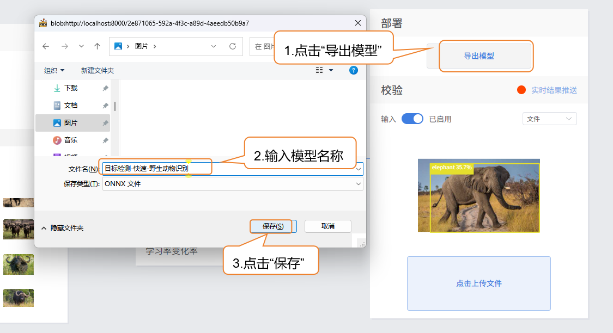

## 步骤6：模型部署

方法一：参考[4.1.4 模型部署](/AITools/Basic_description/model_deployment/model-deployment)

- 适用：支持硬件部署的模型（如行空板M10/K10），如图像分类、目标检测等模型。

方法二：参考[4.1.5 实时结果推送](/AITools/Basic_description/real_time_push/real-time-push)

- 适用：暂不支持硬件部署的模型，如语音识别、文本分类等模型。

## 模型训练常见问题

| **问题**               | **可能原因**                         | **解决方法**                                                 |
| ---------------------- | ------------------------------------ | ------------------------------------------------------------ |
| 目标识别不准确         | 目标模糊、遮挡或光照不均             | 确保目标清晰完整，光照均匀；必要时增加样本数量               |
| 标注错误或不完整       | 矩形边界框未完整覆盖，漏标或重复标注 | 标注时沿目标边缘画完整矩形边界框，确保框选目标主体，无漏标、重复标注，每个目标单独标注 |
| 类别不平衡导致模型偏向 | 某类别样本数量过少或过多             | 保持各类别样本数量接近，必要时增加少数类别样本               |
| 训练时间过长           | 批次大小过大或训练轮次过多           | 调整批次大小和训练轮次，可减少训练轮次                       |