### 姿态分类-快速体验

姿态分类的快速体验操作步骤以“课堂姿态识别”案例为例，带领用户学习姿态分类模型的完整训练流程。该案例旨在直观演示姿态分类在实际场景中的应用效果：模型能够对摄像头实时采集或本地上传的姿态图片进行识别与分类（如区分 “站立”、“坐正“、“举手”），帮助用户清晰理解姿态分类的核心原理（基于图像特征提取与类别匹配）与应用价值（如课堂姿态监测、运动监测、安防监控、健康护理辅助等）。

- **效果：** 能准确区分3种常见课堂人体姿态，包含坐正、举手、站立
- **效果展示：**

姿态分类模型训练实现过程分为六个步骤：

- **新建项目** —— 创建姿态分类项目并准备数据集；
- **背景样本** —— 采集当前环境的背景图样本数据，减少环境干扰对模型识别精度的影响；
- **新增类别** —— 添加待识别的姿态分类标签（如 “站立”“坐姿”），并通过摄像头（按住录制）或本地上传的方式获取对应姿态的图片数据集；
- **训练模型** —— 通过平台训练得到姿态分类模型；
- **模型校验** —— 测试模型效果。
- **模型部署** —— 模型训练完成后，可以将其导出并部署到硬件设备，实现本地运行与应用。同时，用户还可以选择将模型的识别结果实时推送到 SIoT 平台，便于远程监测与管理。

### 步骤1：新建项目

- 打开 Mind+，在菜单栏中选择 “新建项目”，然后点击 “模型训练”。
- 在训练选项中找到 “姿态分类（M7）” 并点击，即可完成项目创建。

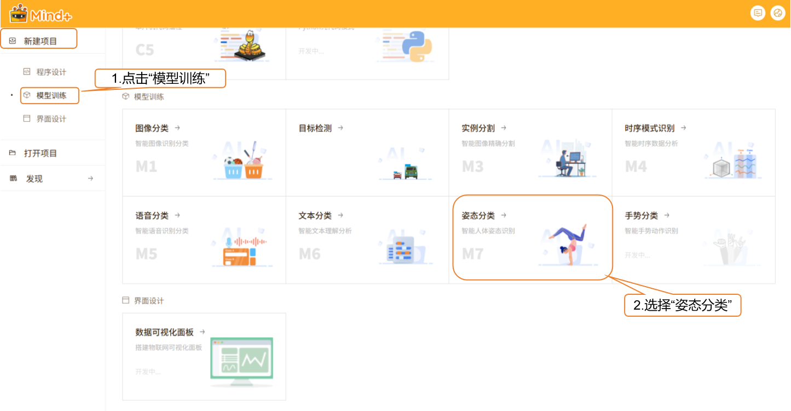

- 项目创建成功后，将自动跳转至新的姿态分类快速体验界面。

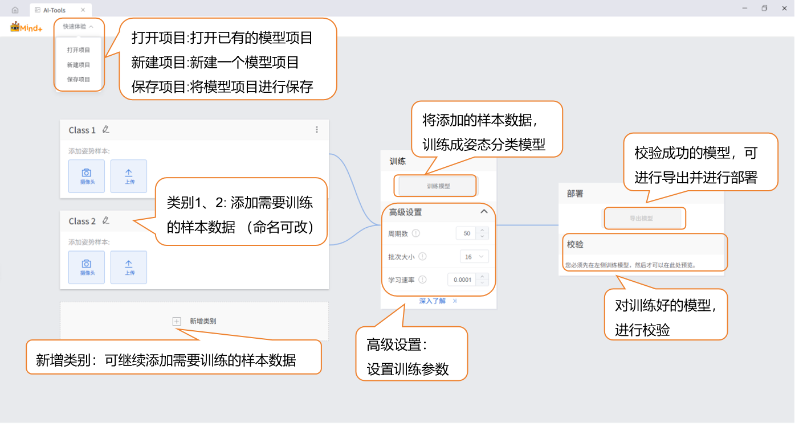

### 步骤2：背景样本

- 为提升模型鲁棒性，或如检测场景背景画面较为复杂、需要提高准确率的情况下，建议添加当前环境下的背景图像样本数据（建议覆盖环境内不同区域、光线条件，如窗边、墙角、室内灯光 / 自然光切换场景），避免单一背景导致模型对环境变化敏感。

数据样本小提示：背景样本需与后续姿态样本的采集环境保持一致（如均在室内客厅场景），若后续应用场景变化，需重新采集对应环境的背景样本

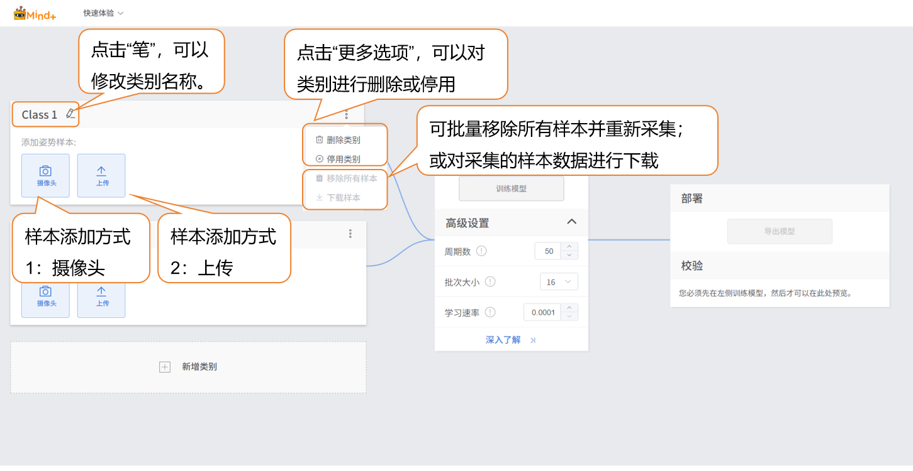

- 样本可通过以下两种方式添加，用户可根据实际需求灵活选择：

  - **摄像头采集：** 适合现场获取实时环境背景，操作便捷，能最大程度匹配后续姿态采集的真实场景；
  - **本地上传：** 适合导入已准备好的图像素材（如提前拍摄的环境照片），支持批量添加，便于高效管理固定场景的数据。

- 通过这两种方式，用户能够灵活地构建数据集，为后续的模型训练做好准备。

  - **样本添加方式1：摄像头采集**

    - 点击界面中的 “摄像头” 按钮，系统将弹出摄像头选择列表，选择当前设备可用的摄像头（如笔记本内置摄像头、外接 USB 摄像头）；若未检测到摄像头，需检查设备连接状态或驱动程序。

      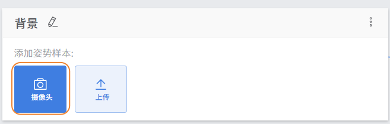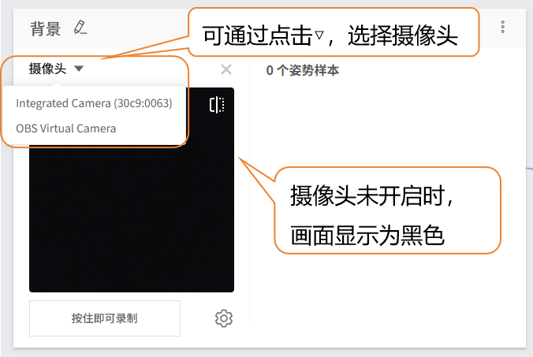

    - 注：若使用台式机且无内置摄像头，需通过 USB 接口外接兼容的摄像头设备，并确保系统已正确识别

    - 如遇采集界面未显示摄像头画面，请按以下步骤排查：

    - 1. 检查摄像头是否被其他软件占用（如视频会议工具）；
      2. 确认摄像头镜头无遮挡；
      3. 重启 Mind + 后重新尝试采集

    - 按住摄像头采集按钮“按住即可录制”开始录制背景（录制过程中保持镜头固定，避免画面晃动），松开按钮即可停止录制；

      - 系统将自动从录制的视频流中截取静态图像作为样本，若需补充样本，可重复 “按住录制 - 松开停止” 操作，直至样本数量达到预期（建议100-200个样本）。

    - 该类型样本采集完成后，点击“×”退出采集界面。

      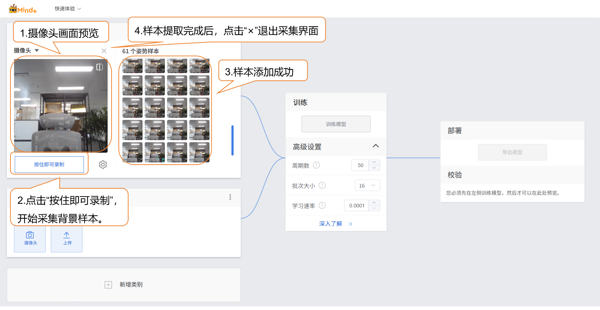

    - 可对采集的样本进行单独的移除；批量移除所有样本并重新采集；或对采集的样本数据进行下载

      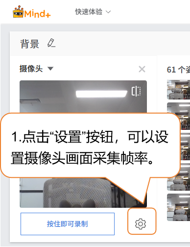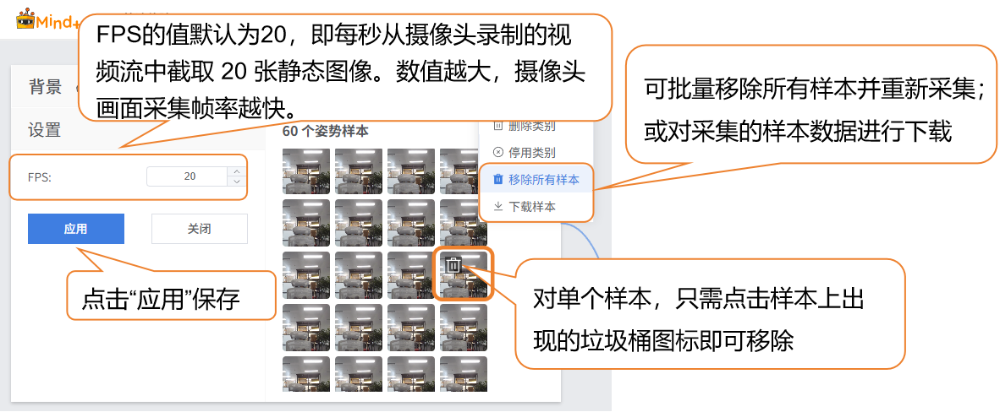

### 步骤3：样本添加

- 完成背景样本采集后，即可开始添加目标姿态类别的样本。继续修改下方默认生成的 “Class2” 标签，点击标签旁的笔型按钮，修改类别名称为具体姿态（如 “站立”），完成该姿态样本的类型命名。

  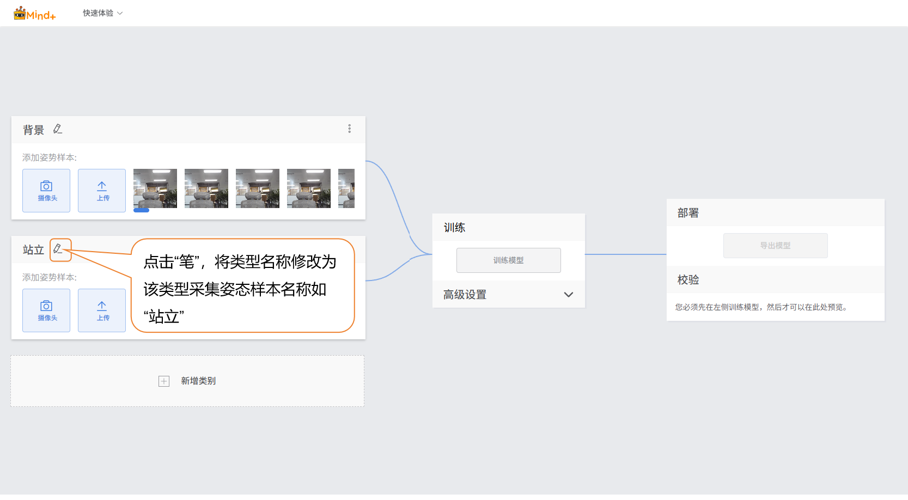

- **样本添加方式2：本地上传**

  - 在目标姿态类别（如 “站立”）下，点击 “上传” 按钮，进入姿态样本上传界面。

  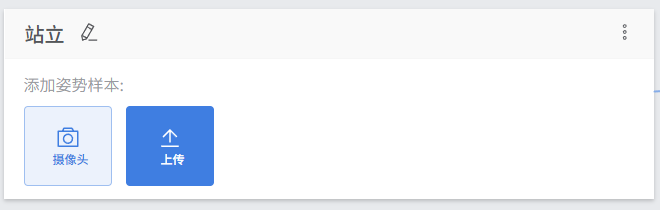

  - 点击 “选择文件上传” 按钮，在本地文件管理器中选择提前准备好的姿态图片文件（支持单张上传或多选上传，格式需为 支持JPG/JPEG/PNG格式，单张图片大小不超过5M），或者样本素材压缩包.zip格式。

    - 点击“打开”，完成样本上传。点击“×”退出采集界面。
    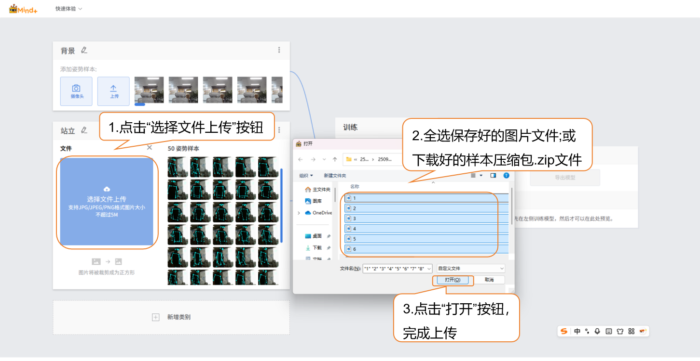

    - 可在此基础上继续上传添加新样本，或通过摄像头采集补充

  - 点击“新增类别”，新建另一类别（如“举手”），重复上述样本添加操作，直至完成所有类别的样本添加。

    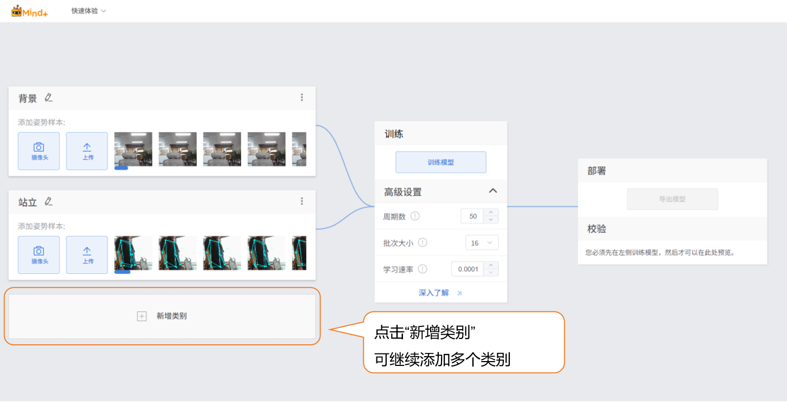

    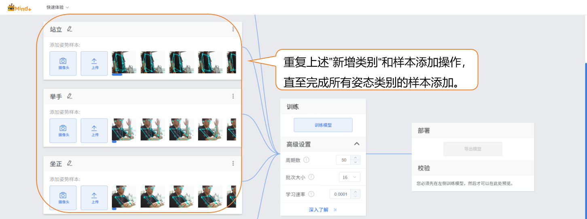

    数据样本小提示：
    
      - 每个数据类别可准备100-200张多样化的样本图片，类别间数量尽量平衡。
      - 建议给类别起个简洁的名字，不要用太复杂的符号或过长的名称。

### 步骤4：训练模型

- **高级参数设置**
  - 在训练模型前，点击“高级”设置训练参数，可设置以下 3 个核心参数：

| **参数**                  | **参数说明**                                                 | **类别说明**                                                 | **推荐设置**                                                 |
| ------------------------- | ------------------------------------------------------------ | ------------------------------------------------------------ | ------------------------------------------------------------ |
| 周期数（Epochs）          | 一个周期指训练数据集中的所有样本均已向模型馈送并完成一次参数更新。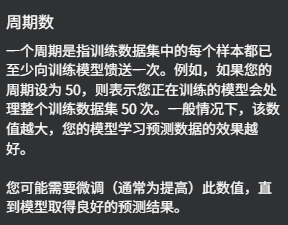 | 反映模型对训练数据的学习深度，周期数不足易导致欠拟合（分类准确率低），周期数过多可能导致过拟合（对新数据泛化差）。 | ・基础场景（5 类姿态、每类 10-20 样本）：推荐设置 50-100； ・复杂场景（样本差异大）：可上调至 100-200，需结合校验结果微调，避免过拟合。 |
| 批次大小（Batch Size）    | 模型每次训练时同时处理的样本数量。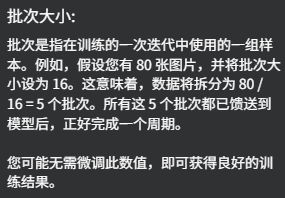 | 影响训练速度与模型稳定性：批次过小会增加训练耗时（需更多迭代次数），批次过大可能导致内存不足或模型收敛困难。 | ・普通电脑（4GB 内存以上）：推荐 8-16； ・高性能设备（8GB 内存以上）：可设置 16-32，需根据设备内存调整，避免卡顿。 |
| 学习速率（Learning Rate） | 控制模型每次参数更新的步长，即模型根据误差调整权重的幅度。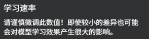 | 决定模型训练的收敛速度与最终精度：速率过大易导致训练震荡（无法稳定收敛），速率过小会使训练缓慢（需更多周期）。 | ・推荐初始设置 0.001； ・若训练中损失值下降缓慢，可上调至 0.005；若损失值波动大，可下调至 0.0001。 |

- **启动模型训练**
  - 完成训练参数设置后，点击 **“训练模型”** 即可开始训练（若不做设置，也可直接使用系统默认参数）。
  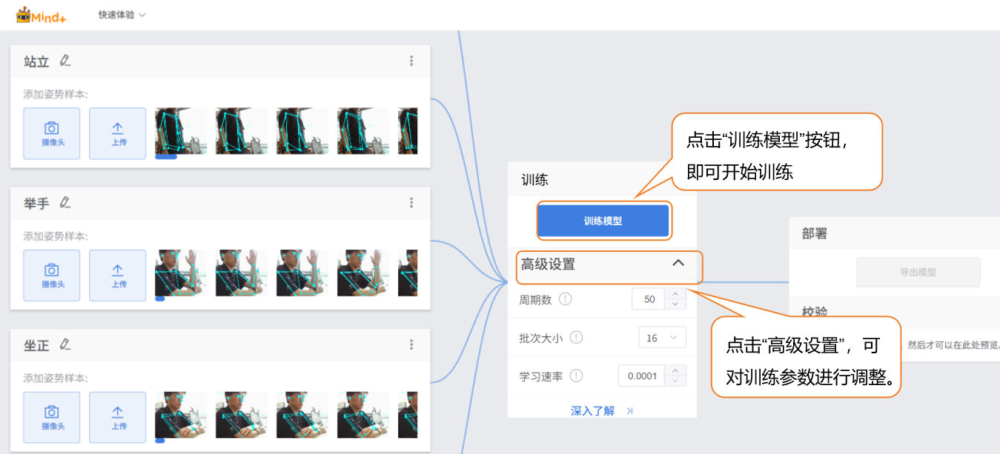

  - 训练过程中，请务必保持此标签页为打开状态，避免切换页面或关闭浏览器导致训练中断。
  

  - **训练过程监测**
  - 在训练模型过程中，可通过点击“深入了解”按钮，查看训练监测相关数据。
    - **每个类别的准确率：** 指针对不同姿态类别（如背景、站立、举手、坐正），模型对该类别样本预测结果与实际结果相符的比例。
    - **混淆矩阵：** 是用于展示模型对各个姿态类别预测情况的矩阵，能直观呈现真实姿态类别与模型预测姿态类别之间的对应关系。
    - **每个周期的准确率：** 是指在模型训练的一个周期（即对整个训练数据集完整迭代一次）内，模型预测结果与实际结果相符的比例。
    - **每个周期的损失：** 则是该周期内模型预测值与真实值之间的误差程度量化指标。
    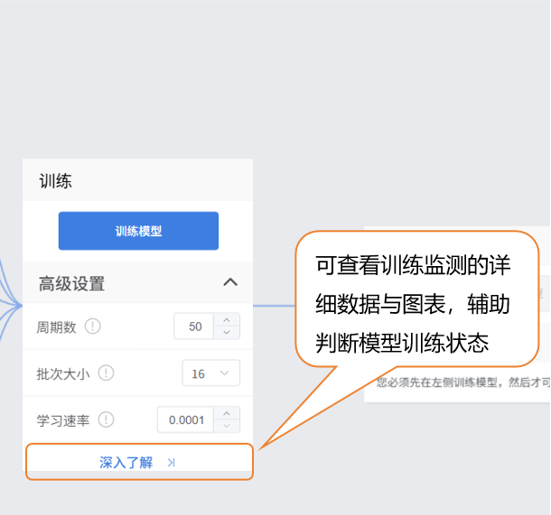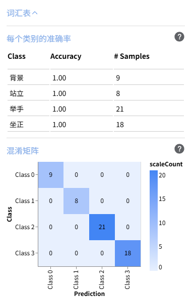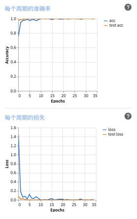

    

### 步骤5：模型校验

- 模型训练完成后，可以通过校验区，检验模型效果。校验的方式分为两种：摄像头、文件。
  - > 小提示：用一些未参与训练的新图片进行测试，更能反映模型实际效果。
- 检验方式1：摄像头
  - 让测试对象保持目标姿态，系统将实时捕获姿态图片，将自动进行特征提取与类别预测，在界面 “输出” 区域显示实时分类结果。
  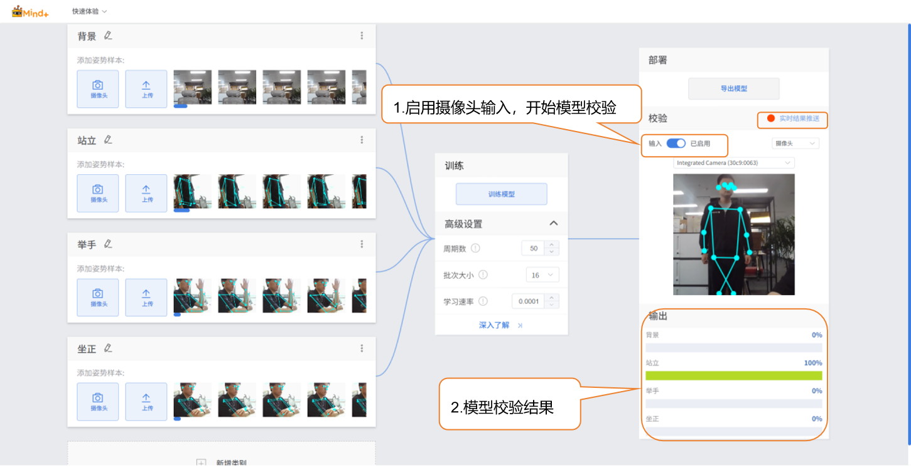
- 校验方式2：文件
  - 修改检验方式为“文件”，点击“上传文件”，选择一张图片并打开。
  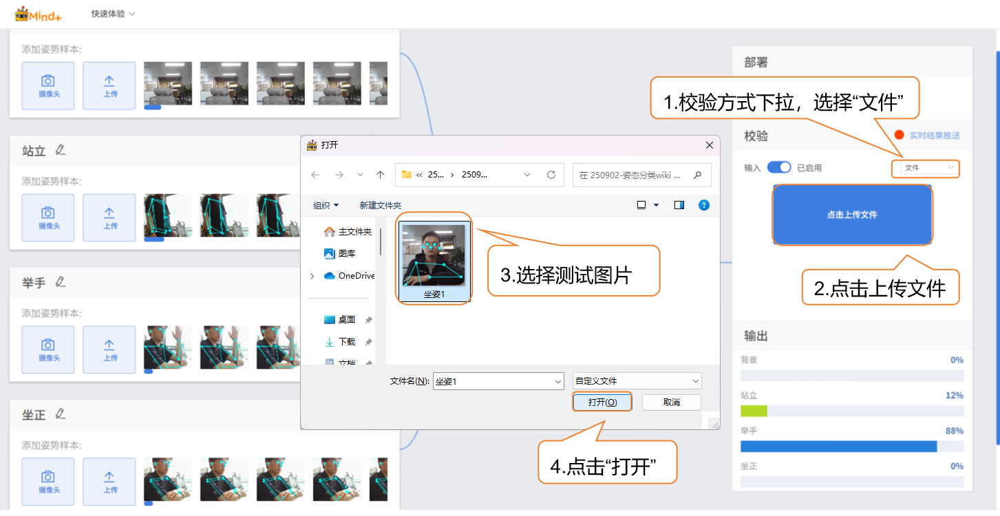

  - 图片上传成功后，输出图片分类结果。
  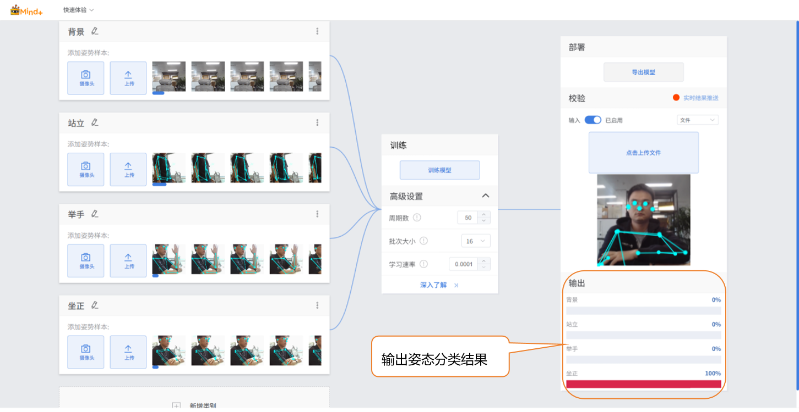

### 步骤6：模型导出

- 当模型校验结果满足需求时，就可以进入部署阶段。
  - “部署” → 点击 “导出模型”。
  - 平台支持将模型导出为zip格式，便于在其他环境中使用或进行二次开发。

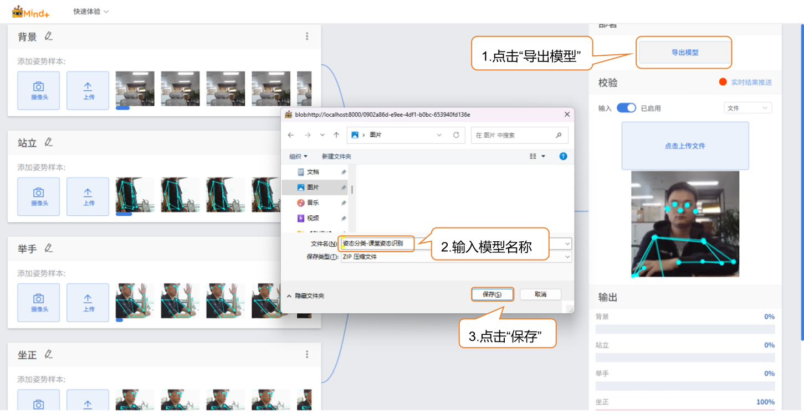

### 步骤6：模型部署

方法一：参考[4.1.4 模型部署](/AITools/Basic_description/model_deployment/model-deployment)

- 适用：支持硬件部署的模型（如行空板M10/K10），如图像分类、目标检测等模型。

方法二：参考[4.1.5 实时结果推送](/AITools/Basic_description/real_time_push/real-time-push)

- 适用：暂不支持硬件部署的模型，如语音识别、文本分类等模型。

### 模型训练常见问题

- 在模型训练过程中，可能会遇到各种问题，例如训练速度慢、精度不理想或参数设置不当。下面整理了常见问题及解决思路，帮助你更顺利地完成模型训练。

| **常见问题**     | **导致的原因及解决方法**                                     |
| ---------------- | ------------------------------------------------------------ |
| 模型准确率不高。 | 可能原因：样本数据数量不足样本类别不平衡训练参数设置不合理解决方法：补充样本：每个类别样本增至 100-150个，覆盖不同拍摄角度（正面、侧面、45° 角，需体现姿态关键特征，如‘举手’包含手臂不同抬起高度）、人体体型、光线条件”尽量保持各类别样本数量均衡，以提升模型的准确率。 |
| 训练时间过长     | 可能原因：批次大小设置过小，每次训练处理的数据量少，导致训练轮次需要更多时间。周期数设置过大，模型重复学习数据太多。解决方法：适当增大批次大小，让模型每次处理更多样本，加快训练速度。根据数据量和任务需求合理调整训练轮次，避免不必要的重复训练。 |