### 语音分类-快速体验

语音分类的快速体验操作步骤以“音乐风格识别”案例为例，带领大家学习语音分类模型的训练流程。该案例主要演示语音分类在实际应用中的效果：模型能够对麦克风实时采集的音频进行音乐风格的识别与分类，帮助用户直观理解语音分类的基本原理与应用价值。

- **效果：** 能准确区分乡村、古典、爵士、蓝调、摇滚 5 种不同的音乐风格
- **效果展示：**

语音分类模型训练实现过程分为六个步骤：

- **新建项目** —— 创建语音分类项目并准备数据集；
- **背景噪声** —— 采集当前环境的背景音样本数据，保障模型对复杂环境下语音的识别能力；
- **样本添加** —— 添加待识别的分类标签（如“摇滚”、“古典”），并通过麦克风采集（或上传）对应的音频样本数据；
- **训练模型** —— 通过平台训练得到语音分类模型；
- **模型校验** —— 测试模型效果。
- **模型部署** —— 模型训练完成后，可以将其导出并部署到硬件设备，实现本地运行与应用。同时，用户还可以选择将模型的识别结果实时推送到 SIoT 平台，便于远程监测与管理。

### 步骤1：新建项目

- 打开 Mind+，在菜单栏中选择 “新建项目”，然后点击 “模型训练”。
- 在训练选项中找到 “语音分类（M5）” 并点击，即可完成项目创建。

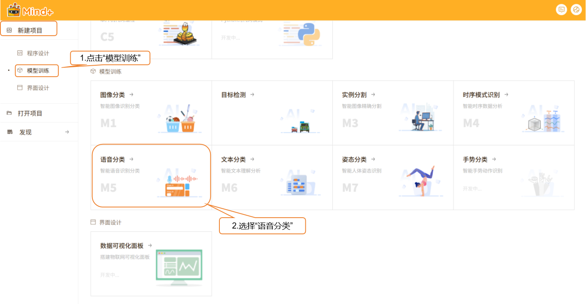

- 项目创建成功后，会跳转到新的语音分类快速体验界面。

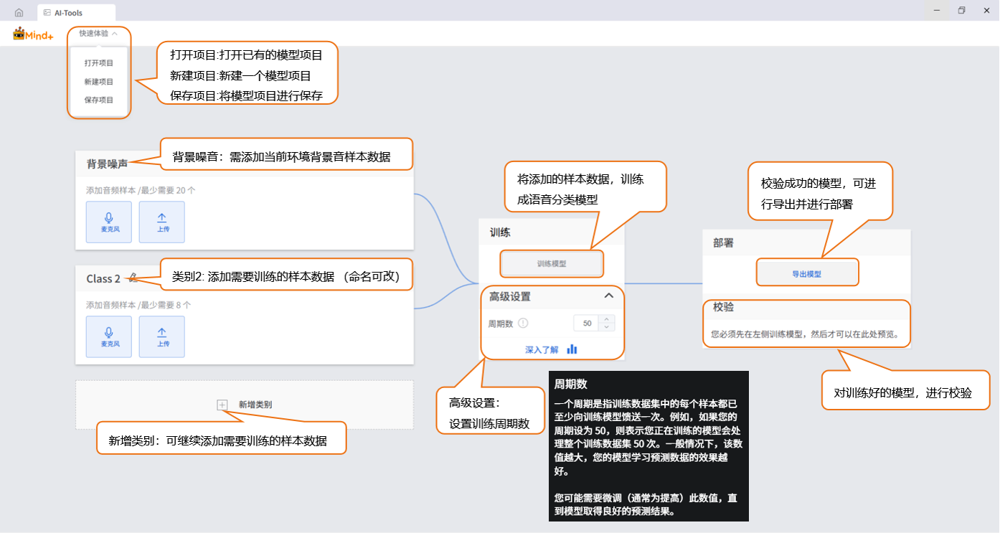

### 步骤2：背景噪声

- 需添加当前环境下的背景音样本数据

数据样本小提示：该数据类别需最少20个

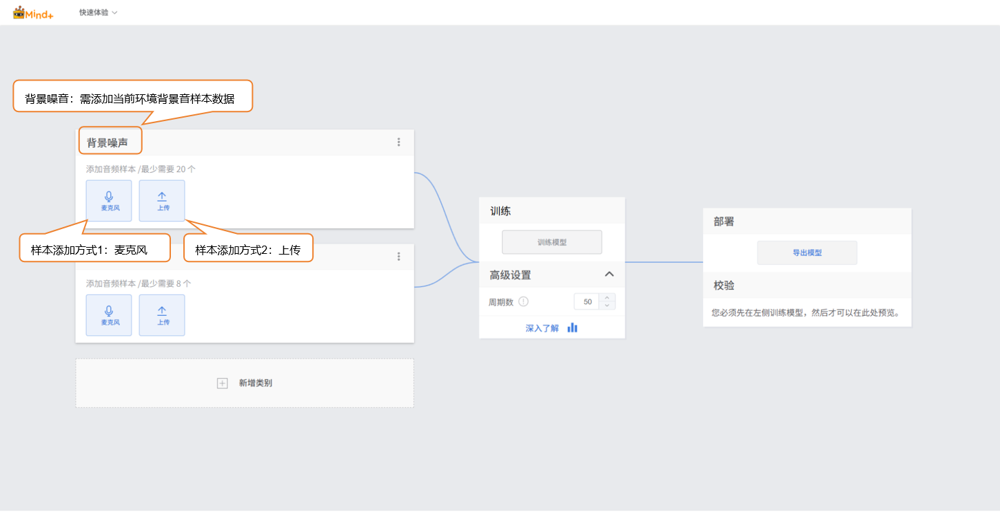

- 可以通过两种方式添加音频样本：
  - **麦克风采集**：适合现场录制，快速获取实时语音，方便在实验过程中直接收集数据。
  - **本地上传**：适合导入已准备好的音频素材，便于批量添加和管理现有数据。
- 通过这两种方式，用户能够灵活地构建数据集，为后续的模型训练做好准备。
- **样本添加方式1：麦克风采集**
  - 点击麦克风。选择当前电脑可用麦克风。
    - 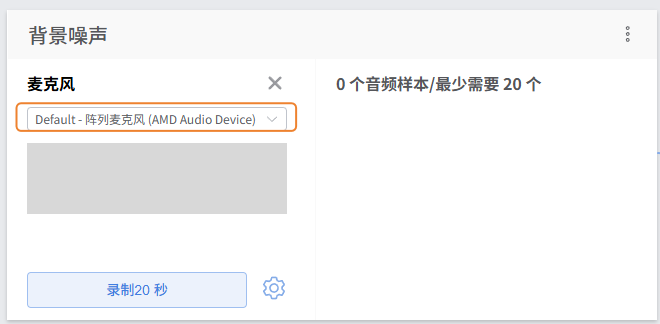

    - 
  - > 注：如果台式机没有麦克风，可通过外接麦克风。

  - 点击“录制20秒”进行音频样本采集。等待倒计时20秒结束，录制采集自动停止。
    - 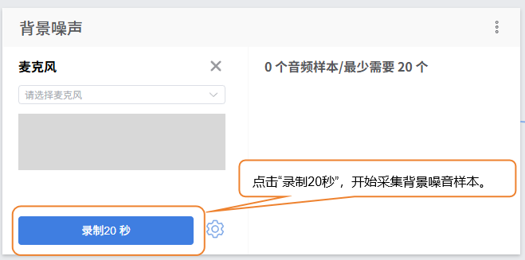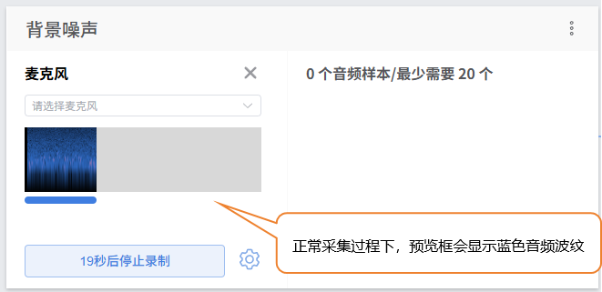

    - 
  - 点击“提取样本”，对音频片段进行样本提取。
    - 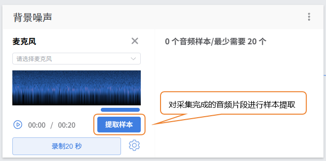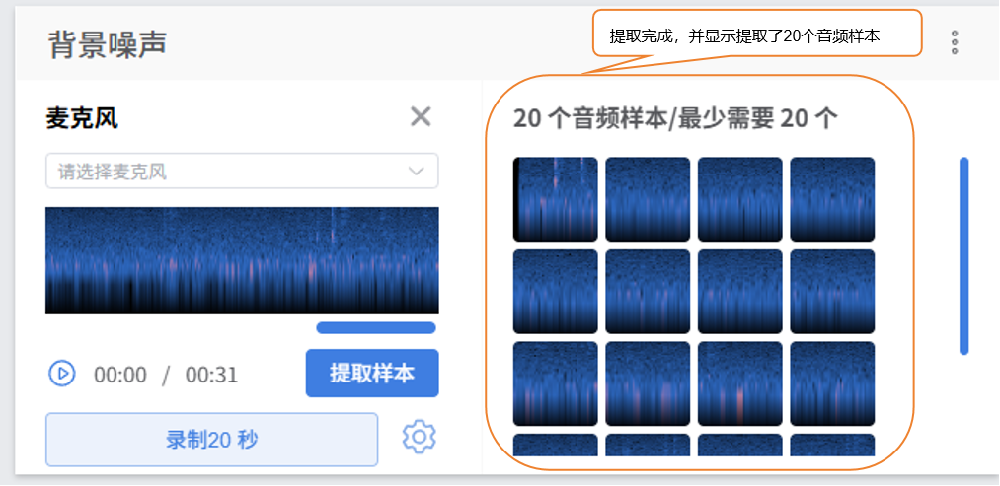

    - 
  - 提取完成后，点击“×”退出采集界面。
    - > - 提取样本后，界面会显示当前已采集样本数，若未达到最少20个（单类别），需重复录制/上传 - 提取操作

    - 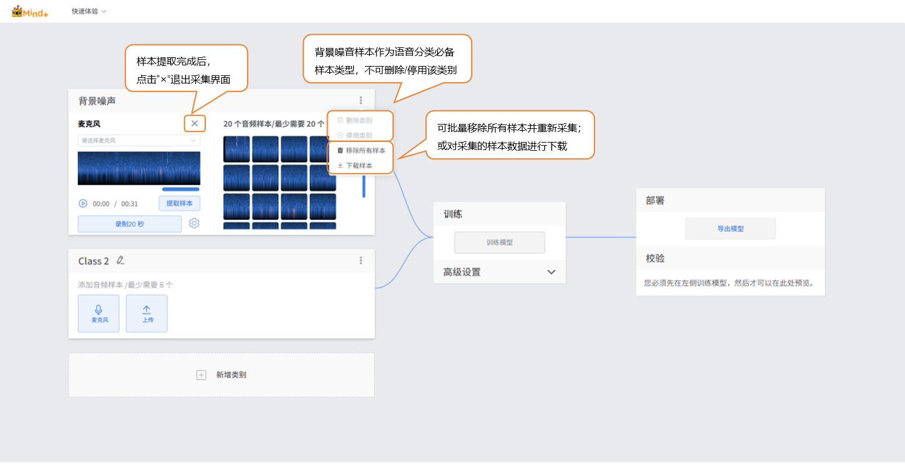
  - 采集状态检查
    - > 注：如遇采集显示如下，请检查麦克风开启或连接状态。

    - 

    - 
  - 音频采集设置
    - 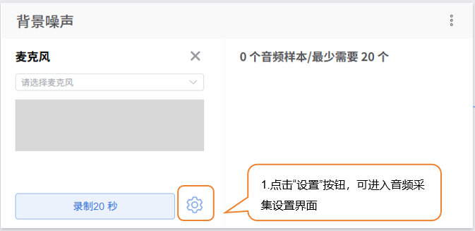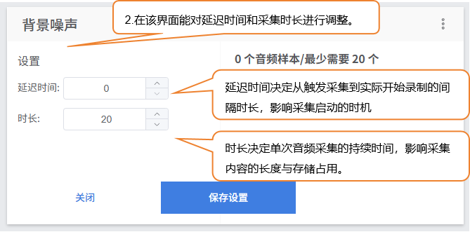

    - 

### 步骤3：样本添加

- 完成背景噪声采集后，可添加其他类别样本。首先修改 “Class2” 的名称，完成该音频样本类型命名，如“摇滚”。

  - 

  - 

  - **样本添加方式2：本地上传**
  - 点击“上传”按钮，进入音频样本上传界面。
  - 点击“选择文件上传”按钮，在本地文件中选择通过“下载样本”功能创建的.zip文件。
  - 点击“打开”，完成样本上传。
  - 

  - 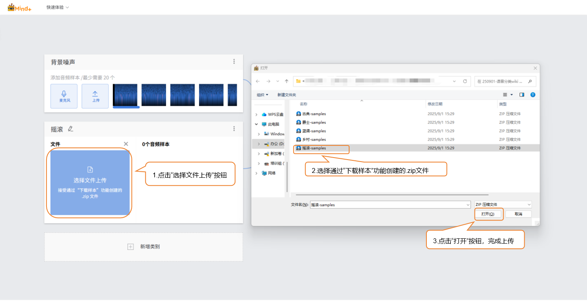

  - 音频样本提取完成后，点击“×”退出采集界面。
  - > - 提取样本后，界面会显示当前已采集样本数，若未达到最少20 个（单类别），需重复录制/上传 - 提取操作

  - 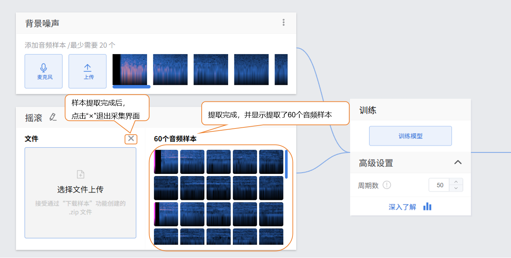

- 点击“新增类别”，新建另一类别（如“古典乐”），重复上述样本添加操作，直至完成所有类别的样本添加。

  - 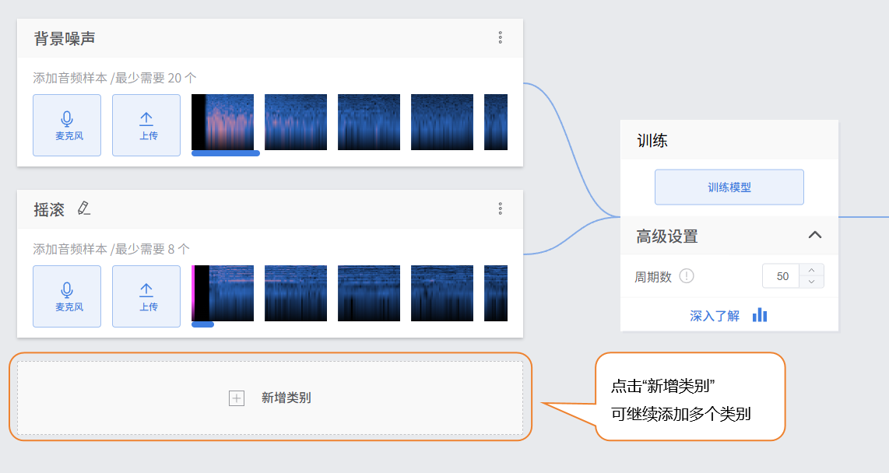

  - 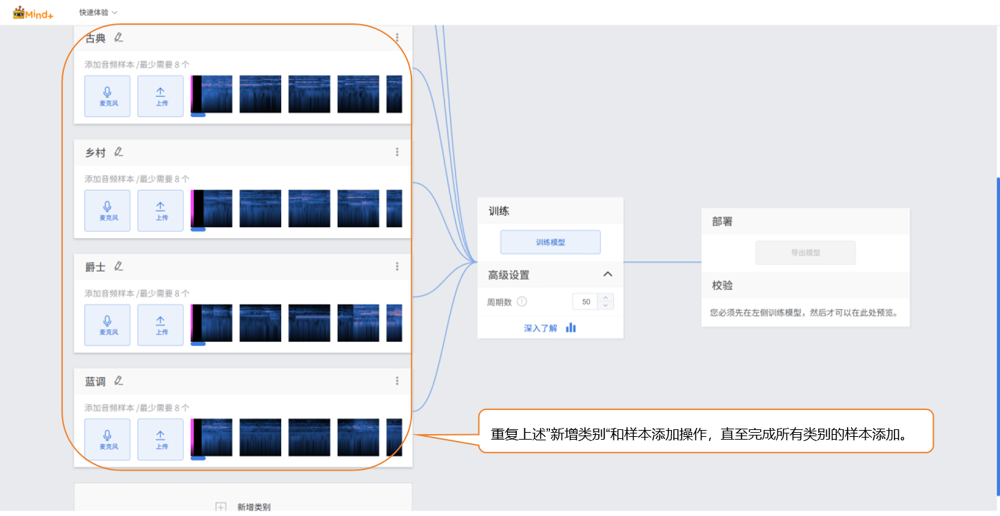

  - 数据样本小提示：

  - - 每个数据类别可准备尽可能特点明确且音质清晰的音频样本数据，类别间数量尽量平衡。
    - 建议给类别起个简洁的名字，不要用太复杂的符号或过长的名称。

### 步骤4：训练模型

- **高级参数设置**
  - 在训练模型前，点击“高级设置”设置训练参数“周期数”。

| 参数   | 参数说明                                                     | 类别说明                                                     | 推荐设置                                                     |
| ------ | ------------------------------------------------------------ | ------------------------------------------------------------ | ------------------------------------------------------------ |
| 周期数 | 一个周期是指训练数据集中的每个样本都已至少向训练模型馈送一次。例如，如果您的周期设为50，则表示模型会对整个训练数据集迭代处理 50 次。在未出现过拟合的情况下，一般情况下，该数值越大，您的模型学习预测数据的效果越好。 | 模型对训练数据集的完整迭代次数，反映学习过程中对数据的遍历程度 | 可上调至100您可能需要微调(通常为提高)此数值，直到模型取得良好的预测结果。 |

- **启动模型训练**
  - 完成训练参数设置后，点击 **“训练模型”** 即可开始训练（若不做设置，也可直接使用系统默认参数）。
  - 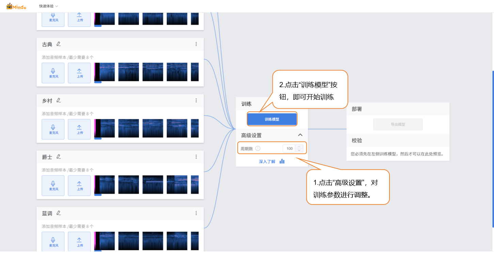

  - 训练过程中，请务必保持此标签页为打开状态，避免切换页面或关闭浏览器导致训练中断。
  - 
- **训练过程监测**
  - 在训练模型过程中，可通过点击“深入了解”按钮，查看训练监测相关数据。
    - **每个周期的准确率：** 是指在模型训练的一个周期（即对整个训练数据集完整迭代一次）内，模型预测结果与实际结果相符的比例
    - **每个周期的损失：** 则是该周期内模型预测值与真实值之间的误差程度量化指标。
    - 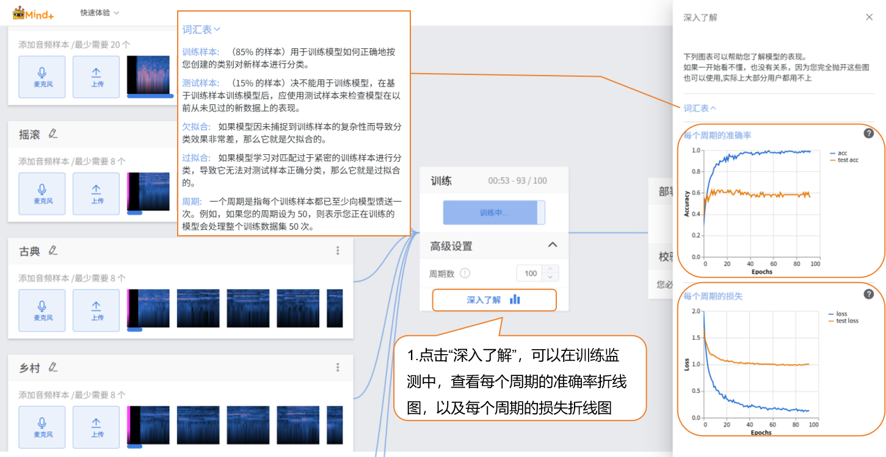

    - > - **每个周期的准确率折线图**
      > - 蓝色线（`acc`）代表模型在训练数据上每个周期的准确率，从图中能看到，随着训练周期（`Epochs`）增加，训练准确率快速上升，后期趋于稳定在接近1.0的高水平，说明模型对训练数据的拟合程度越来越好。 橙色线（`test acc`）代表模型在测试数据上每个周期的准确率，它前期有小幅度上升，但很快趋于平稳，且稳定在约0.6的水平，远低于训练准确率，这体现出模型在训练数据上表现很好，但在未见过的测试数据上表现一般，存在一定的泛化能力不足的情况。
      > - **每个周期的损失折线图**
      > - 蓝色线（`loss`）代表模型在训练数据上每个周期的损失，损失值随着训练周期增加快速下降，后期稳定在很低的水平，这和训练准确率的变化趋势一致，说明模型对训练数据的预测误差越来越小。 橙色线（`test loss`）代表模型在测试数据上每个周期的损失，它前期下降后，后期趋于平稳，且稳定值高于训练损失，结合测试准确率的表现，反映出模型在测试数据上的预测误差比在训练数据上大，进一步说明模型对训练数据过拟合，在测试数据上的泛化效果欠佳。

### 步骤5：模型校验

- 模型训练完成后，可以通过校验区，检验模型效果。校验的方式为麦克风实时采集音频。
  - > 小提示：用一些未参与训练的新音频进行测试，更能反映模型实际效果。
- 靠近麦克风，播放未参与训练的新音频用于测试，查看输出d实时分类结果。

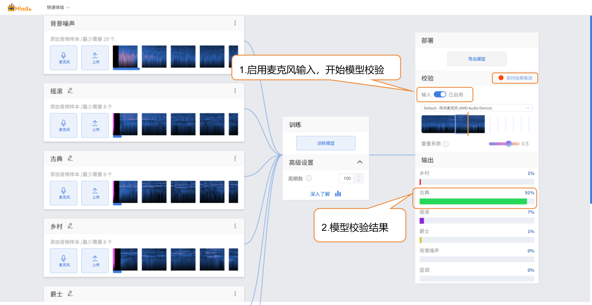

### 步骤6：模型导出

- 当模型校验结果满足需求时，就可以进入部署阶段。
  - “部署” → 点击 “导出模型”。
  - 平台支持将模型导出为zip格式，便于在其他环境中使用或进行二次开发。

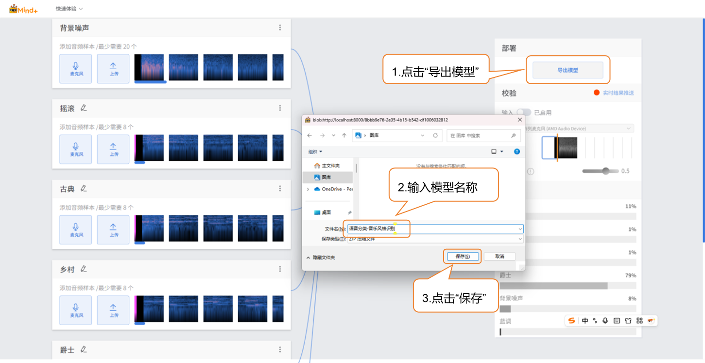

### 步骤6：模型部署

方法一：参考[4.1.4 模型部署](/AITools/Basic_description/model_deployment/model-deployment)

- 适用：支持硬件部署的模型（如行空板M10/K10），如图像分类、目标检测等模型。

方法二：参考[4.1.5 实时结果推送](/AITools/Basic_description/real_time_push/real-time-push)

- 适用：暂不支持硬件部署的模型，如语音识别、文本分类等模型。

### 模型训练常见问题

- 在模型训练过程中，可能会遇到各种问题，例如训练速度慢、精度不理想或参数设置不当。下面整理了常见问题及解决思路，帮助你更顺利地完成模型训练。

| **常见问题**     | **导致的原因及解决方法**                                     |
| ---------------- | ------------------------------------------------------------ |
| 模型准确率不高。 | 可能原因：样本数据数量不足样本类别不平衡。解决方法：在添加样本数据时，确保每个类别的样本覆盖不同音量、播放场景（非训练时的背景噪声）。尽量保持各类别样本数量均衡，以提升模型的准确率。 |
| 训练时间过长     | 可能原因：批次大小设置过小，每次训练处理的数据量少，导致训练轮次需要更多时间。训练轮次设置过大，模型重复学习数据太多。解决方法：适当增大批次大小，让模型每次处理更多样本，加快训练速度。根据数据量和任务需求合理调整训练轮次，避免不必要的重复训练。 |
