# 【时序模式识别】 专业模式

本项目以 “K10加速度动作识别” 为案例，带领大家学习如何在专业模式下完成时序模式识别。通过该案例，用户不仅能够掌握完整的基本流程（数据设置、数据标注、模型训练），还可以进一步体验专业模式中的进阶功能。

在模型训练完成后，系统能够对实时采集的加速度传感器数据进行分析与识别，从而实现对不同动作的分类预测。

在开始之前，需要提前准备并整理好对应的时序数据集，这是模型训练与识别的前提条件。 为了便于大家操作，针对本项目要实现的功能（检测鼓掌、挥手、静止 三种动作），提供了UNIHIKER K10的两类数据集：

- **有标注的时序数据集**：用于模型训练与验证。
- **无标注的时序数据集**：用于体验专业模式的详细使用过程。

这里，主要以UNIHIKER K10为例，展示如何利用加速度传感器完成时序模式识别的数据采集与应用。但需要注意的是，这一流程并不局限于UNIHIKER K10，其他具备传感器和串口通信功能的主控板（如UNIHIKER M10、micro:bit、掌控板等）同样可以按照类似方式实现。

暂时无法在飞书文档外展示此内容

暂时无法在飞书文档外展示此内容

**效果：**训练采集到的UNIHIKER K10加速度传感器x、y、z 三轴采集到的时序数据，可以让模型识别出鼓掌、挥手、静止等不同动作模式。

**效果展示：**

## 模式切换

- 打开 Mind+，在菜单栏中选择 “新建项目”，然后点击 “模型训练”。在训练选项中找到 “时序模式识别（M4）” 并点击，即可完成项目创建。

- 在界面右上角点击 “专业模式” 以切换模式。切换成功后，菜单栏将新增以下功能模块：数据设置、标注设置、模型训练、模型校验和模型部署。

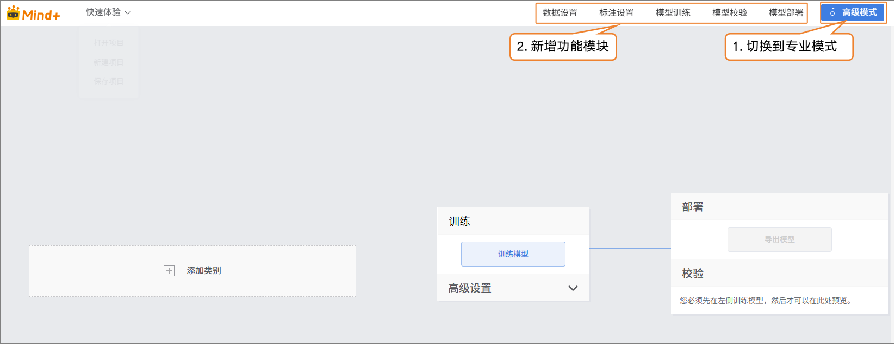

## 数据设置

- 切换到 “数据设置” → 点击左上角 “创建数据集”，例如创建一个名为“K10动作识别”的数据集。

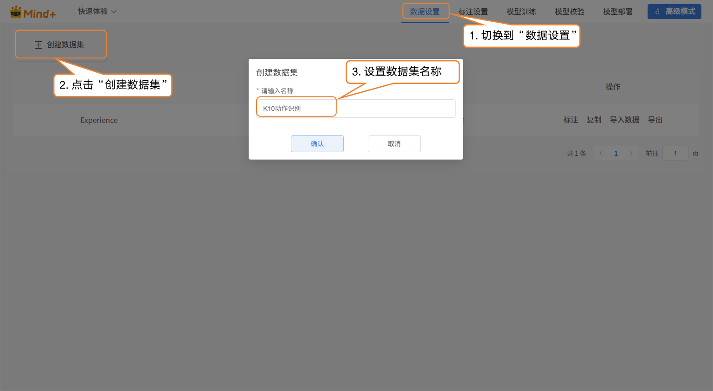

- 切换到专业模式后，数据集列表中会默认显示一个 “Experience” 数据集，该数据集由快速体验模式生成。用户可以对新建数据集执行以下操作：标注、复制、导入数据、导出以及删除。

注意：默认数据集不可删除。

- 接下来，为新建的K10动作识别数据集执行 “导入数据” 操作。系统支持两种导入方式：有标注数据和无标注数据。
- 导入方式1：无标注数据导入
  - 适用于仅上传原始图片的情况（如鼓掌、挥手、静止混合在一起的数据，且每种类别数据数量不低于10条）。
  - 操作步骤：选择导入类型为 “无标注数据” → 点击 “点击上传” → 从本地选择数据 → 点击“确认”完成导入。

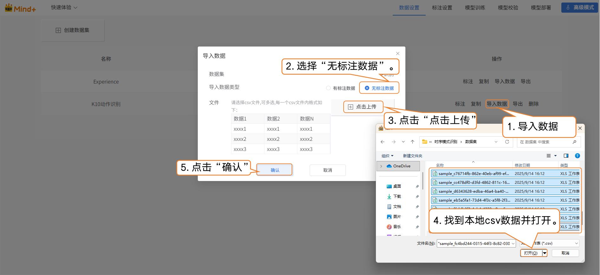

- 导入方式2：有标注数据
  - 直接上传csv格式的已标注数据（.zip 压缩包）。
  - 按照平台要求组织文件夹结构，上传后无需手动标注，直接跳转到模型训练。
  - 注意：有标注数据的分类名称需使用英文，否则上传后标签可能出现乱码。

## 标注设置

- 时序数据导入成功后，标注进度栏会同步显示已导入时序数据数量及对应的标注数量。

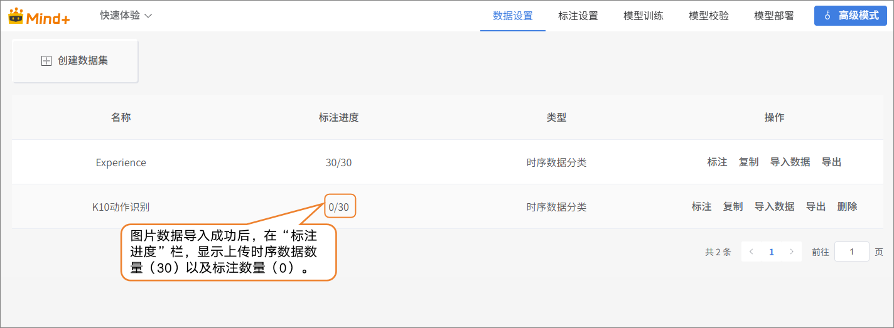

- 在“操作”栏中点击 “标注”，进入时序数据的标注设置界面。

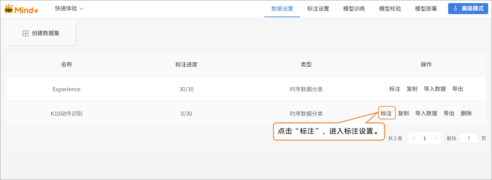

- 按照界面提示完成标签创建（鼓掌、挥手、静止），用于标注不同类别的水果。

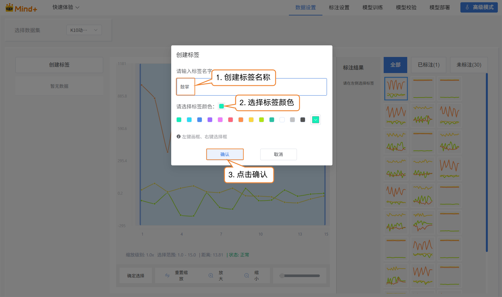

- 接下来，在界面最右侧的时序数据区，对数据逐一标注：

  - | **时序数据图**                                               | **对应标签名** |
    | ------------------------------------------------------------ | -------------- |
    |  | 鼓掌           |
    |  | 静止           |
    |  | 挥手           |

- 标签标注完成后，时序数据右下角会显示蓝色√，标注的结果会显示在标注结果栏中。

注意：所有时序数据都需要进行标注。

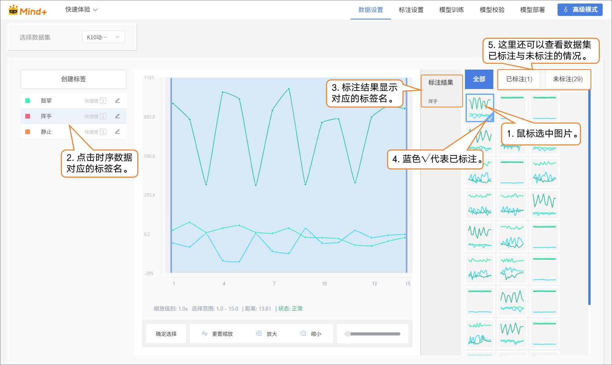

- 导入方式2：有标注数据
  - 直接上有标注数据（.zip 压缩包）。
  - 按照平台要求组织文件夹结构，上传后无需手动标注，直接跳转到模型训练。

## 模型训练

- 所有时序数据都标注完成后，切换到“模型训练”功能模块。

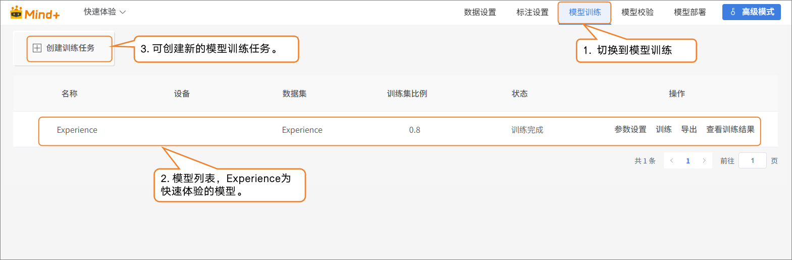

- 点击 “创建训练任务”，在弹出的窗口中进行如下设置：
  - **名称**：K10加速度动作识别模型（根据需求自行命名）
  - **设备**：选择对应的主控设备（UNIHIKER K10）
  - **数据集**：K10动作识别（在数据设置中，我们已创建并命名数据集 “K10动作识别”；在标注设置中，也完成了时序数据的标注与整理。至此，数据已具备模型训练所需的完整结构。接下来进入模型训练阶段，系统将基于该数据集学习时序特征，从而逐步具备通过加速度值进行动作识别的能力。因此，此处的数据集必须选择K10动作识别。）
  - **训练比例**：根据自己需求进行选择（也可保持默认）

| **创建任务参数** | **作用**                                           | **说明**                                                     |
| ---------------- | -------------------------------------------------- | ------------------------------------------------------------ |
| 名称             | 仅用于区分和管理不同的训练任务，不会影响模型性能。 | 相当于给这次实验取一个名字，方便后续查看和比较。             |
| 识别             | 确定使用的主控。                                   | 主控用的是什么，这里的设备就选择什么                         |
| 数据集           | 告诉模型要从哪些数据中学习。                       | 相当于教材，模型会从这个数据集的图片和标签里，学习如何识别不同交通标志。 |
| 训练比列         | 决定数据集中多少比例用来训练，多少比例用来验证。   | 训练集 = 模型学习用的例子验证集 = 检查模型学习效果的例子（模型没见过的图片） |

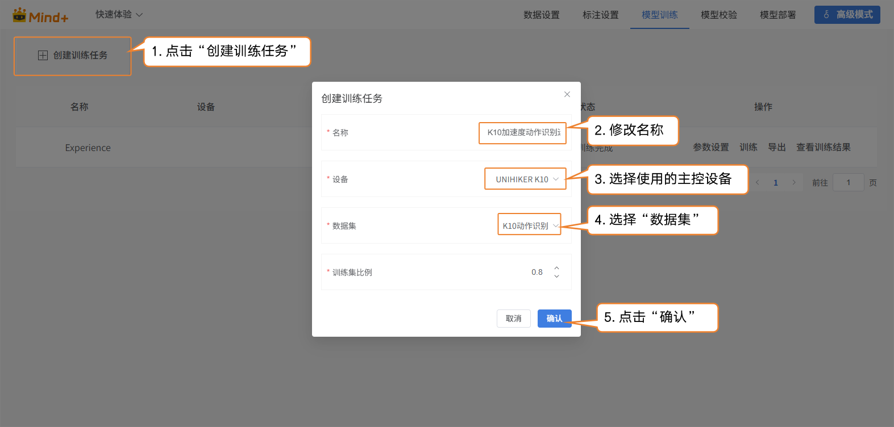

- 模型训练任务创建成功后，点击“参数设置”进入训练参数配置界面。你可以根据需要调整参数，也可以直接使用默认设置开始训练。
  - 参数设置：数据时间间隔、训练轮次、批次大小、学习率。

| 参数         | 参数说明                                                     | 类别说明                             | 推荐设置                                        |
| ------------ | ------------------------------------------------------------ | ------------------------------------ | ----------------------------------------------- |
| 数据时间间隔 | 传感器两次采样之间的时间间隔，间隔越短，捕捉的细节越多，数据量也越大。 | 记录动作的频率高低                   | 数据时间间隔：100ms（默认即可，根据需求可调整） |
| 批次大小     | 一次送入模型里训练的数据样本数量。当数据很多时，一次把数据都送进去，计算机算不过来，因此就分成一批一批来学习。例如，默认批大小为16，每次训练用16张图片。 | 每次学习多少内容                     | 批次大小：16（默认即可）                        |
| 训练轮次     | 所有训练数据完整地送入模型学习一遍，叫做一轮。学习一遍可能会不够牢固，要重复多次训练才能记住规律。例如，默认训练轮次为100，模型会将数据集从头到尾学习100遍。推荐训练轮次为20次以上。 | 学几遍                               | 训练轮次：100（小数据集可以将训练轮次适当减小） |
| 学习率       | 决定模型在每次更新参数时迈出的“步子”大小。步子太大容易错过最佳点，步子太小学习会很慢。 | 步子太大容易摔倒，步子太小走得很慢。 | 学习率：0.005（默认即可）（默认即可）           |

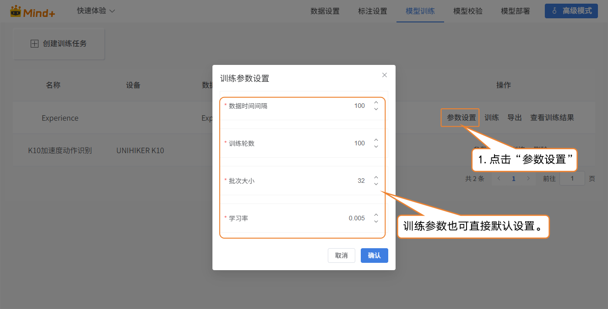

- 点击“训练”，开始进行模型训练。

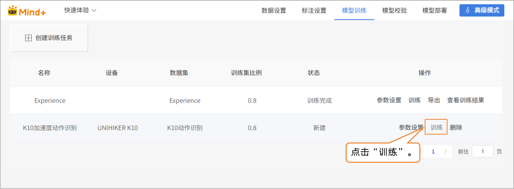

- 训练完成后，可在操作栏点击 “查看训练结果”，查看模型的关键指标，包括验证集最高准确率、最佳验证准确率损失值、以及最终的准确率和损失值，用于评估模型的训练效果。

| **指标名称**             | **指标说明**                         | **判断标准（通俗理解）**                                     |
| ------------------------ | ------------------------------------ | ------------------------------------------------------------ |
| **验证集最高准确率**     | 模型在训练过程中达到的最高识别准确率 | 数值越高越好，说明模型能很好识别训练样本。                   |
| **最佳验证准确率损失值** | 验证数据集上获得的最低损失值         | 越低越好，表示模型在验证集上的预测误差更小。                 |
| **最终准确率**           | 模型在最后一次训练完成时的准确率     | 如果接近最高准确率，说明训练较为稳定。                       |
| **最终损失值**           | 模型在最后一次训练时的损失值         | 越低越好，若明显高于最低损失，说明模型可能还需继续训练或调整参数。 |

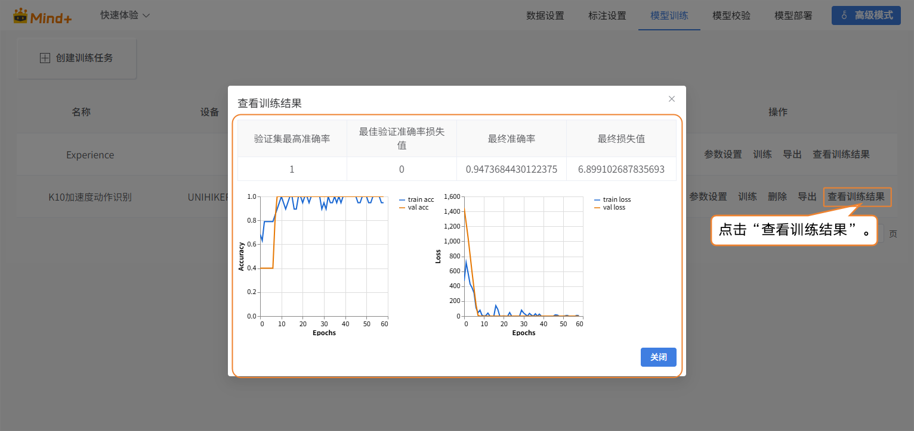

## 模型校验

- 切换到“模型校验”功能模块，选择训练项目为：K10加速度动作识别；选择模型为：model.h5。

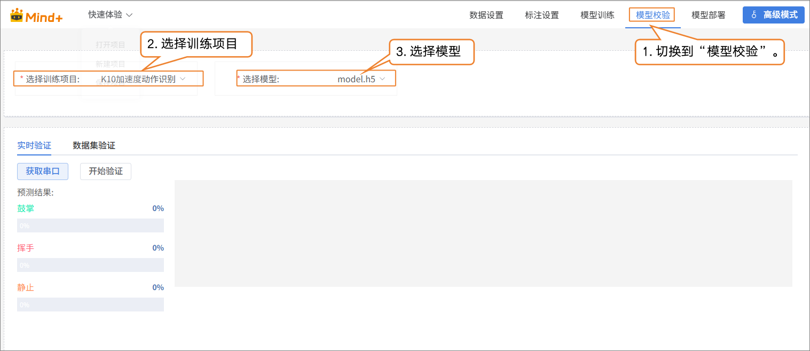

- 在 “实时验证” 中，先点击 “获取串口”，选择对应的UNIHIKER K10串口设备。

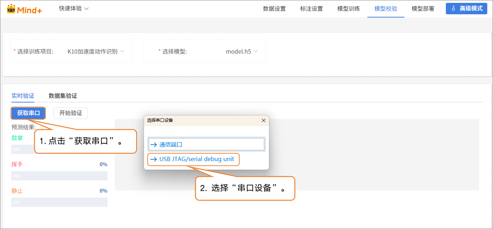

- 设备连接成功后，点击 “开始验证”，即可进行动作识别验证，并且根据时序数据输出对应的预测结果。

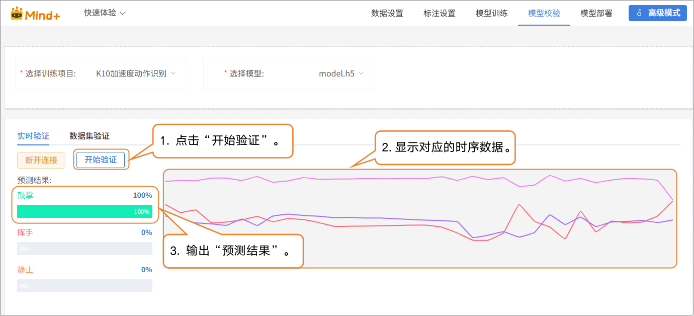

## 模型部署

- 当模型测试结果符合需求时，切换到 “模型部署”功能模块：
  - 可根据需求导出、转换或上传模型。
  - 平台支持导出为 ONNX 格式，便于在其他应用环境或硬件设备中使用。

**如需了解模型部署及实时结果推送的操作方法，可访问以下进行学习**

- [4.1.4 模型部署](/AITools/Basic_description/model_deployment/model-deployment) 

- [4.1.5 实时结果推送](/AITools/Basic_description/real_time_push/real-time-push) 

## 常见问题

| **问题**                           | **可能原因**                                                 | **解决方案**                                                 |
| ---------------------------------- | ------------------------------------------------------------ | ------------------------------------------------------------ |
| 模型训练效果不理想，识别准确率偏低 | 数据量不足，未覆盖完整动作过程标注不够精准，存在错误或模糊动作间相似度高，特征不明显 | 增加不同速度、力度的动作样本检查并修正标注调整训练参数（增加轮次/优化学习率） |
| 实时识别结果不稳定                 | 传感器采样频率与训练不一致测试动作幅度或速度差异大           | 保持采样设置与训练一致增加不同幅度、速度的训练样本，提升泛化能力 |
| 导入数据集时报错或无法识别         | 数据集命名或结构不符合要求标注文件缺失或格式错误             | 检查标注文件完整性，参考示例数据集                           |
| 静止状态与轻微动作容易混淆         | 静止数据采集不足，覆盖不全轻微动作与静止特征过近             | 增加不同姿势下的静止样本明确采集标准，保证标注准确           |