## 时序模式识别-快速体验

时序模式识别的快速体验操作步骤以“UNIHIKER K10动作识别”案例为例，带领大家学习如何利用加速度传感器的时序数据来完成模式训练与识别。该案例主要演示时序模式识别在实际应用中的效果：模型不仅能够通过采集的加速度三轴数据区分不同动作，还能对实时输入的传感器数据进行识别，帮助用户直观理解时序模式识别的基本原理与应用价值。

- **效果**：通过采集并训练加速度传感器的 x、y、z 三轴数据，可以让模型识别出鼓掌、挥手、静止等不同动作模式，识别结果会以标签形式显示在屏幕上。
- **效果展示**：

这里，主要以 UNIHIKER K10 为例，展示如何利用加速度传感器完成时序模式识别的数据采集与应用。但需要注意的是，这一流程并不局限于UNIHIKER K10，其他具备传感器和串口通信功能的主控板（如UNIHIKER M10、micro:bit、掌控板等）同样可以按照类似方式实现。

## 程序设计

### 步骤1：新建项目

- 打开 Mind+，在菜单栏中选择 “新建项目”，然后点击 “程序设计”，选择“上传模式”并点击，即可完成项目创建。

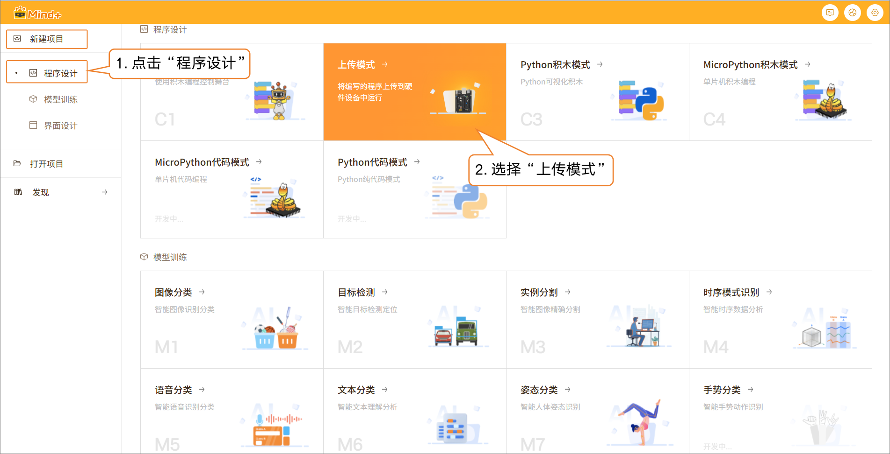

### 步骤2：添加主控

- 点击 扩展，在“主控扩展”中找到 UNIHIKER K10 并下载。下载完成后，点击UNIHIKER K10完成主控加载。主控加载成功后，点击返回，切换到编程界面。

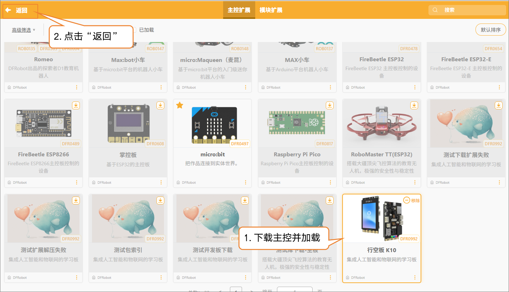

### 步骤3：程序编写

- 利用UNIHIKER K10内置加速度传感器，实时采集三轴数据（x、y、z）。设置采样间隔为0.2s（即 20Hz），并通过串口将加速度数据输出。

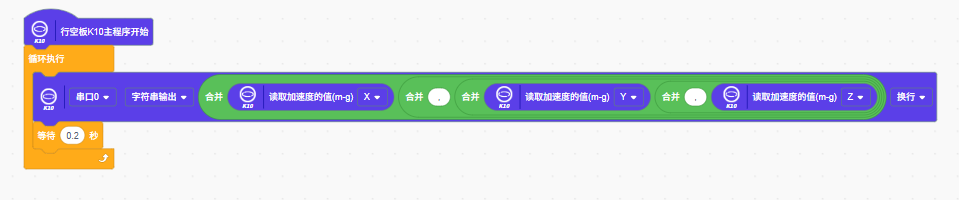

### 步骤4：程序上传

- 点击连接设备，选择识别到的UNIHIKER K10端口并完成连接。

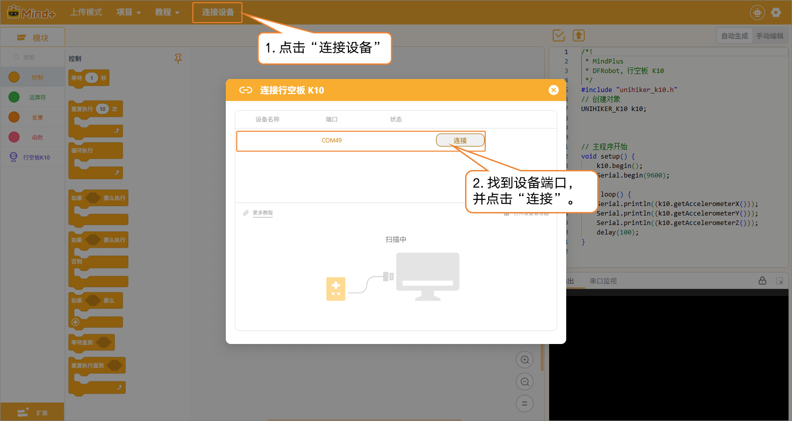

- 设备连接成功后，点击运行，等待程序上传完成。

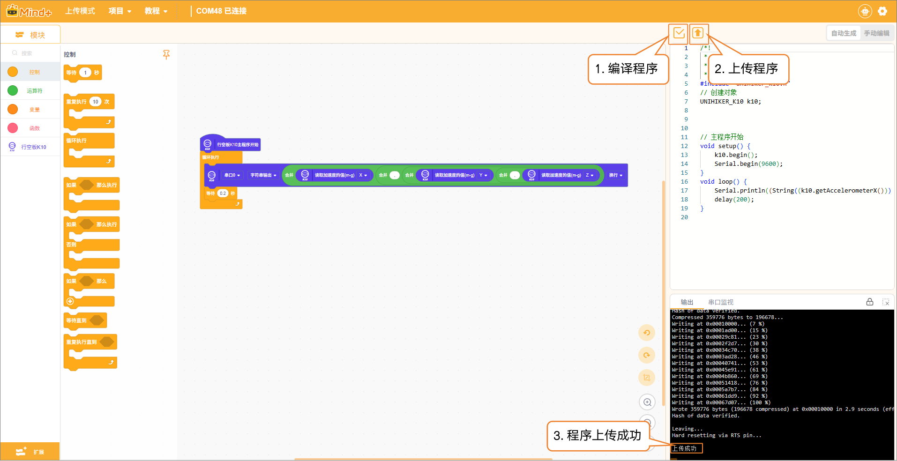

- 程序上传成功后，需要及时断开设备连接，以避免在添加样本数据时出现串口占用的问题。

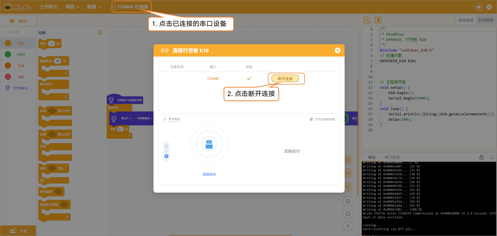

## 模型训练

### 步骤1：新建项目

- 点击“首页”图标，返回Mind+首页。在菜单栏中选择 “新建项目”，然后点击 “模型训练”。在训练选项中找到 “时序模式识别（M4）” 并点击，即可完成项目创建。

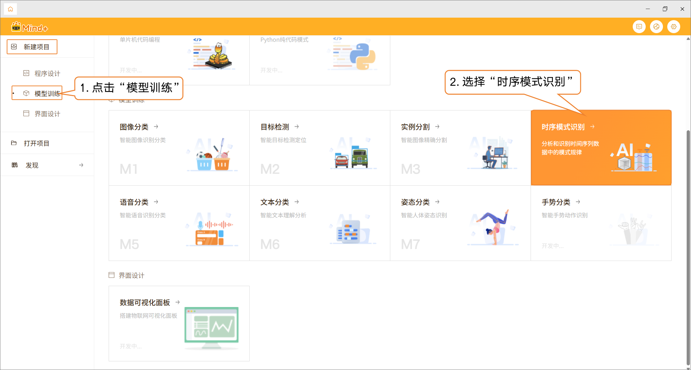

- 项目创建成功后，会跳转到新的时序模式识别快速体验界面。

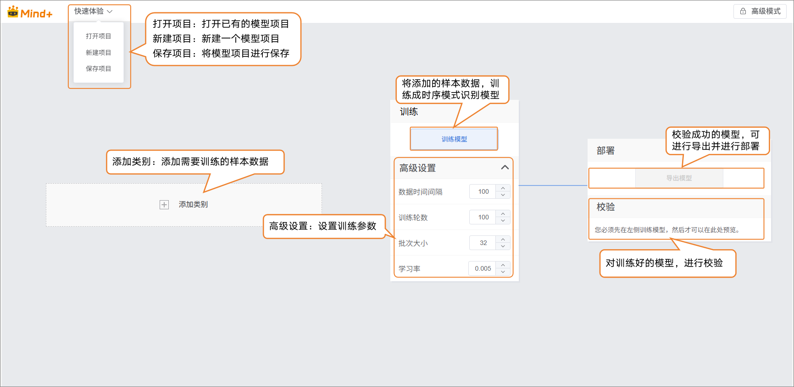

### 步骤2：添加样本数据

- 点击 “添加类别” 按钮，为图像分类任务创建所需类别。用户可以根据项目需求，添加多个类别，用于后续数据采集与模型训练。

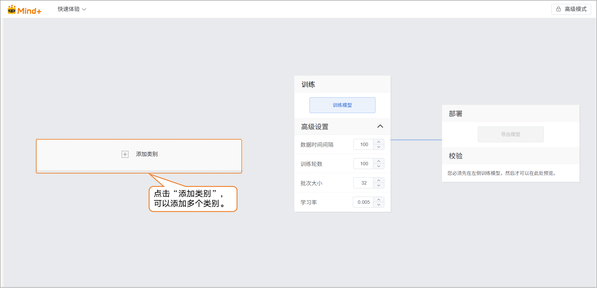

- 类别创建完成后，可以通过以下两种方式添加样本数据：
  - **采集**：通过串口直接采集实时数据。
  - **上传**：导入已准备好的数据文件，支持批量添加和管理。
- 利用这两种方式，用户能够高效、灵活地构建数据集，为模型训练打下基础。

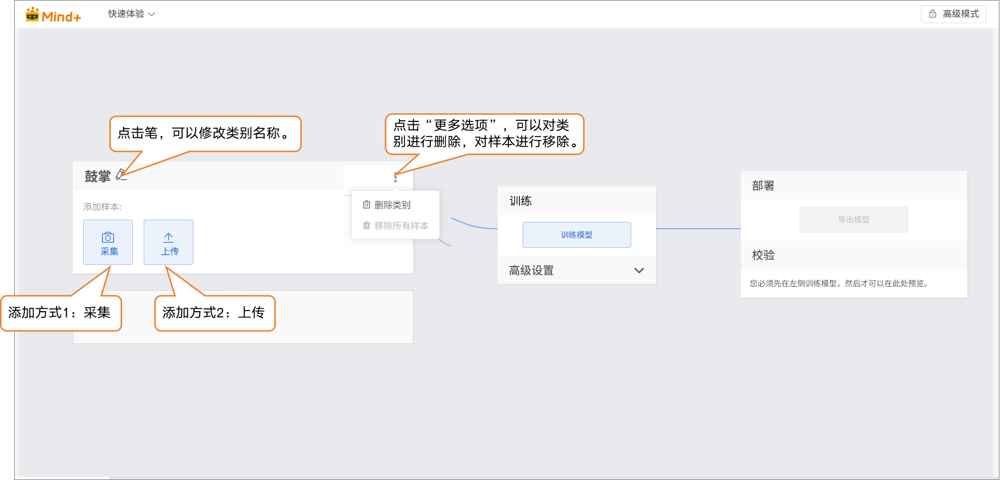

- 样本添加方式1：采集
  - 点击采集，然后在串口中，点击“获取串口”，在弹出的“选择串口设备“中，选择串口调试设备。

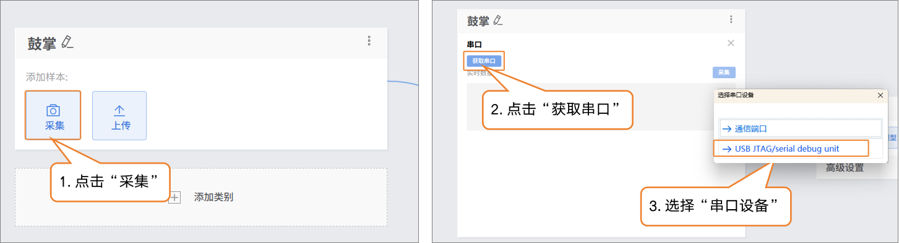

- 开发板串口连接成功后，点击“采集”即可开始实时数据采集，在“实时数据”界面可以看到连续更新的折线图，直观展示传感器输出的时序变化。

数据采集过程中，不能断开UNIHIKER K10与电脑的连接。

数据采集过程中，我们需要手持UNIHIKER K10执行对应的动作。

建议数据样本不低于10条，采集数据样本时保持动作一致。

样本数据的采集时长最好控制到3-5秒。

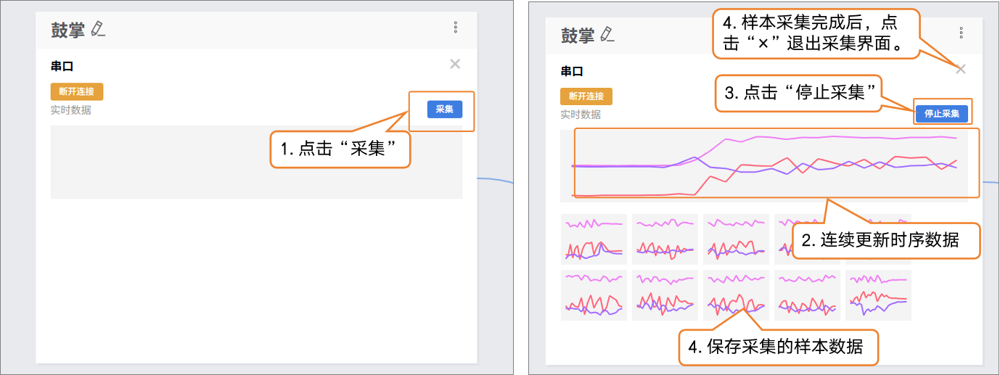

- 样本添加方式2：上传
  - 点击“添加类别”，新建另一类别（如“挥手”）→ 点击 “上传”，选择电脑本地csv数据批量导入。
  - 这种方式，适合有对应的csv文件，才能完成数据样本添加。

  - 提供简单的鼓掌、挥手、静止的csv文件供大家体验上传的操作。

暂时无法在飞书文档外展示此内容

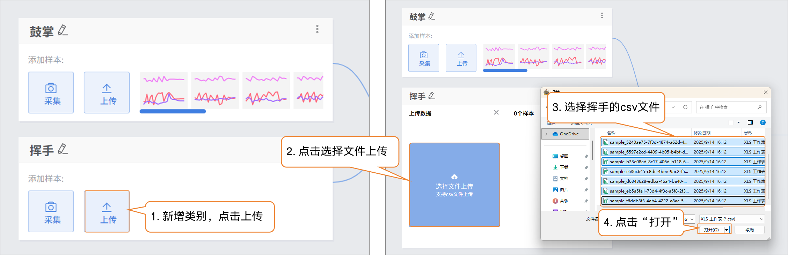

- 数据上传完成后，点击“×”退出上传数据界面。

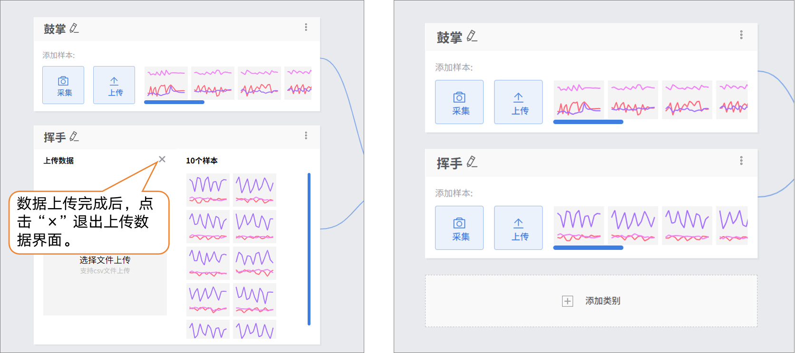

接下来，你可以选择上面任意一种数据添加方式，进行“静止”类别的样本数据添加。

### 步骤3：训练模型

- 在训练模型前，可点击“高级”进行训练参数的设置，数据时间间隔、训练轮次、批次大小、学习率。

| 参数         | 参数说明                                                     | 类别说明                             | 推荐设置                                        |
| ------------ | ------------------------------------------------------------ | ------------------------------------ | ----------------------------------------------- |
| 数据时间间隔 | 传感器两次采样之间的时间间隔，间隔越短，捕捉的细节越多，数据量也越大。 | 记录动作的频率高低                   | 数据时间间隔：100ms（默认即可，根据需求可调整） |
| 批次大小     | 一次送入模型里训练的数据样本数量。当数据很多时，一次把数据都送进去，计算机算不过来，因此就分成一批一批来学习。例如，默认批大小为16，每次训练用16张图片。 | 每次学习多少内容                     | 批次大小：16（默认即可）                        |
| 训练轮次     | 所有训练数据完整地送入模型学习一遍，叫做一轮。学习一遍可能会不够牢固，要重复多次训练才能记住规律。例如，默认训练轮次为100，模型会将数据集从头到尾学习100遍。推荐训练轮次为20次以上。 | 学几遍                               | 训练轮次：100（小数据集可以将训练轮次适当减小） |
| 学习率       | 决定模型在每次更新参数时迈出的“步子”大小。步子太大容易错过最佳点，步子太小学习会很慢。 | 步子太大容易摔倒，步子太小走得很慢。 | 学习率：0.005（默认即可）（默认即可）           |

- 完成训练参数设置后，点击 “训练模型” 即可开始训练（若不做设置，也可直接使用系统默认参数）。

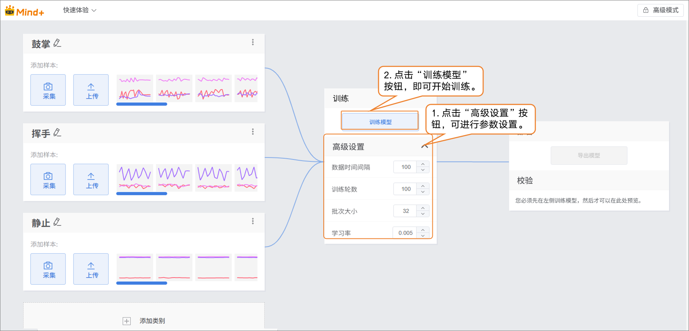

### 步骤4：模型校验

- 模型训练完成后，可在校验区测试模型效果。手持UNIHIKER K10执行动作，观察输出结果是否与实际动作一致，从而判断模型识别的准确性。

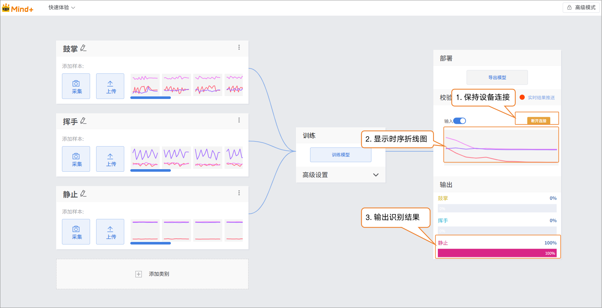

### 步骤5：模型导出

- 当模型校验结果满足需求时，就可以进入部署阶段。
  - “部署” → 点击 “导出模型”。
  - 平台支持将模型导出为 ONNX 格式，便于在其他环境中使用或进行二次开发。

> 小提示：ONNX 是一种开放的模型格式，可以在多种深度学习框架和设备上运行。这样，你不仅可以在平台上测试，还能把模型应用到真实项目中。
>
> 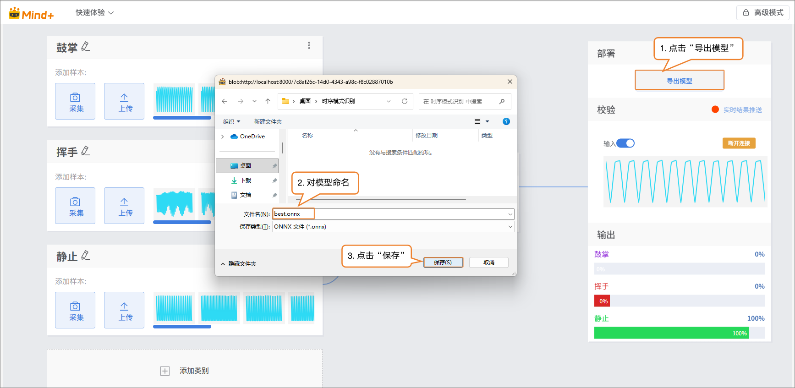

### 步骤6：模型部署

方法一：参考[4.1.4 模型部署](/AITools/Basic_description/model_deployment/model-deployment)

- 适用：支持硬件部署的模型（如行空板M10/K10），如图像分类、目标检测等模型。

方法二：参考[4.1.5 实时结果推送](/AITools/Basic_description/real_time_push/real-time-push)

- 适用：暂不支持硬件部署的模型，如语音识别、文本分类等模型。

## 模型训练常见问题

| **常见问题**       | **可能原因**                                         | **解决方案**                                    |
| ------------------ | ---------------------------------------------------- | ----------------------------------------------- |
| 样本数量不足       | 每个动作采集的数据太少，模型难以学习动作特征。       | 每个动作至少采集 10–30 条数据，复杂动作可更多。 |
| 动作不一致或噪声多 | 动作幅度、速度姿态差异大。                           | 采集时保持动作一致，可适当加入轻微变化。        |
| 采样间隔不合理     | 时间间隔太长漏掉动作细节，太短增加数据量和计算压力。 | 一般设置约 100ms，可根据动作快慢调整。          |
| 识别准确率低       | 样本太少、动作噪声大或特征不明显。                   | 增加样本量、确保动作标准、或调整训练参数。      |
| 实时识别延迟       | 采样率低、数据传输或模型推理速度慢。                 | 提高采样率、优化模型或硬件性能。                |
| 校验动作误差大     | 手持设备动作与训练动作不一致。                       | 校验时保持动作与训练一致，幅度和速度尽量相似。  |