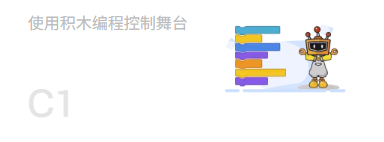
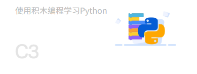
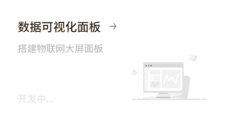

欢迎来到 Mind+ 常见问题解答页面！这里汇总了用户在使用 Mind+ 软件过程中遇到的各类问题及其解决方案。

## 🔍 快速导航

根据您遇到的问题类型，选择对应的分类进行查找：

### 程序设计

- **[实时模式](Coding/RealTimeMode/index.md)**  
    [{width=400, style="display:block;margin: 10px auto"}](Coding/RealTimeMode/index.md)

- **[上传模式](Coding/UploadMode/index.md)**  
    [{width=400, style="display:block;margin: 10px auto"}](Coding/UploadMode/index.md)

- **[Python积木模式](Coding/PythonBlockMode/index.md)**  
    [{width=400, style="display:block;margin: 10px auto"}](Coding/PythonBlockMode/index.md)

- **[MicroPython积木模式](Coding/MicroPythonBlockMode/index.md)**  
    [{width=400, style="display:block;margin: 10px auto"}](Coding/MicroPythonBlockMode/index.md)

### 模型训练

- **[模型训练](AITools/index.md)**  
    [{style="display:block;margin: 10px auto"}](AITools/index.md)

### 界面设计

- **[界面设计](ViewDesign/index.md)**  
    [{style="display:block;margin: 10px auto"}](ViewDesign/index.md)

<!-- - **[扩展库](UserExtension/index.md)**  
    [{style="display:block;margin: 10px auto"}](UserExtension/index.md) -->

## 💡 使用提示

- **快速搜索**：<button onclick="openSearch()" style="background: #1976d2; color: white; border: none; padding: 4px 12px; border-radius: 4px; cursor: pointer; font-size: 0.9em;">🔍 点击搜索</button> 
- **问题反馈**：如果没有找到您的问题，可以通过官方QQ群或论坛反馈  
- **持续更新**：我们会根据用户反馈持续更新常见问题库

