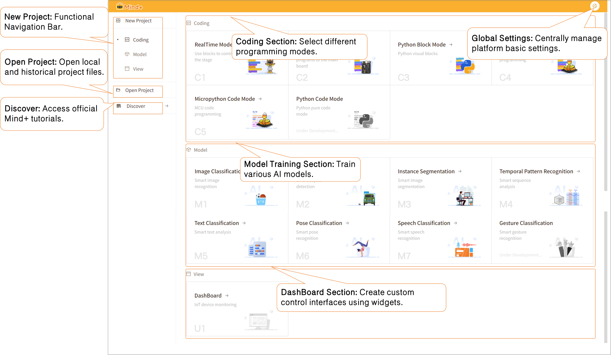
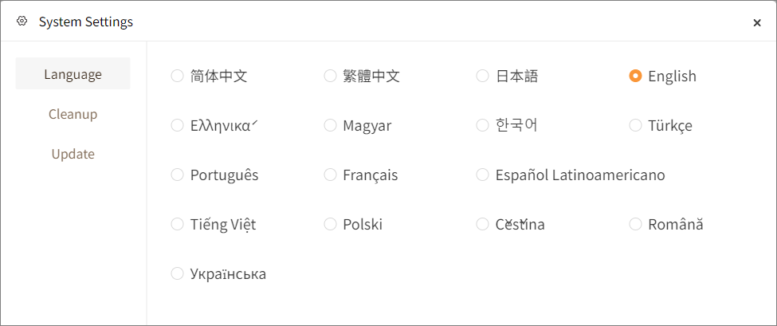
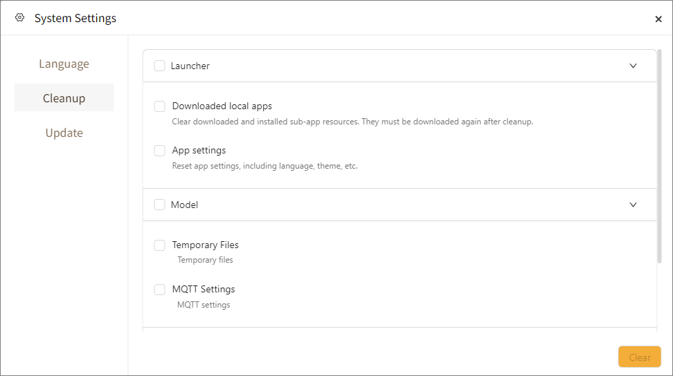
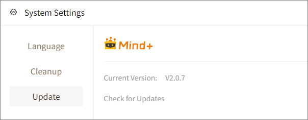

After completing the installation and launching Mind+, you will see the main interface as follows:

This page is the home screen (Project Selection Home) upon launching Mind+, serving as the gateway to various development features. The left side contains the global navigation bar, the center displays the three main functional sections, and the top-right corner provides access to global settings for quick configuration of language settings, data cleanup, and version updates.

!!! tip "Tip"
This document is for Mind+ V2. If you are using Mind+ V1.x, please [click here](https://mindplus.dfrobot.com.cn/catalog) to view the relevant documentation.

## **1. Left Navigation Bar**

| Navigation Option | Description                                                                                                                                                                                                          |
| ----------------- | -------------------------------------------------------------------------------------------------------------------------------------------------------------------------------------------------------------------- |
| New Project       | Platform core function navigation bar. Clicking it automatically switches the right panel to choose from the three development paths—Program Design, Model Training, and Interface Design—to create a new project. |
| Open Project      | Supports loading locally saved project files and quickly retrieving historical project records to continue editing existing projects.                                                                                |
| Explore           | Redirects to the official Mind+ Documentation Center, providing tutorials, courses, and learning resources for convenient developer reference.                                                                       |

## **2. Central Feature Area**

In the right area of the main interface, there are three primary functional modules: **Program Design**, **Model Training**, and **Interface Design**. They are used respectively for program writing, artificial intelligence training, and interactive interface design.

| Feature Option   | Features                                   | Description                                                                                                                                                                                                                                                                                                                                                   |
| ---------------- | ------------------------------------------ | ------------------------------------------------------------------------------------------------------------------------------------------------------------------------------------------------------------------------------------------------------------------------------------------------------------------------------------------------------------- |
| Program Design   | The core programming area of Mind+         | In this module, you can write programs to control mainboards, sensors, and actuators through graphical block programming or code programming. It supports multiple mainboards (such as micro:bit, UNIHIKER K10 & M10, Arduino, etc.), allowing you to easily implement creative projects ranging from simple control to complex interactions.                 |
| Model Training   | AI learning and training platform of Mind+ | In this module, you can collect data, annotate samples, and train your own AI models to achieve intelligent features such as image recognition, sound recognition, and time-series pattern recognition. Trained models can also be integrated with the Program Design module, empowering your projects with the ability to "recognize", "judge", and "learn". |
| Interface Design | Area for creating interactive interfaces   | In this module, you can design controls such as buttons, text boxes, images, and gauges to implement human-machine interaction or data visualization. It is commonly used to create smart control panels, visual monitoring dashboards, or creative interactive projects.                                                                                     |

## **3. Global System Settings**

System Settings includes three main functional modules: **Language Settings**, **Data Cleanup**, and **Version Update**, which are used to adjust the software interface language, clear local cached resources, and check for software version upgrades.

| Global System Settings | Description                                                                                                                                                                                         |
| ---------------------- | --------------------------------------------------------------------------------------------------------------------------------------------------------------------------------------------------- |
| Language Settings      | Switch the display language of the Mind+ interface. Changes take effect immediately without restarting the software.                                                                                |
| Data Cleanup           | Clean up cache, resources, and configuration files generated during software runtime to free up local disk space.**None of the cleanup operations will delete manually saved project files.** |
| Version Update         | View the local Mind+ version and check for the latest official updates online to obtain new features, bug fixes, and hardware compatibility optimizations.                                          |

#### **Language Settings**

Language Settings is used to switch the software interface display language. Once selected, the interface text updates in real time to the chosen language.

|     简体中文     | 繁體中文  |          日本語          |       English       |
| :--------------: | --------- | :----------------------: | :------------------: |
| Ελληνικά | Magyar    |          한국어          |       Türkçe       |
|    Português    | Français | Español Latinoamericano |     Tiếng Việt     |
|      Polski      | Čeština |         Română         | Українська |

#### **Data Cleanup**

A system maintenance tool to free up disk space by selecting specific items to clean up based on your needs.

General Operation Rules: Click the dropdown arrow to the right of each category to expand sub-options; supports batch selection for overall cleanup or individual selection for targeted cleanup.

| Category         | Description                                                                                                                                                | Sub-option Details                                                                                                                                                                                                                                                                                                                                                                                                                                                                                                                                                                                                                                                                   |
| ---------------- | ---------------------------------------------------------------------------------------------------------------------------------------------------------- | ------------------------------------------------------------------------------------------------------------------------------------------------------------------------------------------------------------------------------------------------------------------------------------------------------------------------------------------------------------------------------------------------------------------------------------------------------------------------------------------------------------------------------------------------------------------------------------------------------------------------------------------------------------------------------------ |
| Launch Platform  | A cleanup category under Data Cleanup used to clear sub-application resources required for platform launch and reset personalized software configurations. | **1. Locally Downloaded Applications** Clears locally downloaded and installed sub-application resources. Instructions: After deletion, opening the corresponding sub-application later will require re-downloading resources via network; this will not delete your project files, only locally installed sub-app resources. **2. Software Settings** Resets software settings, including language, theme, etc., restoring all personalized configurations to default. Instructions: All personalized settings like language and theme will revert to factory defaults, and previous manual settings will be lost and need to be reconfigured. |
| Model Training   | A cleanup category under Data Cleanup used to clear temporary files and IoT connection configurations generated during AI model training.                  | **1. Temporary Files** Clears sample caches, intermediate training files, logs, and temporary weights generated automatically during model training. Instructions: Will not delete manually exported and saved model files; do not clean up while training tasks are actively running to avoid interruptions; frees up significant disk space. **2. MQTT Settings** Resets parameters related to IoT MQTT connections. Instructions: All custom MQTT server addresses, accounts, and topics will be cleared and restored to defaults, requiring connection details to be re-entered.                                                            |
| Interface Design | A cleanup category under Data Cleanup used to clear temporary project caches generated by the visual interface editor.                                     | **1. Cache** Clears local temporary project data caches generated by the Interface Design module. Instructions: Only clears cached files like preview assets and temporary snapshots without deleting manually saved interface design project files; when reopening a project after cleanup, assets will need to reload, resulting in slightly slower initial load times.                                                                                                                                                                                                                                                                                            |

#### **Version Update**

Check the local Mind+ version and check for the latest official updates online to get new features, bug fixes, and hardware compatibility optimizations.

