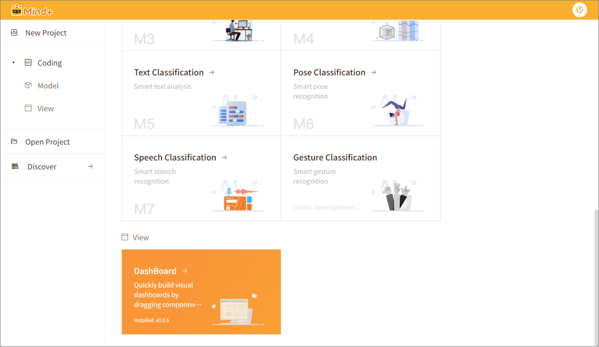
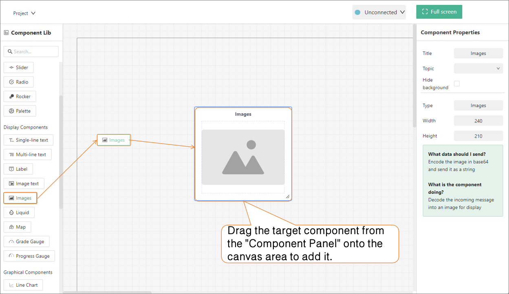
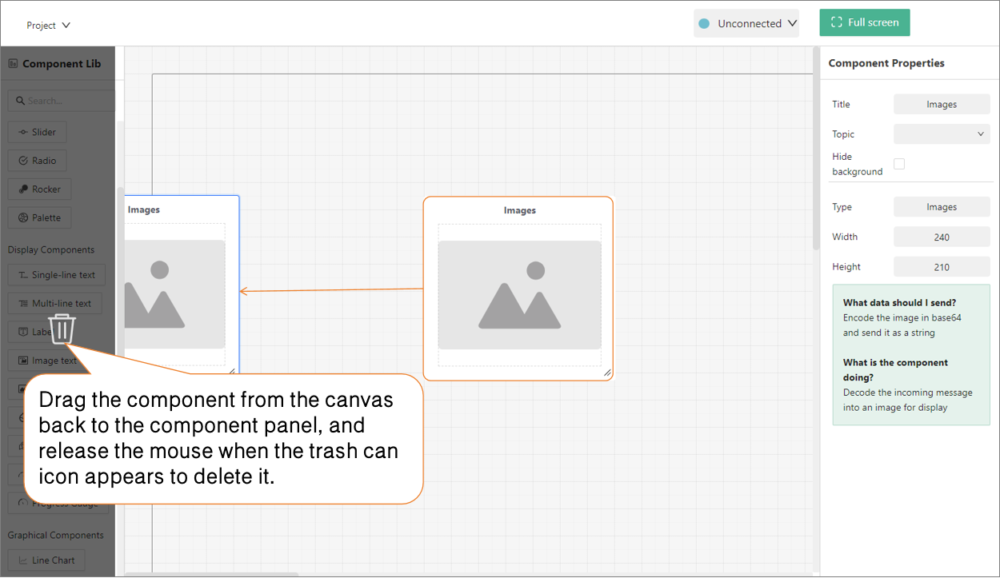
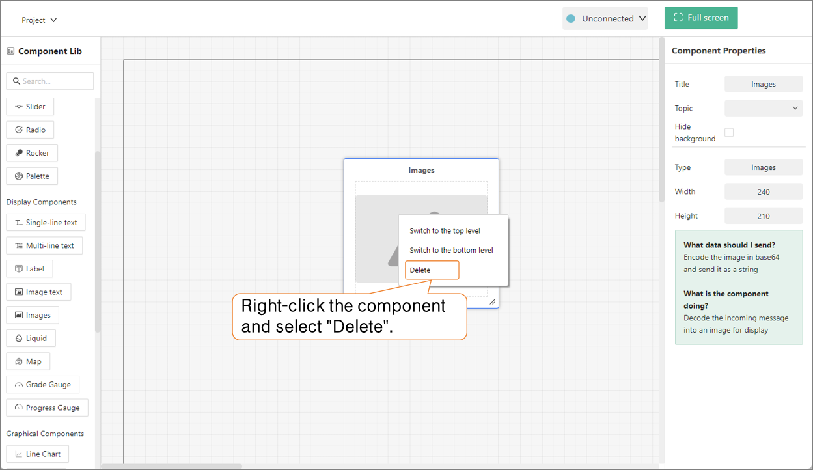

# 5.1 Dashboard

Dashboard is a tool for building graphical user interfaces, allowing users to quickly create monitoring dashboards by dragging and dropping components without programming. Users can freely add components such as charts, numeric displays, indicators, and text to complete the layout design. The dashboard can connect to IoT servers, receive sensor data collected by UNIHIKER, and display real-time curves and device statuses, turning the UNIHIKER screen into an IoT monitoring display.

**Applicable Scenarios:** Environmental monitoring, smart device status monitoring, real-time sensor data visualization, etc.

**Note:** Starting from Mind+ V2.0.5, the Dashboard from Mind+ V1.x has been migrated and made available as a standalone application (Home Screen > UI Design > Dashboard), featuring the same functionality as in V1.x.

> For tutorials, please refer to: [Click Here]()

# Dashboard: Adding and Deleting Components

## 1. Adding Components

**Method 1:** Click the target component, and it will automatically be placed in the top-left corner of the canvas. You can then freely adjust its position, size, and appearance styling.

**Method 2:** Select the target component in the component library and drag it directly onto the canvas area to add it.

## 2. Deleting Components

**Method 1:** Select the component on the canvas and press the `Delete` key on your keyboard to quickly delete it.

**Method 2:** Select the component and drag it from the canvas area back to the component panel until the trash can icon appears.

**Method 3:** Right-click the target component and select "Delete" from the context menu.

